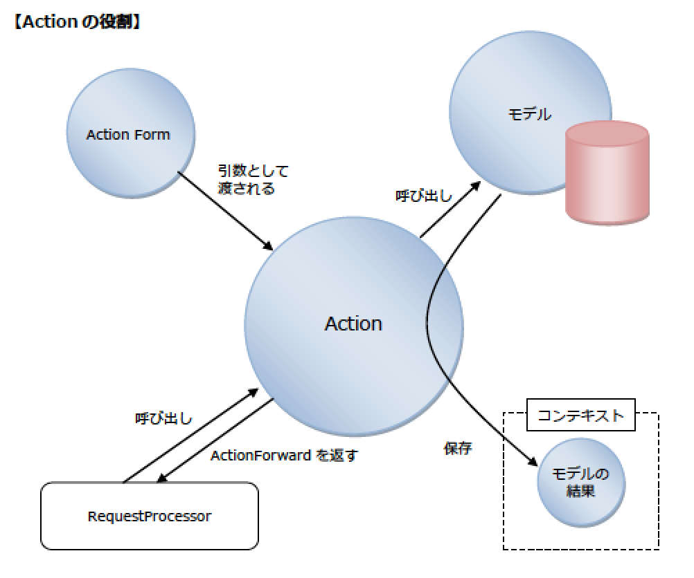
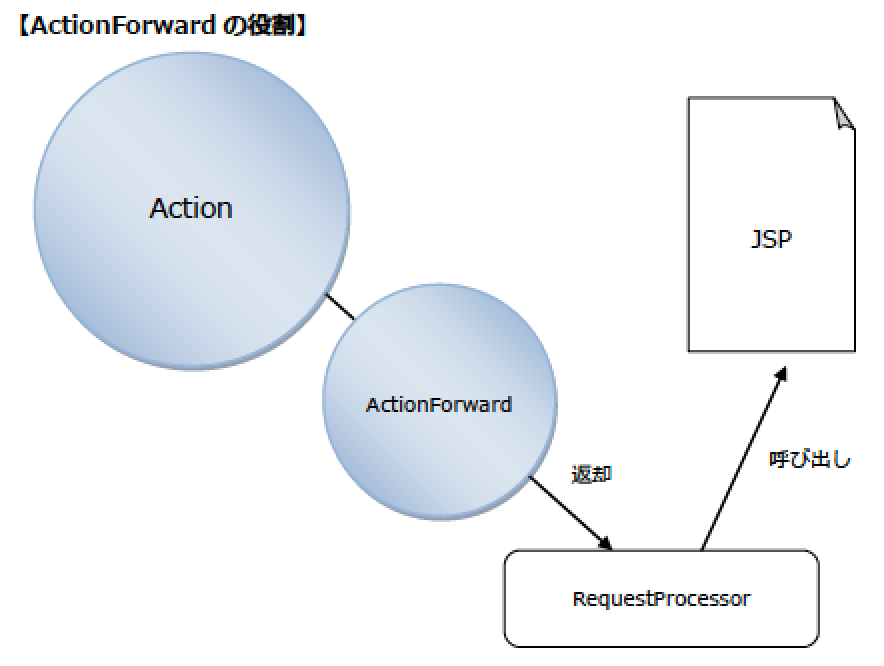
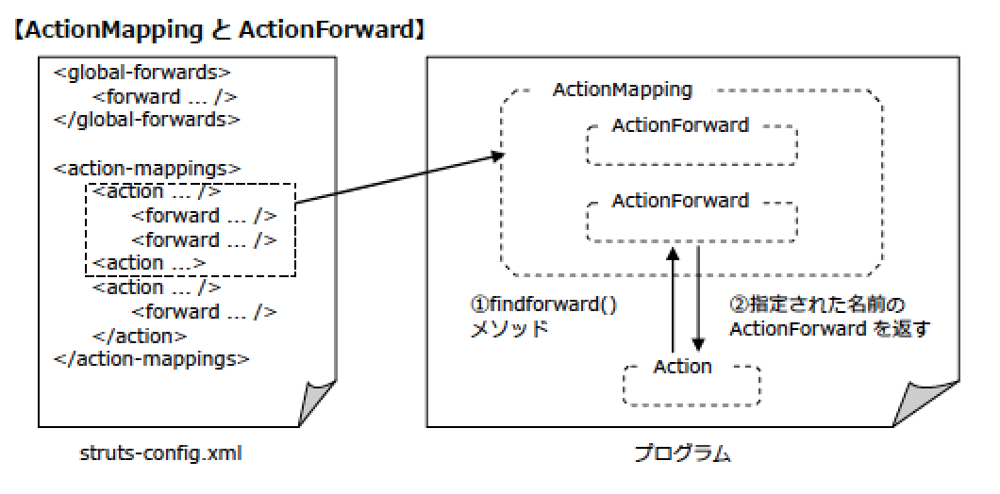

# Action

* Actionの役割
* Actionの`execute()`
* 3.ActionMappingとActionForward
    * (1)ActionMapping
    * (2)ActionForward
    * (3)ActionMappingのメソッドとAction
* 4.Actionの実装
* 5.Action設計時のガイドライン
    * (1)スレッドセーフを意識する
    * (2)例外はActioでキャッチする
    * (3)Actionは小さく、シンプルにする

### Actionの役割

* Actionの役割はモデルの呼び出し
* HTTPリクエストに従ってモデルを呼び出し
* 終了後はモデルにより生成された結果をコンテキストに保存する
* また、Actionを作成する際は、org.apache.struts.action.Actionを継承する必要がある



* StrutsではActionServletが唯一のサーブレット
* サーブレットでできることはActionでもほぼ実現可能
    * ActionはActionServletからRequestProcessor経由で処理を引き継ぐため

### Actionのexecute()

* Actionはorg.apache.struts.action.Actionを継承したクラスを作る
* それに当たり、`execute()`をオーバーライドする必要もある
* Actionの作成と`execute()`の作成はほぼ同義と考え差し支えない
    * このメソッドに、ビジネスロジックの呼び出しを実装し、フォワード先を指定するため
* 以下は`execute()`のシグニチャ

```text
public ActionForward execute(ActionMapping mapping,
                             ActionForm form,
                             HttpServletRequest request,
                             HttpServletResponse response)
    throws Exception
```

* `execute()`の引数と戻り値を以下に示す
* `execute()`の引数

| クラス名 | 説明 |
|:----|:----|
| ActionMapping | org.apache.struts.actionパッケージのクラスで、Actionに関する設定を管理する |
| ActionForm | org.apache.struts.actionパッケージのクラスで、リクエストパラメータの値を管理する |
| HttpServletRequest | javax.servlet.httpパッケージのクラスで、ユーザーからのリクエストを表する |
| HttpServletResponse | javax.servlet.httpパッケージのクラスで、ユーザーへのレスポンスを表する |

* `execute()`の戻り値
    
| クラス名 | 説明 |
|:----|:----|
| ActionForward | org.apache.struts.actionパッケージのクラスで、遷移先に関する設定を管理する |

### 3.ActionMappingとActionForward

#### (1)ActionMapping

* ActionMappingは、Struts設定ファイルに記述された内容を管理するクラス
    * 開発者が作成するクラスではない
* ActionMappingはリクエストされたURLとActionの関連付けを担当する
    * RequestProcessorにおいてリクエストのURLからActionを呼び出すときに利用される
    * どのActionを実行するのかを識別するものと考えてもよい
* また、Actionの`execute()`の引数にもActionMappingがある
    * このメソッドの中でActionMappingが持つデ一夕を取り出し、操作することが可能
* ActionMappingのインス夕ンスは、Struts設定ファイルのaction要素の情報から自動生成される
* 以下のようなStruts設定ファイルを例にActionMappingのインス夕ンスとStruts設定ファイルの関連を確認

```text
<action-mappings>
    <action path="/actionA"
            name="sampleForm"
            type="sample.SampleActionA">
        <forward name="forward_A" path="/WEB-INF/a.jsp"/>
        <forward name="forward_B" path="/WEB-INF/b.jsp"/>
    </action>
    <action path="/actionB"
            type="sample.SampleActionB">
        <forward name="forward_C" path="/WEB-INF/c.jsp"/>
        <forward name="forward_D" path="/WEB-INF/d.jsp"/>
    </action>
</action-mappings>
```

* ActionMappingのインスタンスはaction-mappings要素の中にある
    * action要素数の分だけ作成される
* action要素に必須の属性はtypeのみで、ここにはこのActionMappingから呼び出されるActionのクラス名を指定する
* ActionMappingのもう1つの重要な役割として、ActionFormとActionの関連付けがある
* ActionFormはHTTPリクエストパラメ一夕の値を保持する
    * JavaBeanが、これをActionに引き渡す場合は、action要素のname属性にActionFormの名前を指定する

#### (2)ActionForward

* ActionForwardは、ActionMappingと同様にStruts設定ファイルに記述された内容を管理するクラス
    * 開発者が作成するクラスではない
* ActionForwardは、Action終了後の遷移先を保持するクラス
    * ActionForwardのインス夕ンスはStruts設定ファイルの記述に従って自動生成される
    * 最終的にどこに遷移するかはAction内に記述する



* Struts設定ファイルにおいてActionForwardを設定するのは、global-forwards要素とaction要素にネストされるforward要素
* global-forwards要素で指定されるActionForwardは複数のActionから参照される
    * ¥これをグローバルフォワードと呼ぶ
    * global-forwards要素に関しては、後述のStruts設定ファイルの説明でも改めて触れる
* 一方、forward要素で指定されるActionForwardは、親のaction要素で呼び出されるActionからのみ参照される
    * これをローカルフォワードと呼ぶ
* ActionMappingの説明の際に使用した例の場合
    * ①のaction要素は2つのforward要素を持っている
    * そのため、SampleActionAというActionは、終了後に遷移する先の候補として、forward_Aとforward_Bの2つがあるということになる
    * forward要素、global-forwards要素では、nameとtypeの2つ属性は必須
        * name属性ではこのActionForwardの論理名 (Actionの中で使用される）を指定
        * path 属性で遷移先のリソースを指定
        * ①の例ではどちらもJSPが遷移先となっているが、これは別のActionである場合もある

#### (3)ActionMappingのメソッドとAction

* ActionMappingはorg.apache.struts.config.ActionConfigのサブクラス
    * ActionConfigで用意されているメソッドを利用することにより、action要素の各属性値を取得可能
    * 具体的には属性値をメソッドで取得することが可能
        * 属性値: path, type, input, name, scope, validateなど
        * メソッド: getPath(), getType(), getlnput(), getName(), getScope(), getValidate()など
* またaction要素にネストされているforward要素をActionForwardのインスタンスとして返すメソッドもある
    * 以下にAction内でよく利用される、ActionMapping のメソッドを示す

ActionMappingのメソッド

| メソッド | 説明 |
|:----|:----|
| findForward(String name) | 引数で指定した文字列をname属性に持つforward要素の情報を、ActionForwardインスタンスとして返す |
| getInputForward() | action要素のinput属性で指定されるリソースへの ActionForwardインスタンスを返す |

* 上記のメソッドは、どちらも戻り値はActionForwardとなる
    * Actionで`execute()`を実装する際の戻り値として設定することも多々ある
* `findForward()`
    * まずaction要素にネストされたforward要素のname属性を調べる
    * 引数と一致するものがあれば、それをActionForwardとして返す
    * 見つからない場合には、global-forwards要素にネストされたforward要素のname属性を調べる
    * そして引数と一致するものがあれば、そのforward要素をActionForwardとして返す
    * action要素、global-forwards要素のいずれからも適したforward要素が見つからない場合、nullが返される
* このようにActionMappingとActionForwardは、Struts設定ファイルに書かれた情報をラッビングして保持
    * Actionなどでの利用を容易にする



### 4.Actionの実装

* Actionの役割は実際には以下
    * ActionFormのメソッドを使用できるように型変換を行う
    * ビジネスロジックを呼び出す
    * ビジネスロジックの処理結果をコンテキストに登録
    * 遷移先のActionForwardをRequestProcessorに返す

`Strutsの概要と動作`で作成したサンプルActionで考える

`execute()`

```text
public ActionForward execute(ActionMapping mapping,
                            ActionForm form,
                            HttpServletRequest request,
                            HttpServletResponse response)
          throws Exception {
    // ActionFormをLoginFormにキャス卜
    LoginForm loginForm = (LoginForm) form;

    //フォームに入力されたIDを取得する
    String id =loginForm.getId();

    //フォームに入力されたパスワードを取得する
    String password =loginForm.getPassword();
    String message = " ID：" + id + " パスワード：" + password;

    // messageをrequestスコープに登録する
    request.setAttribute("message", message);

    // ActionForwardを返却
    return mapping.findForward("success");
}
```

また、このActionを呼び出すためのStruts設定ファイルない定義は以下

```text
<action path="/sample01/login"
        type="sample01.LoginAction"
        name="sample01_loginForm"
        scope="request">
    <forward name="success" path="/WEB-INF/jsp/sample01/success.jsp"/>
</action>
```

* このメソッドでは、まずActionFormをLoginFormにキャストしている
    * ActionFormのインスタンスについては`ActionForm`の資料にて触れる
* 次にloginFormからid, passwordの値を取得
* それらを連結してmessageという新しいStringを作成する
* そしてmessageをrequestスコープに登録
    * この例の場合は、このActionの中で処理が完結している
    * 本来であれば、ここにビジネスロジックを呼び出すための処理を記述する
        * 例: DBに問い合わせをして、結果セットをコンテキストに登録するなど
* 最後に、ActionMappingの`findForward()`を使用して、ActionForwardインスタンスを返す
* `findForward()`
    * Struts設定ファイルに記述されたforward要素から、name属性の値が引数に指定された文字列と同じものを探す
    * 同じものがあれば、forward要素の情報をActionForwardとして返す
    * 上記の場合、name属性がsuccessであるforward 要素の情報が返される
        * `findForward()`の引数にはsuccessという文字列が指定されているため
    * これにより、`execute()`の処理が終わるとき、`/WEB-INF/jsp/sample01/success.jsp`へ処理がフォワードされる
* ActionForwardがnullの場合の処理結果も言及する

### 5.Action設計時のガイドライン

* Actionの設計について、本家のWebサイトでは`Action Class Design Guidelines`が示されている
* 以下はそちらを要約したものとなる

#### (1)スレッドセーフを意識する

* RequestProcessorにより生成されるActionのインスタンス
    * 各クラスに1つつ
    * まり、Webアプリケーション利用者からのリクエストがあるたびに、新しいインスタンスが生成されることはない
* Actionにインスタンス変数を定義し、それを利用してしまうと、複数のスレッドからアクセスされることになる
* その結果、あるスレッドでセットした値が、別のスレッドにより読み込まれる/書き換えられるといったことが起こる
* インスタンス変数は極力使用せずに、ローカル 変数で処理を行うようにする

#### (2)例外はActioでキャッチする

* `Actionのexecute()`ではビジネスロジックを呼び出すため、様々な例外が発生する可能性がある
* `execute()`は、あらゆる例外をスローすることができる
    * 例外は極力スローせずに`execute()`内でキャッチするようにすべき

#### (3)Actionは小さく、シンプルにする

* Actionの`execute()`では、遷移先を決定するまでの部分をできるだけシンプルに、短く書くことが推奨
* MVCモデルのコントローラはどのロジックを呼び出すかを制御するだけにするのが望ましい
    * ビジネスロジックはモデルに任せる
* 同様にActionも、どのメソッドを呼び出すか制御するだけで、複雑な処理は行わない方が良い