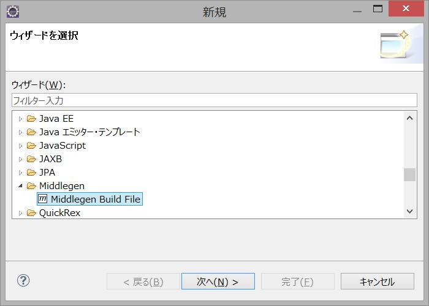
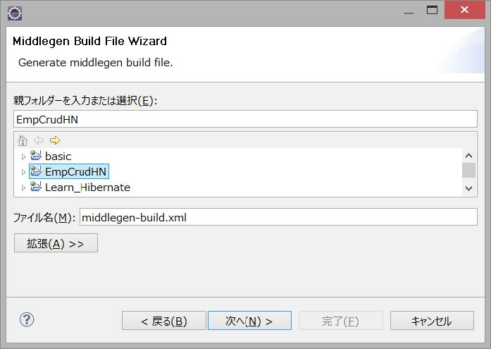
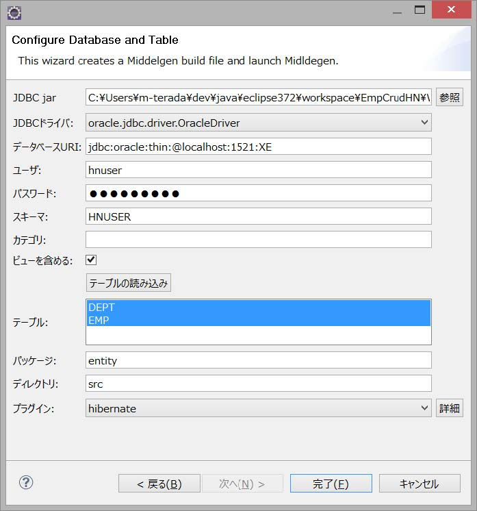
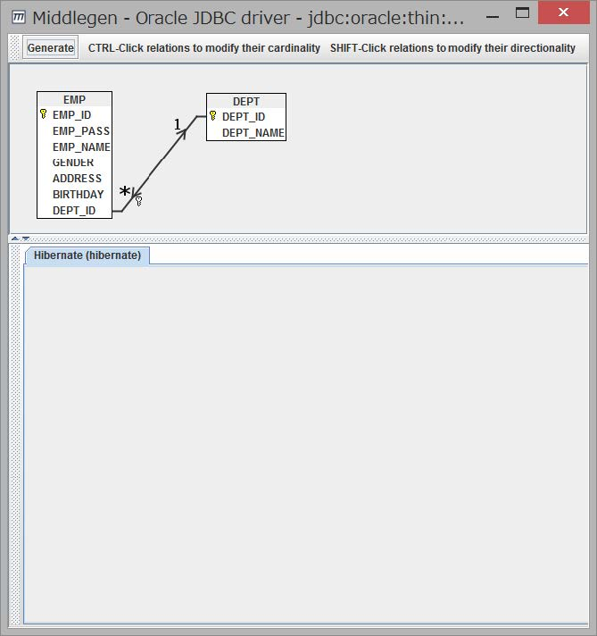
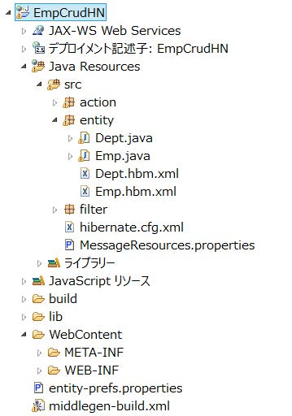
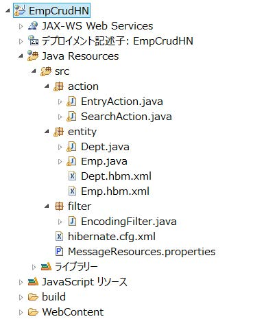
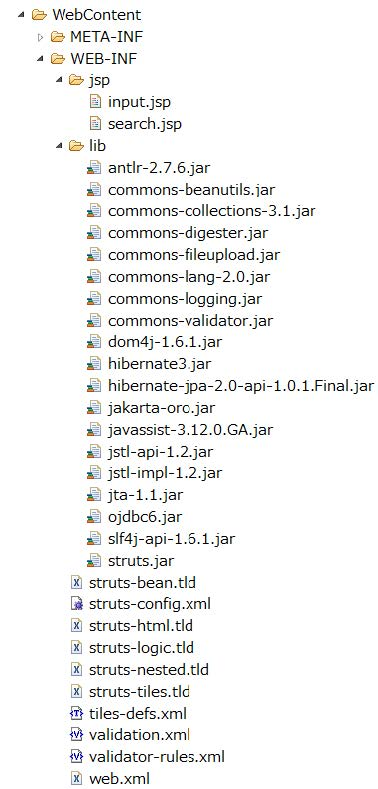

# Hibernate

## 1.HibernateとO/Rマッピング

* O/Rマッピングを行うためのフレームワーク
    * O/Rマッピング: Object / Relational Mapping
        * オブジェクト指向で扱うオブジェクトとリレーショナルDBのレコードマッピング(対応付け)することを指す
    * 検索結果のJavaBeansへの対応付けを自動化
    * トランザクション管理をしたり、インピーダンスミスマッチを解消することが可能
    * トランザクションもサポート
        * 実際には、使用するDB製品のトランザクション機能を使用
        * Hibernateはそれをラップした機能を提供する

### O/Rマッピングの必要性

* DBプログラム設計では、O/RマッピングフレームワークとしてHibernateを使用
* JavaでもJDBCというDB製品に接続するためのAPIが提供されている
    * JDBC: JavaDataBaseConnectivity
    * JDBCは以下を行うが不十分
        * コネクションを取得する
        * 渡されたSQLを実行する
        * StringやIntegerといった基本的なクラスで結果を取得する
    * SQLを組み立ててオブジェクトに結果を格納するのは、プログラムが行わなければならない
    * オブジェクトの世界とDBのリレーションの世界には、インピーダンスミスマッチが存在する
        * オブジェクトからのSQLの組み立てや、結果からのオブジェクトへの格納も、インピーダンスミスマッチ
    * 以前はJavaでもEJB(EnterpriseJavaBeans)で対策をしていた
        * EJBにはSessionBean、EntityBean、MessageBeanがあり、EntityBeanはDBに格納する永続化オブジェクトを分散オブジェクト環境で扱えるようにしたもの
        * EntityBeanは、O/Rマッピングの機能も含んでいる
        * EJBを実行するには、専用のEJBコンテナを搭載したWebアプリケーションサーバー製品が必要
        * このように、EJBはあまりにも多機能で、複雑で、重いため使える場面が限定されるため、実用的ではない
        * EJBに対する反省もあり、オープンソースの有志たちによって軽量のO/Rマッピングツールが開発された
            * その1つがHibernate
* 他にも、以下のようなO/Rマッピングツールが利用可能
    * Hibernate
    * iBATIS
    * S2Dao

軽量O/Rマッピングツールの特徴は、専用のコンテナが不要なことと、POJOを扱えること

* EJBではEntityBeanインターフェイスをすべてのEntityBeanで実装する必要がある
    * EntityBeanインターフェイスには、EJBコンテナがEntityBeanオブジェクトのライフサイクルを管理するためのメソッドがいくつかある
    * EntityBeanを実装するにはそれらすべてのメソッドを実装する必要がある
* 軽量O/RマッピングツールはPOJOを永続化できる

O/Rマッピングツールのもう1つの役割は**特定のDB製品にプログラムが直接依存しないようにする**こと

* DB製品ごとに、SQLに方言がある
* つまり、O/Rマッピングツールが、**DB製品によるSQLの違いを吸収し、隠蔽**してくれる
* これにより、プログラムの変更なし以下のことが行える
    * DB製品がバージョンアップ
    * 他のDB製品に変更
    * 複数のDB製品で動作させる

#### O/Rマッピングツールが提供する一般的な機能

* オブジェクトとテーブルのマッピング
* 永続化オブジェクトのライフサイクル管理(コネクション管理、SQLの実行)
* トランザクション管理
* 並列製・ロック制御

### 2.学習用の環境の構築

* 簡単な社員管理システムの構築を通してHibernateの基本的な使用方法を学ぶ
* 以下のサンプルプロジェクトをEclipseにインポート
    * サンプルプロジェクト：EmpCrudHN.zip
* 続いて、DB環境の構築
    * 今回は`Oracle11g`のDBを使用
    * 以下のSQLファイルをSQL*Plusにて実行
        * SQLファイル：Hibernate環境構築.txt
* 作成される環境は以下の通
    * ユーザー：hnuser
    * パスワード：systemsss
    * テーブル：emp、dept

# Hibernateの開発環境

## 1.Middlegenのインストール

* Hibernateの開発を支援するEclipse用Pluginは今回はMiddlegenを使用
* Middlegenは`設定ファイル`や`永続化クラス`を自動生成してくれる便利なツール
* インストール方法は以下
    * middlegenide_1.3.3.zipを解凍し、featuresとpluginsフォルダ以下をEclipseの同名フォルダ以下にコピー
    * Eclipseを再起動

### Middlegenによる設定ファイルと永続化クラスの自動生成

* JDBCドライバー(今回はobjdbc6.jar)を「WebContents/WEB-INF/lib」にコピー
* 「ファイル」→「新規」→「Middlegen」→「Middlegen Build File」と選択する



* EmpCrudHNを選択し、次へを選択する



* 以下の図の内容を入力し、完了を選択する
    * ただし、「JDBC jar」は、①にて配備した、各々の環境のojdbc6.jarを指定すること
    * また、スキーマは大文字で入力すること



* 表示されたウィザードにてGenerateを押下し閉じる



* Hibernate関係の設定ファイル、永続化クラスなどが自動生成される



* 不要なファイル、及びフォルダを削除する
    * ibフォルダ
    * entitiy-prefs.properties
    * middlegen-build.xml


* Hibernateに必要なJarファイルを「Web-Content/WEB-INF/lib」にコピーする
    * その際、commons-collections.jarを削除すること
    * 追加ファイル
        * antir-2.7.6.jar
        * commons-collections-3.1.jar
        * commons-lang-2.0.jar
        * dom4j-1.6.1.jar
        * hibernate3.jar
        * hibernate-jpa-2.0-api-1.0.1.Final.jar
        * javassist-3.12.0.GA.jar
        * jta-1.1.jar
        * slf4j-api-1.6.1.jar
    * 削除ファイル
        * commons-collections.jar
* 以下のようなファイル構成になっていることを確認する
    * また、エラーが出ている場合は、「ビルドパスの構成」から削除したjarファイルへの参照を除去すること





以上でMiddlegenに夜設定ファイルと永続化クラスの自動生成は完了

### 3.Hibernateの設定ファイルと永続化クラス

Hibernateは大きく分けると以下の３種類のファイルで構成されている

* 接続定義ファイル(アプリケーションとDBの接続に関する定義)
* マッピングファイル(テーブルと永続化クラスとのマッピングを定義)
* 永続化クラス(DBに保存される一時的及び永続化インスタンス)

#### 1.接続定義ファイル

* Hibernate.cfg.xmlは、アプリケーションとDBの接続に関する定義を記述するファイル
* [hibernate.cfg.xml](hibernate.cfg.xml)
* DBとの接続情報を`<property>`タグで記述
    * `show_sql`は、発行したSQL文をログに出力するかの設定
    * また、`<mapping>`タグでDBのテーブルとのマッピング情報を記述したファイルの読み込み設定を記述
    * その他、コネクションの詳細な設定をする場合もこのファイルに記述

#### 2.マッピングファイル

* Emp.hbm.xmlやDepg.hbm.xmlなどの`テーブル名.hbm.xml`ファイルは、DBのテーブルとJavaクラス(永続化クラス)とのマッピングを記述するためのファイル
* [Emp.hbm.xml](Emp.hbm.xml)
    * `<class>`タグでマッピングするテーブル名を記述
        * name属性がJavaクラス、table属性がテーブル名
    * 主キーの設定は`<id>`タグにて行う
        * nameにJavaクラスのプロパティ名、typeにデータ型、columnにテーブルの列名を指定
    * その他の列は、`<property>`タグにて設定
        * name、type、column属性は`<id>`タグと同様の設定を行う
        * その他、NOT NULL 制約についてはnot-null 属性、桁数に関してはlength 属性で指定可能
    * また、列を結合する際は、`<many-to-one>`タグ、`<one-to-many>`タグを使用する
    * 多対１の多に当たるテーブルの方には、`<many-to-one>`タグを記述
        * 今回はempテーブルがこれにあたる
        * `<many-to-one>`のnameには、Javaクラスの結合先の永続化クラスを格納するためのプロパティ名を記述
    * class 属性には型を、not-null 属性にはNOT NULL制約を記述
        * 入れ子にした`<column>`タグには結合に使用する列名を指定
* [Dept.hbm.xml](Dept.hbm.xml)
    * 多対１の１に当たるテーブルの方には、`<set>`タグ、`<key>`タグ、`<one-to-many>`タグを記述
        * 今回はdeptテーブルがこれにあたる
    * `<set>`タグには、Javaクラスの結合先の永続化クラスを格納するためのプロパティ名を記述し、`<one-to-may>`タグにクラス名を指定
    * `<key>`タグには、結合に使用する列名を指定

#### 3.永続化クラス(エンティティクラスとも呼ぶ)

* 永続化クラスはDBに保存される一時的及び永続化インスタンス
* 永続化クラスには、マッピングファイルにて定義したプロパティとアクセサメソッドを定義する
* 結合を利用する際には、結合に使用するプロパティの設定も忘れないよう注意
* [Emp.java](Emp.java)
* [Dept.java](Dept.java)

### Hibernateを使用する

* Hibernateでは、様々な方法での検索をサポートしている
* 今回はその中でも最も基本的なCriteriaクラスを利用した検索方法を学習

#### 1.全件検索

* Hibernateで検索や登録を行う際には、必ず以下の手順を踏む必要がある
    * 設定ファイルの読み込み
    * セッションファクトリーの作成
    * セッションオブジェクトの作成
    * セッションオブジェクトのクローズ

```text
// 設定ファイルの読み込み
Configuration config = new Configuration();
config = config.configure();

// セッションファクトリーの作成
SessionFactory sessionFactory = config.buildSessionFactory();

// セッションオブジェクトの作成
Session session = sessionFactory.openSession();

// セッションオブジェクトのクローズ
session.close();
```

* 検索を行う際は、セッションオブジェクトに対して、`createCriteria()`を呼び出す
* 引数には、検索するテーブルに対応する永続化クラスを指定
* 全件検索の場合は、生成されたCriteriaオブジェクトに対して`list()`を実行する
* 結果はjava.util.Listオブジェクトで返る
* 結合されたテーブルが存在する場合は、戻り値の永続化オブジェクトの結合用プロパティに設定される

全件検索の機能の実装はSearchActionクラスに記述

* [SearchAction.java](SearchAction.java)
* 作成したファイルを保存したら、動作を確認
    * まずは、プロジェクトをサーバーに追加した
    * サーバーを起動
    * サーバーの起動が確認できたら、以下のURLにアクセス
        * URL: http://localhost:8080/EmpCrudHN/search.do
* Empテーブルのレコードが全件表示されていれば成功
    * 結合先のdeptテーブルのデータも表示されていることを合わせて確認する

#### 2.条件を指定した検索

* 検索条件の追加は、Criteriaオブジェクトに対して`add()`を呼び出すことで行える
* 引数には、Criterionオブジェクトを指定
* CriterionオブジェクトはRestrictionsクラスの各種メソッドにて生成可能
    * 例: 完全一致の条件は`eq()`を、部分一致の場合は`like()`を指定
    * 引数には、検索項目と検索値を指定
    * 複数の条件がある場合は、`add()`を複数回呼び出す

社員名による曖昧検索の機能を実装する

実装はSearchActionクラスに追加

[SearchAction.java](SearchAction2.java)

* 動作を確認
    * 以下のURLにて検索条件を入力し、検索ボタンを押下
    * URL: http://localhost:8080/EmpCrudHN/search.do
    * Empテーブルのレコードから入力したデータが含まれているレコードのみ表示されていることを確認
    
### 3.登録

* 最後に登録機能を実装
    * 登録、変更、削除を行う際はトランザクションを開始する
    * トランザクションはセッションオブジェクトの`beginTransaction()`で開始する
    * トランザクションを開始するとトランザクションオブジェクトが取得できる
    * コミットはトランザクションオブジェクトの`commit()`で行う
    * ロールバックは`rollback()`で行う

以下は例

```text
// トランザクションの開始
Transaction trans = session.beginTransaction();
try{
    // コミット
    trans.commit();
} catch (HibernateException e) {
    // ロールバック
    Trans.rollback();
}
```

* 登録を行う際は、セッションオブジェクトに対して、`sabe()`を呼び出す
* 引数には、登録する永続化クラスのオブジェクトを指定
    * 更新の際は`update()`、削除は`delete()`で行う
    * 実際の流れは登録の場合と同様

登録の機能の実装はEntryActionクラスに記述

[EntryAction.java](EntryAction.java)

* 動作を確認
    * 以下のURLにアクセスし、新規登録ボタンを押下
        * URL: http://localhost:8080/EmpCrudHN/search.do
            * 入力画面に遷移する
    * 登録するデータを入力した後に登録するボタンを押下
    * 誕生日は「yyyy-MM-dd」形式で入力

