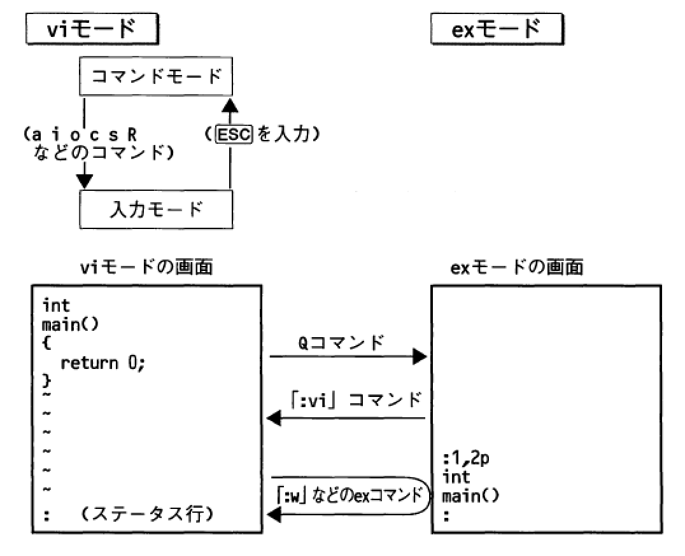

# vim

## 起動と終了

### vim (vimの起動)

```bash
# 起動
vim
# ファイル名を指定して起動
vim ファイル名.txt
```

* 各行頭に表示されている`~`記号は、この表には何もデータがなく、空行であることを表す
* 最下行は`ステータス行`と呼ばれる
    * vimからの各種メッセージが表示される
    * exコマンドなどを実行する際のCLIとして利用される
        * exコマンドを実行する際には、ステータス行の行頭に` : `のプロンプトが表示される
* 引数のファイルには新規の(まだ存在していない)ファイルを指定可能
    * その場合は、vimの初期画面は前述の行頭の`~`が表示される空のファイルの画面になる
* 引数で指定した新規のファイル名は、編集した内容を保存する際のファイル名として`予約`される
    * 保存動作を行うまで、実際のファイルには書き込まれない

### 各種モード

* vimはモードを持つ
* vimでの編集作業は、コマンドモードと入力モードを切り替えながら行う
    * `コマンドモード`: vimを起動した直後の状態
    * `入力モード`: 編集を行う状態
    * `exモード`: ラインエディタのモード
        * exモード上のコマンドも適宜利用する
        * vimのコマンドモードから`:`に続いてコマンドを入力する
        * その１コマンドだけがexのコマンドとみなされる
        * exコマンドモードには切り替えずにexコマンドを実行
        * 可能通常はこの方法を利用する
        


### exモードへの移行と、vimモードへの移行

* exモードに移行
* コマンドモードで`Q`を入力
    * exモードでは、画面の左下に`:`プロンプトが表示される
    * ここにexコマンドを入力しながら編集を進める
* exモードからvimモードに戻るには
    * `:`のプロンプトに対して`vi`と入力

### :q (vimの終了)

* `:q`
    * vimを終了する
    * `:quit`でも可
* `:q!`
    * 編集内容を破棄してvimを終了する
    * `!`は`強制実行`の意味
* 実際には`:`を入力すると、１コマンドだけexコマンドを入力できる状態になる
* そこに`q`と言うexコマンドを入力するとvimが終了する
* vimを起動中に編集した内容がまだ保存されていない場合は、`:q`では終了不可
    * 保存をするか`:q!`で変更内容を破棄して終了する

### コマンドのルール

* `:q`コマンドなどのexコマンドは、そのコマンド名が確定するのに十分な文字数だけ入力
    * 例: `:q`コマンドは正式には`:quit`というコマンド
        * `:q`と入力するだけで実行可能
            * `:q`で始まるexコマンドは`:quit`しかないため
            * `:set`コマンドなどの場合
                * `:s`(文字列の書き換え)や、`:sh`(シェルエスケープ)などのコマンドが存在する
                * `:set`を実行するには`:se`まで入力する必要がある

## :w (編集内容をファイルに保存)

* `:w`
    * 編集内容をファイルに保存する
* `:w file`
    * 編集内容を`file`という名前のファイルに保存する
* `:wq`
    * 編集内容をファイルに保存して、vimを終了する

```text
vimの起動時に引数なしでファイルを指定していなかった場合
ファイル名が決定していないためエラーが表示される
この場合は、`:w file`のように`:w`コマンドの引数で保存するファイル名を指定する
```

### 編集内容をファイルに保存してvimを終了する

* `:wq`コマンド
    * `:w`と`:q`を連続して実行するコマンド
    * 編集内容をファイルに`保存すると同時にvimを終了`する
    * ただし、ファイルの内容を修正していない場合でも、常に書き込みが行われる
        * ファイルのタイムスタンプが更新されてしまう
    * 通常は後述する`:x`または`ZZ`コマンドを使ってvimを終了する

### Vimの文字コードを修正する

* vimの文字コードを確認する

```bash
# vimのコマンドモードで以下のように入力してEnterを押下
:set enc?
# ファイルの文字コードを確認するには以下のように入力
:set fenc?
# エンコードを指定して保存し直す
:set fenc=utf-8
```

### 設定ファイルを変更

* vimの設定ファイルに保存しておく
    * 毎回文字コードを変更する手間を省く
    * 設定ファイル: `~/.vimrc`

```text
---- vi追記 ----
set encoding=utf-8
set fileencodings=iso-2022-jp,euc-jp,sjis,utf-8
set fileformats=unix,dos,mac
```

```bash
# 保存したら、設定反映
source ~/.vimrc
```
