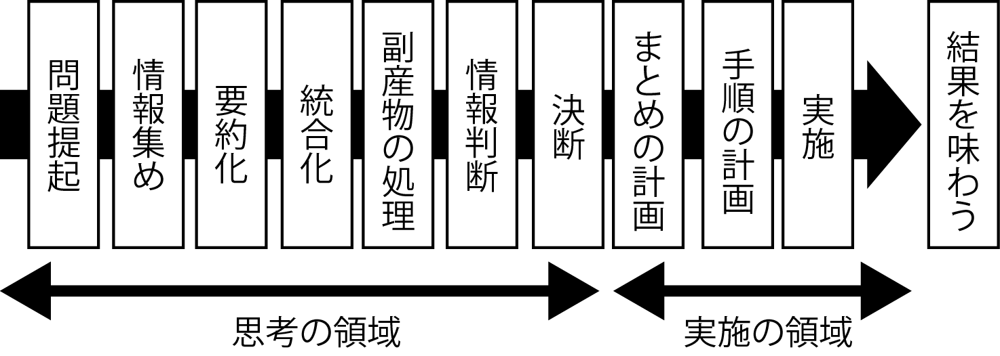

## 各種概要

* [about](about)

## カットオーバー

**効果が数字になって現れる時期までがプロジェクト**

* 数字が出るまでがプロジェクト
* 結果を評価する
    * 瞬間の1つは発注主である企業・組織が具体的な数字として情報システム化投資の効果を確かめる
* カットオーバーを経て運用が開始された後、実際の効果が得られたかどうかを評価してはじめて、その投資が成功だった否かが判断されるべき
    * 運用が軌道に乗ると以後の評価を軽視しがち
* 現在は情報システムへの投資が他の投資案件と同列に評価されるようになった
    * 以下を実施する企業が増加
        * 情報システムへの投資を運用開始の一定期間後に必ず実施する
        * 定期的に運用開始後のシステムについてその効果を追跡評価する

## 効果の基準

* そのコンピュータを使う業務やユーザーの仕事のやり方がどれだけ変わったか
    * コンピュータの機能がどれだけ高度化したかではない
    * さらに言えば、カットオーバーの次の決算期に発表されるその企業の業績が向上しているか、株価が上がっているか

## TODO

* プロジェクトの`成果はいつ計測してほしいか`を積極的にアピール
* `どんな効果`が、`どんな数字`になって`いつどこで現れるのか`をはっきりと示す
    * 事務工数の削減案件であれば、残業代が減る
    * しかし、カットオーバー直後の現場は不慣れな事務に追われており、かえって工数が増えていることがほとんど
    * 実際の効果はカットオーバー直後でなく、例えばその次の四半期の残業代を昨年の実績と比較して計測するのが妥当
    * 計測の結果は、カットオーバーから7ヶ月目にあられる実績数字で評価することになる

## 仕事の12段階

* 川喜多二郎氏: 『発想法』
    * 川喜多二郎氏: KJ法の考案者
* 投資の目的である業績への寄与が確認されてはじめて、起案から開始した1つのサイクルが完了する

