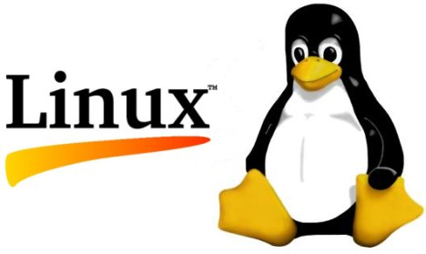

# Linux

## 基本知識

* OSの一種
    * LinuxとUNIXは、基本的な概念は共通
        * ただしLinuxはUNIXではない
        * The Open Groupと言う団体が定める技術仕様を満たして認証されたOSだけがUNIXを名乗れる
    * UNIXの基本的な技術仕様であるPOSIXにしたがって作られたOS
        * UNIX風OSと呼ばれる

## OS

* OS: オペレーティングシステム
    * コンピュータの利用に必要な基本的なソフトウェア
    * 新品のPCにもWindowsやOS XといったOSが最初からインストールされていて、スマートフォンのAndroidやiOSもOS

* AndroidはGoogle社が開発しているスマートフォンやタブレット用のOSとライブラリ
    * 中核部分にはLinuxが使用されている
* iOSはAppleのiPhoneやiPadで動作するOS
    * Linuxと同じくUNIX系OS

### OSの役割

* ハードウェアの利用環境を提供
* コンピューターの資源管理

### プログラムは機械語

* コンピューターのCPUが実行するプログラムは、機械語で書かれている

### インタープリタ

* プログラムを実行する方式にはコンパイラとインタープリタの２通りがある
    * コンパイラ方式
        * 実行ファイルの形で配布
        * 実行速度が速い
        * 改良・編集に手間がかかる
        * 学習が難しい
        * C、C++、Java、Objective-Cなど
    * インタープリタ方式
        * 人間が書いたコードをそのまま配布
        * `インタープリタ(翻訳機)`と呼ばれるプログラムが一文ずつ解読しながら実行する
        * コンパイラ方式に比べると実行速度は遅い
        * コードをそのまま配布するために改良・修正が容易なのがメリット
        * PHP/JSなどが該当
            * Webブラウザに内蔵されたインタープリタが読み込んで実行している
        * Webに関するプログラミング言語の多くがインプタープリタ方式
            * Webの世界では素早い改良・修正が要求されるため

### オープンソース

* 誰もがソースコードの開発に参加できるのが
* このソースコードを公開して、誰もがアクセスできるようにした形態
* ソースコードが公開されていることにより、バグ(プログラムのミス)を発見したり、修正を迅速に行うことが可能

### LinuxはマルチユーザーのOS

* マルチユーザーシステム
    * ネットワークを介して大勢のユーザーが同時に１つのシステムを利用なシステム
    * Linuxは最初から、複数のユーザーが同時に利用できる

### LinuxはマルチタスクのOS

* マルチタスク
    *  CPUの処理を細切れにして、ごく短時間で素早く切り替えながら処理する
* Linuxでは多数のソフトウェアが同時に動作
    * すべてのプログラムが同時に実行されているように見えるのはこのため
    * タスク: コンピュータ上の処理の単位
