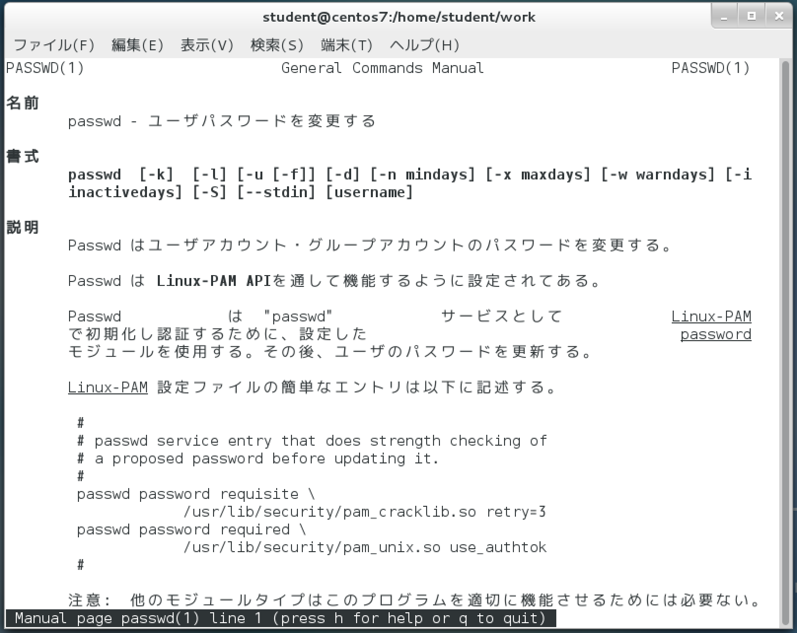
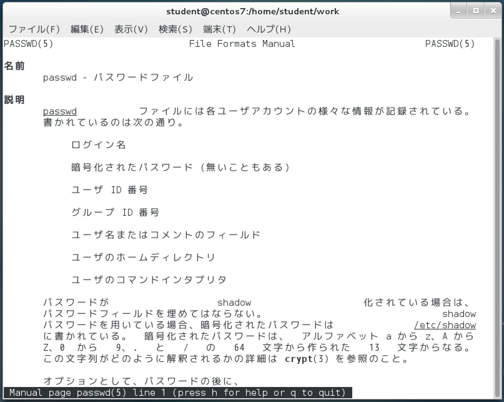
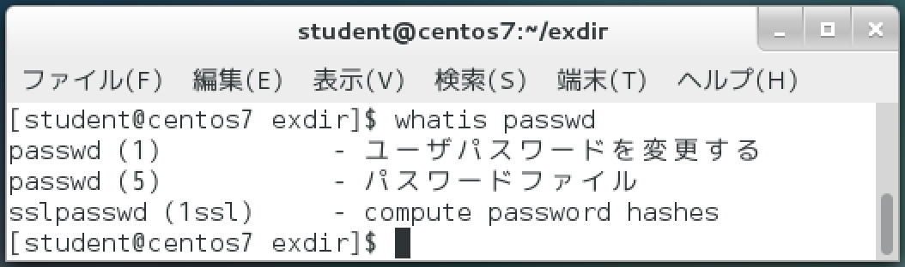
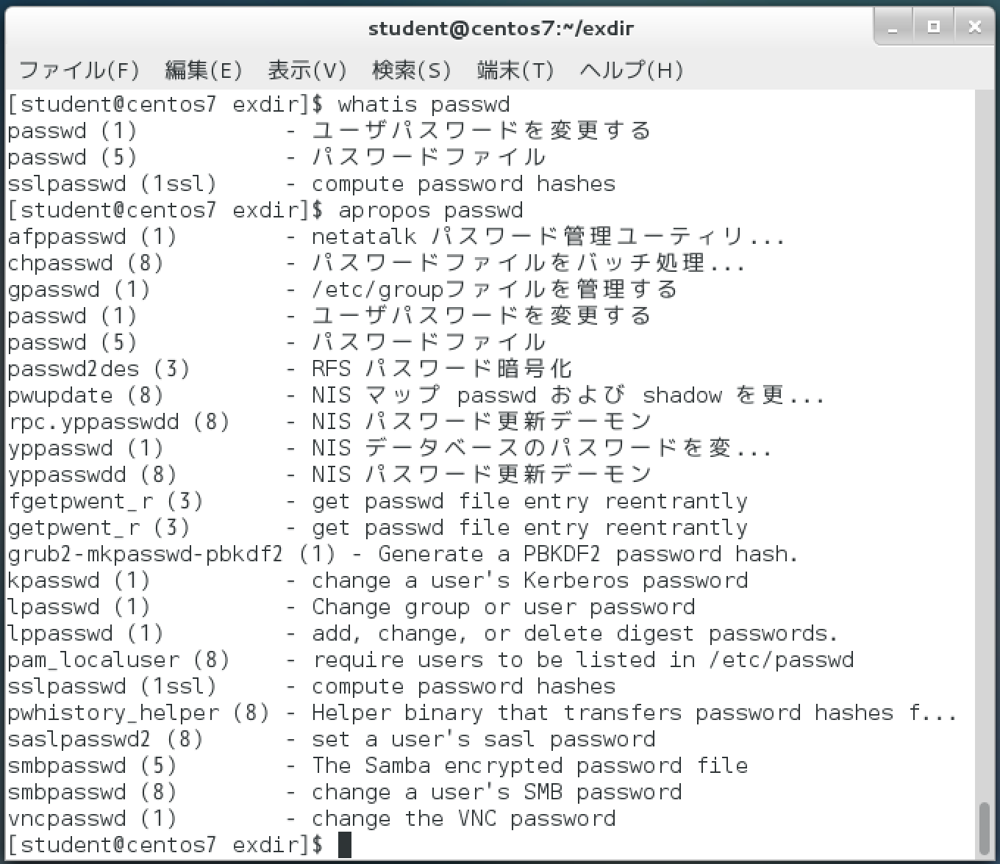

# ヘルプ

* `--help` オプション
    * たいていのコマンドはヘルプが表示される
    * 表示されないものある
        * その場合オンラインマニュアルを使う
    * オプションや引数の使い方を間違えた時にもヘルプが表示されることがある
* `man` コマンド
    * オンラインマニュアルを表示する
* セクションを指定してオンラインマニュアルを表示すること可能
* オンラインマニュアルを検索するには、whatisコマンドやaproposコマンドを使う

## ヘルプを参照する

```bash
#例としてgzipのヘルプを表示
gzip --help
```

## オンラインマニュアルを参照する

* `man`コマンド
    * MANual
* `q` で終了
* ヘルプよりも詳しい使い方を読みたい場合に利用
    * オンラインと言っても、システムにインストールされているもの
    * ネットワーク経由でどこかに観に行くわけではない
* オンラインマニュアルは一般的に、/usr/share/manディレクトリ以下に格納されている
* オンラインマニュアルには、次のような事柄が詳しく記されている
    * コマンドの書式
    * コマンドの説明
    * オプションの説明
    * 関連項目
* 設定の変更で`日本語`することもできる

```bash
man	コマンド名またはファイル名
```

```bash
#例: lsコマンドのオンラインマニュアル
man ls # q で終了
```

manコマンド表示中の操作 (less と同じ)

| キー操作 | 説明 |
|:----|:----|
| ↑ | 上方向に１行スクロールする |
| ↓ | 下方向に１行スクロールする |
| スペース | 次のページに移動する |
| [F] | 次のページに移動する |
| [B] | 前のページに移動する |
| [Q] | manコマンドを終了する |

### マニュアルのセクションを指定

* マニュアルは幾つかのカテゴリーに分類されている。
* この分類をセクション(章)という
* １、５、８はよく使う
* ページ左上の`コマンド(数字)`がセクション

| セクション | 説明 |
|:----|:----|
| 1 | 誰でも実行できる一般ユーザーコマンド |
| 2 | システムコール(カーネルの関数) |
| 3 | ライブラリ関数 |
| 4 | デバイスファイル |
| 5 | ファイルの書式 |
| 6 | ゲーム |
| 7 | その他 |
| 8 | システム管理コマンド |
| 9 | Unix独自のカーネルルーチン用ドキュメント |

#### 全セクションを参照

```bash
man passwd
```



#### ファイルの書式を収めたセクションを参照

```bash
man 5 passwd
```




### マニュアルを検索

* `whatis` コマンド
    * マニュアルに存在するセクションが不明な場合に利用
    * マニュアルの見出し行(１行説明)だけを抜き出して表示する
* `apropos` コマンド
    * whatisコマンドよりも広く検索できる
    * aproposコマンドは、指定されたキーワードが含まれる１行説明をすべて表示
        * つまり、説明文にマッチする文字列があった場合にもヒットする
    * 実行するにはあらかじめ`makewhatis`コマンドを実行しておく必要がある
    * 通常は自動的に実行されている
    * システムのインストール直後の場合などでは、まだ初回の実行が終わっていないことがある
    * その場合はrootユーザーでmakewhatisコマンドを実行

### whatis

```bash
#passwdをキーワードとして検索する
whatis passwd
```



### apropos

```bash
apropos	passwd
```

