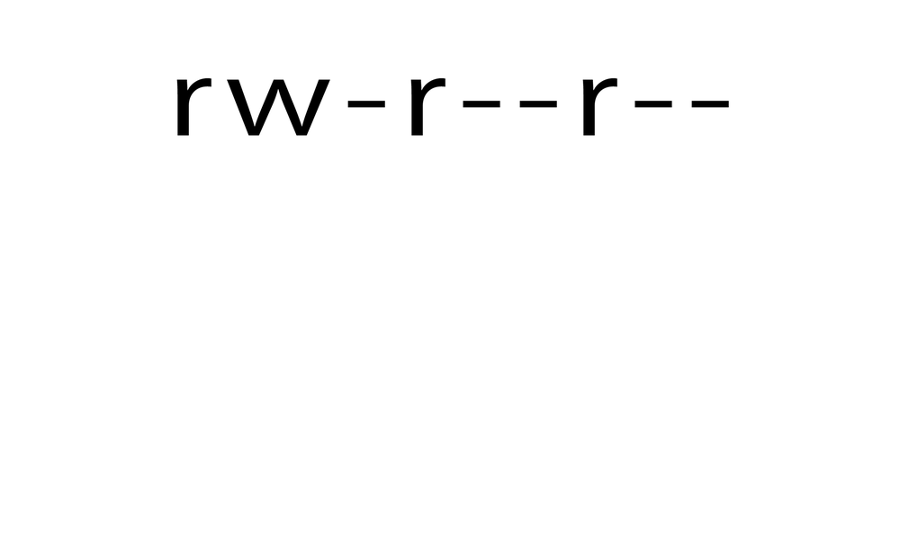
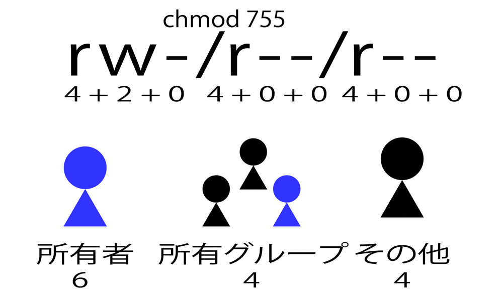

# 権限の操作

* 全てのファイルやディレクトリにアクセス権が設定されている
* これをパーミッションという
* `誰`が`何`をできるか
    * 誰が
        * `u` ファイルの所有者
        * `g` 所有グループ
        * `o` その他のユーザー
    * 何を
        * `r` 読み取り可能 (Read)
        * `w` 書き込み可能 (Write)
        * `x` 実行可能 (eXecute)
* rootユーザーは、どのファイルも読みこみ/書込み/実行が可能
    * ファイルやディレクトリのパーミッションを設定を無視できる

## パーミッションの読み方

* `ls -l` で確認
    * 計9字で表現される
        * `r`,`w`,`x`,`-` の組み合わせからなる3字
    * 各権限は数値でも表現できる
        * `r` ＝ `4`
        * `w` ＝ `2`
        * `x` ＝ `1`

```bash
ls -l # 確認コマンド
```



## パーミッションを変更

* `chmod` コマンド
    * CHange MODe
    * 実行できるのは以下
        * 操作対象となるファイルやディレクトリの所有者か
        * rootユーザー
* 数値か記号を使って指定する
    * 数字: `755`や`644`etc
    * 記号: `r` や `w` や `x`
        * 誰に
            * `a` 全てのユーザ
            * `u` ファイルの所有者
            * `g` 所有グループ
            * `o` その他のユーザー
        * どうする
            * `+` 追加
            * `-` 削除
            * `=` 指定
        * 何を
            * `r` 読み取り可能 (Read)
            * `w` 書き込み可能 (Write)
            * `x` 実行可能 (eXecute)



```bash
chmod [-R] アクセス権 ファイル名/ディレクトリ名
```
    
```bash
touch test.text    # まずは適当なファイルを作成する
ls -l # rw-r--r--    作成直後のパーミッション 644
chmod 000 test.txt # 全ユーザの全権限を剥奪
ls -l # ---------    誰も読めない書けない実行できない
chmod 111 test.txt # 所有者とグループとその他に対して実行権限を与える
ls -l # --x--x--x
chmod a=w test.txt # 全ユーザに書き込み権限だけ与える
ls -l # -w--w--w-
```

## パーミッションの差異

* ファイルとディレクトリにはパーミッションの差異がある

### 読み取り権

* ファイル
    * ファイルの内容をcatコマンドなどで読み出し可能
* ディレクトリ
    * ディレクトリ内のファイル名一覧を読み取り可能
    * ディレクトリ内のファイルにアクセス不可
    * cdコマンドで移動は不可

### 書き込み権

* ファイル
    * ファイル内容を変更可能
* ディレクトリ
    * ディレクトリ内でファイルを作成可能
    * ディレクトリ内でファイルを削除可能
        * ファイルに書き込み権がなくても、ディレクトリ内のファイルは削除可能

### 実行権

* ファイル
    * プログラムとして実行可能
* ディレクトリ
    * ディレクトリ内のファイルにアクセス可能
        * HPでapacheユーザにアクセス権限を与える時は`r`ではなく`x`
    * cdコマンドで移動できる

