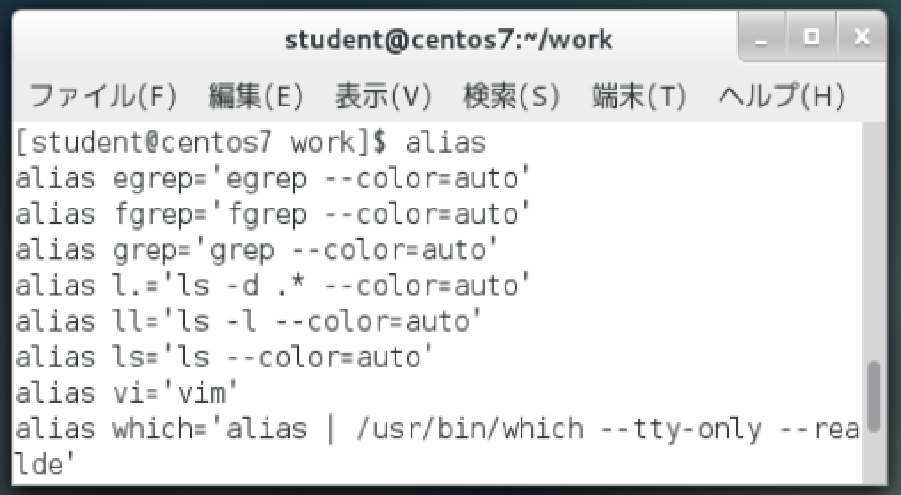

# エイリアス

* コマンドにつける別名
* よく使うコマンドの短縮呼び出しを実現
* 設定したエイリアスが有効な範囲は、設定したシェルの上だけ
* エイリアスを一時的に無効にすることも可能
    * 実行コマンドの直前に `\` をつける
    * 例: `\ls`
* シェルを終了すると、エイリアスの定義も消える

## エイリアスの設定を確認

```bash
alias # 引数を何もつけずに実行すると、定義済みのエイリアスが表示される
```



## エイリアスを登録する

```bash
alias [エイリアス='コマンド[オプション 引数]']
```

例：ホームディレクトリのパスを表示する「home」を定義する

```bash
alias home='echo $HOME' # ホームディレクトリのパスはシェル変数HOMEに格納されている
```

## エイリアスを削除する

シェルを終了すると、エイリアスの定義も消えるが削除コマンドも存在する

```bash
unalias	エイリアス名
```

## エイリアスの永続化

* `~/.bashrc` に記述する
    * `~/.bashrc` : シェルを起動するごとに読み込まれる設定ファイル

```bash
# 記述した設定を反映する
source ~/.bashrc
```