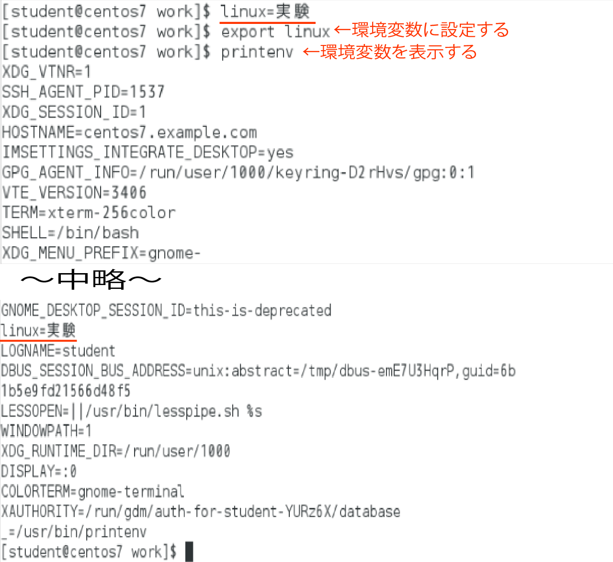

# 環境変数

* Linuxでは、ユーザーごとに、ユーザー環境を設定できる
    * ユーザー環境
        * 利用する言語
        * プロンプトの形
* 環境に関わる情報は、変数に保存される
* 変数は、任意の文字列を格納できる入れ物
* コマンドには２種類ある
    * シェル自身が持っている内部コマンド
    * ファイルの形で存在する外部コマンド

## シェルが利用する変数

| 変数 | 説明 |
|:----|:----|
| HOME | ユーザーのホームディレクトリ |
| LANG | ユーザーの言語環境 |
| PATH | コマンドを検索するディレクトリリスト |
| PS1 | プロンプトの書式 |
| UID | UID (ユーザーID) |
| USER | ユーザー名 |

## 変数の内容を確認

* `echo` コマンド
    * echoコマンドは、引数を表示するコマンド
    * シェルのメタキャラクタがどのように展開されるのか確認するのに便利
* 出力時の変数名には `$` 記号をつける
* 変数の内容を参照するには `${変数名}` のように{}でくくっても構わない

```bash
echo ${変数}
```

### PATH変数の値を表示みる

* `$PATH`
    * シェルが外部コマンドを見つけ出すために使われる
        * コマンド検索ディレクトリのリストが格納されている
    * コマンドが存在するディレクトリがPATH変数に記されていない場合、実行不可
        * シェルはコマンドを見つけることができない
        * コマンドを絶対パスで指定すれば実行可能
        * コマンドの絶対パスは `which` コマンドで調べられる
    * 多くのディストリビューションでは、一般ユーザーのPATHとrootユーザーのPATHは異なる
    * 一般ユーザーのPATH
        * /sbinや/usr/sbinなどシステム管理コマンドのぱすが含まれない

コマンドが実行されるまでは以下の流れ

1. コマンドが入力される
2. シェルはPATH変数に記されたディレクトリ内を検索
3. ディレクトリ内からコマンドを見つける
3. 実行する


```bash
echo $PATH
```

## 変数に値を設定する

* 変数には文字列や数値などを自由に代入可能
    * 指定した名前の変数が既に存在する場合は、上書きされる
* 変数の有効範囲は、変数を定義したシェルの中だけ
* シェルを終了すると、設定した内容は消える

```bash
# スペースを入れない
変数名=値
```

## 環境変数を設定する

* 環境変数
    * 新しいシェルやコマンドでも変数の値を参照できる
    * シェルを起動するごとに変数を設定するのは辛い
    * exportコマンドを使って変数をエクスポートする
        * 新しいシェルを起動すると、環境変数がコピーされるようになる
    * エクスポートしていない変数は、１つのシェル上だけで有効
        * シェル変数

定義済みのシェル変数を環境変数として設定する

```bash
export 変数名
```

変数の定義とエクスポートを同時に行う

```bash
export 変数=値
```

exportコマンドでは、変数名に「$」をつけない

```bash
export linux
```

環境変数を表示するには、printenvコマンドを使う



## ユーザー環境を設定

* シェルは、ユーザーがログインした時に、特定の設定ファイルを読み込む
* ユーザー環境を設定したい場合は、その設定ファイルに変数の定義を追加
    * ユーザーのログイン時には以下のファイルが読まれる
    * `/etc/profile`
        * 全ユーザーに共通する設定ファイル
    * `~/.bash_profile`
        * ユーザーごとに設定できるファイル
        * シェル上で実行できるコマンドで書かれてる
        * シェルは上から順に実行
        * これをシェルスクリプトという

## 独自のHOMEを設定する

~/.bash_profileに設定を追加する

ログイン後は自動的に/home/student/workディレクトリがカレントディレクトリになる

```bash
cd $HOME/work
```


