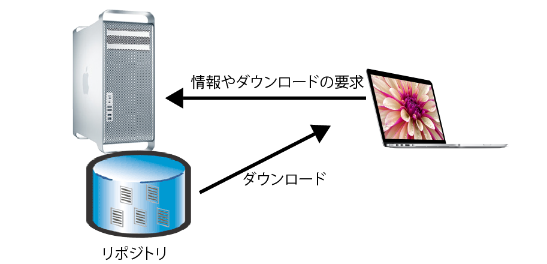

# ソフトウェアのインストール

* [RPM](01)
* [yum](02)

## 概要

* 大半のLinuxディストリビューションでは、ソフトウェアをパッケージという単位で管理する
    * パッケージの形式にはRPMパッケージ、debパッケージなどがある
* パッケージ管理システムは、パッケージの依存関係情報を管理する

## パッケージとは

* ソフトウェアをインストールする単位
    * パッケージを使わないソフトウェアインストールも可能
        * 元来、オープンソース・ソフトウェアはソース・アーカイブでの公開が主
            * `ソース・アーカイブ`: パッケージ化されていない形
                * プログラムのソースコードや関連ファイルをまとめたファイル
        * 管理の手間がかかる
    * ソフトウェアの多くは、ライブラリを利用して作られている
        * `ライブラリ`: 他のプログラムに利用されるプログラム部品
* パッケージを管理する仕組みがパッケージ管理システム
    * ソフトウェアのインストールに使用する

下をまとめて１つの単位として扱う

* 実行ファイル
* マニュアル
* 設定ファイル
* ライブラリ

## パッケージの基本

* ネットで配布されているソフトウェアには以下がが含まれている
    * 実行ファイル
    * マニュアル
    * ドキュメントファイル
    * 設定ファイル
    * 関連ライブラリ
* これらをまとめて、簡単にインストールできるようにしたもの
* 大半のLinuxディストリビューションでは、ソフトウェアをパッケージという単位で管理

### パッケージの分類

* パッケージはディストリビューションごとに異なる
    * RPMパッケージ
        * Red Hat系ディストリビューションで使われる
    * debパッケージ
        * Debian系ディストリビューションで使われる
* RPMパッケージとdebパッケージには互換性がない
    * RPMパッケージをDebianにインストールできない
    * debパッケージをCentOSにインストールできない

## 依存を解決する役割

パッケージ管理システムが依存関係を管理する

### 依存とは

* プログラム本体をインストールしても、ライブラリがインストールされていなければ、プログラムを実行することができない。
* プログラムが動作するために、別のソフトウェアを前提としていることもある
    * プログラムAがプログラムBを必要としている時、`AはBに依存している`
        * AとBのバージョンにズレがあると、正常に動作しない
* ソフトウェアをパッケージで管理する場合、パッケージには依存関係情報も含まれている

### 依存の解決

* 以下の操作の際に警告を出す
    * パッケージをインストール
    * パッケージをアップグレード
    * パッケージをアンインストール
* 依存関係情報を確認し、以下のケースで警告を出す
    * 必要なパッケージが足りない場合
    * 依存関係が損なわれる場合
