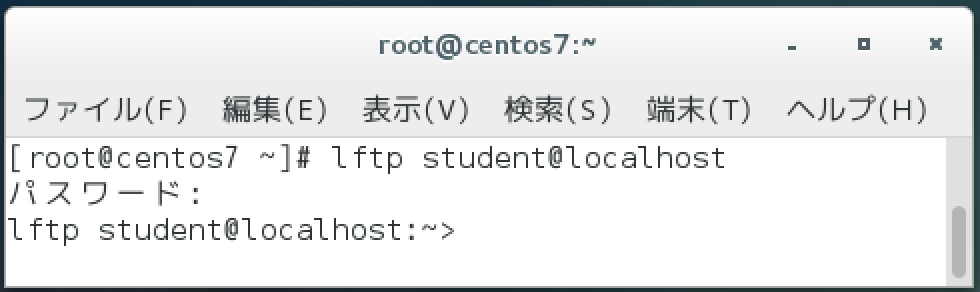
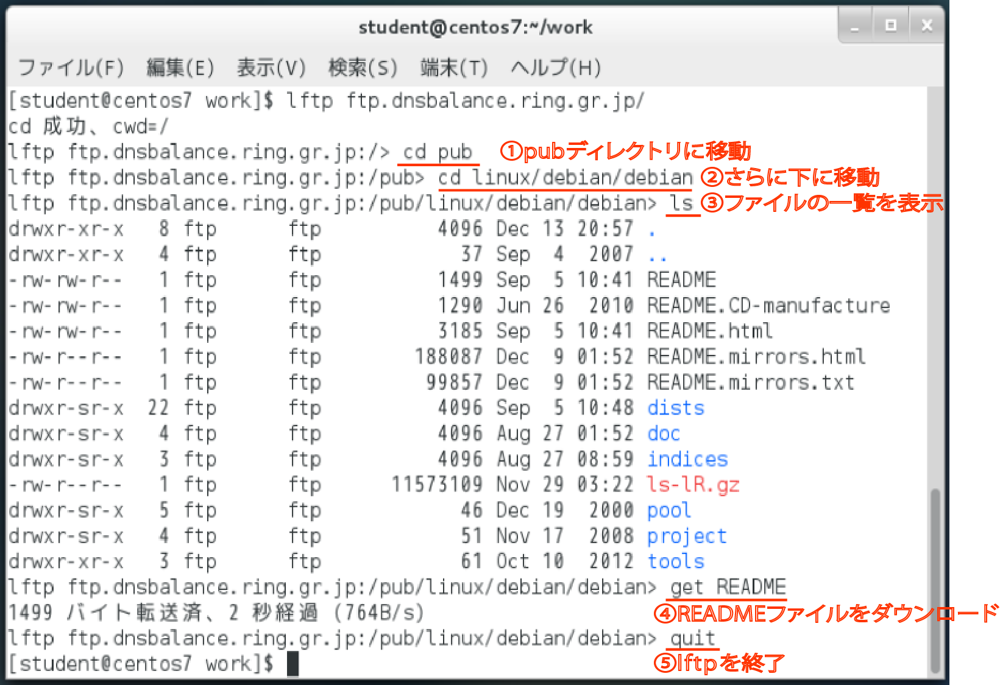

# FPTサーバを使う

## vsftpdをインストール

* CentOSではvsftpd (very secure ftpd)というFTPサーバーが標準的に用意されている
    * 末尾の「d」はdaemonの「d」
        * デーモン：常駐ソフトウェア
* vfstpdをインストールするには、rootユーザーで次のコマンドを実行する

```bash
sudo yum -y install vsftpd
rpm -q vsftpd #正しくインストールできたか確認
#vsftpdのバージョン番号が次のように表示されればOK
```

* 失敗する場合
    * NATになっていることを確認
    * スーパーユーザーとなり以下のコマンドを実行
    
```bash
yum clean all
```

## vsftpdの設定

* 設定ファイル`/etc/vsftpd/vsftpd.conf`で行う
    * 設定ファイルの`.conf`という拡張子は`configure(設定)`の略
    * 設定ファイルの変更にはrootユーザーの権限が必要
    * 編集する前に、ファイルのバックアップをとる
        * 何か不具合があった時に簡単に元の状態に戻せる

```bash
su
cp /etc/vsftpd/vsftpd.conf /etc/vsftpd/vsftpd.conf.bk
```

[FTP設定ファイルの書き換え](FTP_SED.md)

## vsftpdを起動

* `systemctl` コマンド
    * サービス管理コマンド
* activeと表示されれば、vsftpdは稼働している
* `netstat`で
```bash
sudo systemctl start vsftpd.service
is-active vsftpd.service #起動の確認

netstat -at | grep 'ftp' #開いているポートを確認
tcp 0 0.0.0.0.0:ftp 0.0.0.0:* #このような結果であればOK
```

### 自動起動にもできる

* 再起動したら、再度vsftpdを手動で起動しなければならない
    * システムを起動するとvsftpdも自動的に起動されるように設定できる
* 手動で起動は、作業漏れが発生する
* 自動化できるところは、極力自動化する

```bash
systemctl enable vsftpd.service
systemctl list-unit-files #各サービスの自動起動を確認
```

## FTPクライアントコマンドでアクセス

* `lftp` コマンド
    * CentOSでFTPサーバーにアクセスする
    * 無い場合はインストール
* 接続先ホストには、ホスト名かIPアドレスを指定

```bash
lftp [ユーザー名@]接続先ホスト名またはIPアドレス
```

```bash
yum -y install lftp
lftp student@localhost #studentユーザーとしてFTPログイン
#パスワードを聞かれるので、passwordと入力
```

以下の画像のようにプロンプトが変化したら成功



### FTPコマンド

* FTPログイン時に利用できるコマンド
* FTPコマンドはLinuxのコマンドと似ている
* FTPサイトに接続後は、サブコマンドを使って対話的に操作する

```bash
lpwd #FTPサーバでの現在位置を表示
```

## ダウンロードをしてみる

* FTPサイトftp.dnsbalance.ring.gr.jpに接続
    * このFTPサイトは、RingServerプロジェクトのもの
    * 様々なフリーソフトウェアの配布サーバーを運用している
* ディレクトリpub/linux/debian/debian以下にあるREADMEファイルをダウンロード

```bash
lftp ftp.dnsbalance.ring.gr.jp/
cd pub
cd linux/debian/debian
ls
get README  # READMEファイルをダウンロード
quit        # lftpを終了
```




