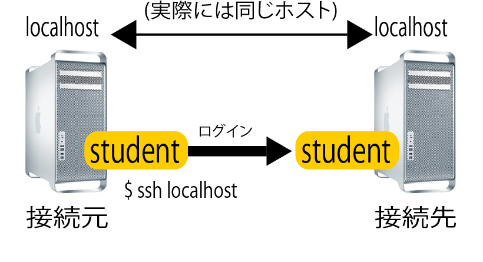

# リモート接続

## SSHで接続する

* `ssh` コマンド
    * SSHでリモートホストに接続する
* 接続先ホストは、ホスト名かIPアドレスで指定

```bash
ssh	[ユーザー名@]接続先ホストまたはIP
```

```bash
#例: ホストcentos7.example.comに接続する場合
ssh teacher@centos7.example.com
```

### ユーザ名の省略

* ユーザー名の指定を省略した場合
    * 自分自身として、接続先ホストにログインする
        * 自分自身: sshコマンドを実行したユーザー
    * そのユーザーが接続先ホストに存在する必要がある

```bash
#例: ユーザ名を省略
ssh centos7.example.com
```

```bash
[student@centos7 ~]$ ssh centos7.example.com #studentユーザーが実行
[student@centos7.example.com ~]$ #ホストに登録されたstudentユーザーとしてログイン
```

### ポートの指定

* `p` オプション
    * SSH接続をするポートを指定する

```bash
ssh アカウント@サーバー -p ポート番号
```

#### サーバーに直接コマンド入力

```bash
ssh ${IP} '実行したいコマンド'
```

例

```bash
#サーバ上でのコマンドの実行結果をローカルのファイルに保存
ssh ${IP} '実行したいコマンド' > /tmp/hoge.txt
```

```bash
#サーバ上でのMySQLの実行結果をローカルのファイルに保存
IP=127.0.0.1
DB_HOST='localhost'
DB_USER='root'
DB_PASS='pass'
DB_NAME='user'
SQL='SELECT login_id FROM account WHERE login_id'

ssh ${IP} "mysql -u ${DB_USER} -p${DB_PASS} -h ${DB_HOST} -D {DB_NAME} -e ${SQL}" > /tmp/hoge.txt
```

#### 公開鍵認証

* 公開鍵認証
    * 公開鍵番号方式を利用した認証
    * パスワードの代わりに公開鍵と秘密鍵というデータを使用
        * パスワードは、接続先サーバーでのユーザーパスワード
        * 予め接続先サーバーのユーザー名とパスワードを聞いておく必要がある
    * パスワード認証よりも安全性が高い

* `ssh-keygen`
    * 事前に鍵を生成しておく必要がある
* `ssh-add`
    * 事後に鍵のパスワードを追加する
        * 鍵でSSH接続する際にパスワードを聞かれなくなる
    * PCを再起動すると消えてしまう

```bash
#鍵の生成
ssh-keygen -t rsa -C comment -f id_rsa_file_name
```

```bash
cat ~/.ssh/config
Host コマンドで指定したいホスト名
    Hostname IPまたはホストメリ
    User ユーザ名
    IdentityFile ~/.ssh/場所/名前
```

```bash
#記述の例: prdと指定した場合にproduction環境用の鍵を使用する
cat ~/.ssh/config
Host *-prd*
    IdentityFile ~/.ssh/production
```

```bash
ssh-add パス
#登録されているか確認したいときは以下
ssh-add -l
```

## ローカルホストにSSH接続してみる

* 概要
    * 練習でローカルホスト(仮想マシン自身)にログイン
    * ローカルホストはlocalhostというホスト名で表される
* 手順
    * ローカルホストに割り当てられたIPアドレスを調べる
        * `ifconfig | grep 'inet'`など
        * `ip addr | grep 'inet'`
    * ポートが開いているか確認する
        * `netstat -at`
    * 接続する
        * パスワードを尋ねられる
        * 自分のパスワードを入力
            * 今回は自分自身に接続しているため
```bash
ssh localhost
#The authenticity of host 'localhost (127.0.0.1)' can't be established.
#ECDSA key fingerprint is ...
#Are you sure you want to continue connecting (yes/no)? yesと回答する
```

```bash
#SSHでの接続状況を確認する(開いているポートを確認する)
netstat -at | grep '127.0.0.1' #stateがESTABLISHとなっていることを確認
```

ここで再現した状況は以下の図の通り



## ホスト名の登録

IPアドレスの代わりにホスト名でアクセスできるようにする

* DNSサーバーへの登録
* `/etc/hosts`ファイルにIPアドレスとホスト名の対応を記載
    * そのコンピューター上でだけIPアドレスの代わりにホスト名を使えるようになる

```bash
cat /etc/hosts
127.0.0.1 localhost.localdomain localhost
192.168.1.10 test1
192.168.1.20 test2
```

## 接続を終了する

```bash
exit
```
