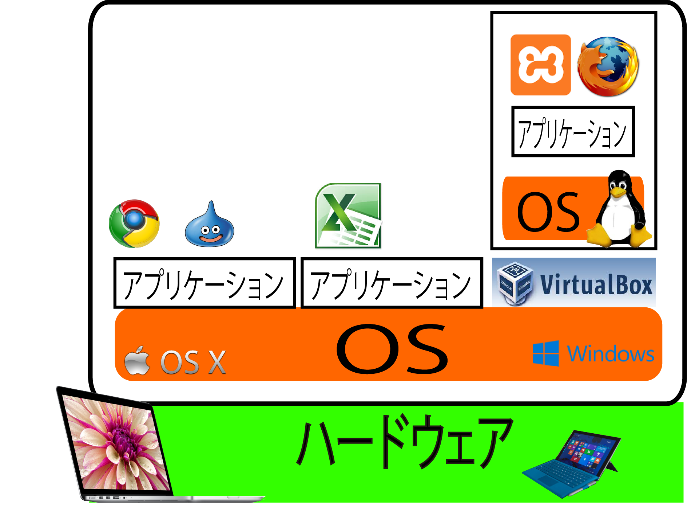

# 仮想環境

## 仮想マシン

## 前提条件

* 利用するCentOS 7は64bit専用
* そのため、仮想マシンを動かすためのパソコンも64bitである必要がある
* ここから先に進める前にOSが64bitかどうか確認

### 概要

* 仮想マシンとは、ソフトウェア的に再現されたコンピュータのこと
* 仮想マシンの上でLinuxを動かすことで、１アプリケーションのようにLinuxを扱うことが可能
    * VirtualBox
        * VirtualBoxはフリーで提供されているソフトウェア
        * オラクル社が開発
    * Docker

