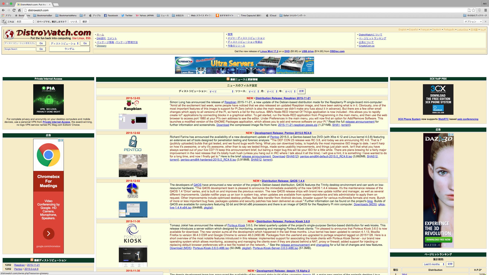

# ディストリビューション

## 概要

* 利用者に配布できるLinux製品
    * * distribute ＝ `配布する`という意味
* １つのOS製品としてまとめ上げたソフトウェアパッケージ
    * 多数のオープンソースソフトウェアや、商用ソフトウェアを組み合わせ
* カーネルと様々なソフトウェアをまとめたもの
    * 前述のようにLinuxは厳密にはカーネルのみを指す
    * カーネルだけでは、OSとして使い物になならない
        * エンジンだけでは自動車にならないのと同じ
* 一般的にはLinuxディストリビューションを「Linux」と呼ぶ
* ディストリビューションの提供元をディストリビューターという
* 利用者は自分の目的に合わせて最適のディストリビューションを選択

## 用途に合わせたディストリビューション

* 企業向け(エンタープライズ)
* 個人のデスクトップ向け
* 学校向け、教育向け
* トラブル対応用
* 古いPC用

## ディストリビューションの動向

* `Distrowatch`というサイトでチェックできる
    * http://distrowatch.com/

## ３つの系統

パッケージ管理システムの差異で３つに大別

* Red Hat (レッドハット)系
* Debian (デビアン)系
* その他

### Red Hat系

パッケージ管理システムは`RPM`

* Fedora(フェドーラ)
    * Fedora Projectというコミュニティをベースに開発されている
    * 無償
    * 最新のソフトウェアがいち早く導入される傾向
    * とりわけ個人ユーザーに人気
* Red Hat Enterprise Linux
    * Red Hat社が提供する企業向け
    * 略して、RHEL
    * Fedoraの成果を取り入れ、より安定したソフトウェアを使用して作られている
    * 企業では少し古くても安定したソフトウェアが求められる
    * サポートと合わせて有償で提供
    * メジャーアップデートは数年に１度で、サポート期間も７年と長期間
* CentOS
    * Red Hat社が商標を持つものをRHELから削除し、オープンソース・ソフトウェアのみで再構成
    * 基本的にはRHELとほぼ100%の互換性を持つ
        * ソフトウェアのアップデートにはRHELより遅れが生じる
    * コミュニティベースで開発
    * 無償

### Debian系

* Debian GNU/Linux (デビアン・グヌー・リナックス)
    * フリーソフトウェアのみを厳密に用いて作成されている
    * GNU: フリーソフトだけでUNIX互換の環境を作り上げることを目標とするプロジェクト
* Ubuntu
    * Debian GNU/Linuxから派生したディストリビューション
    * Canonical社によって作成され、無償で提供されている
    * 使いやすさを追求して作られているため、とりわけデスクトップ用途で人気
    * 半年に一度という早いペースでリリース
        * 最新のソフトウェアを使うことができる
    * デスクトップ版と、サーバー版が提供されている
    * LTS (Long Term Support)版がリリースされる
        * LTS: ２年に１度、５年間のセキュリティアップデートが受けられる
* Linux Mint
    * Ubuntuをベースとする
    * マルチメディア関連が強化されている
    * Ubuntuとは異なる独自のデスクトップを用意し、海外で高い人気
* Edubuntu
    * Ubuntuの公式派生ディストリビューション
    * 教育(education)関連のソフトウェアが充実
        * 学校や児童の家庭で使われることを想定している

## その他

* Slackware (スラックウェア)
    * 最も古くからあるディストリビューション
        * 20年以上の歴史がある
    * 非常にシンプルなパッケージ管理システム
    * 派生ディストリビューション: 軽量ディストリビューションのSLAX(スラックす)など
* openSUSE (オープン・スーゼ)
    * ノベル社が支援するコミュニティで開発されている
    * パッケージ管理システムにRPMを採用
    * もともとはSlackwareから派生し発展
* SUSE Linux Enterprice
    * ノベル社が提供するエンタープライズLinux
    * openSUSEの開発成果を取り入れている
* Tiny Core Linux
    * サイズがわずか10数Mバイトしかない軽量ディストリビューション
    * スペックの低いコンピューターでも動作
    * インストールしなくても、CDやUSBメモリから起動して使用可能
