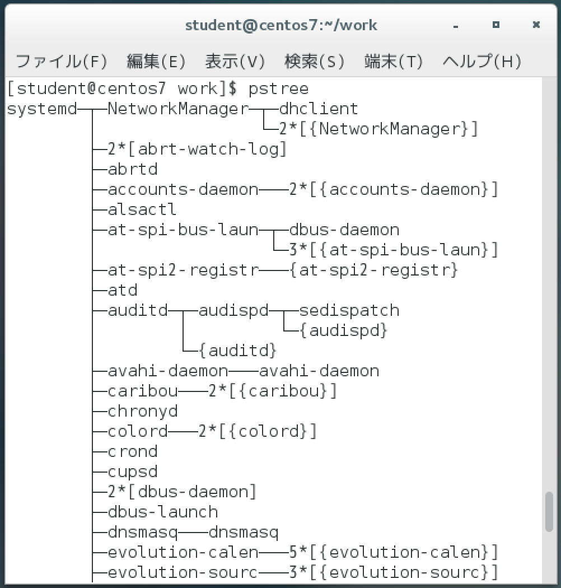

# システム管理

* `ps` コマンド
    * プロセス情報を見る
* `pstree` コマンド
    * プロセスの親子関係を見る
* `&`
    * コマンドをバックグラウンドで実行する
* `kill` コマンド
    * プロセスに対してシグナルを送る
* `killall` コマンド
    * PIDではなくプロセス名を指定してシグナルを送る

## プロセスとデーモン


### デーモンを管理する

#### デーモンとは

* メモリに常駐しているプロセス
* システムサービスやサーバープログラムなどは、systemdというシステムサービスによって管理される
* systemdはsystemctlコマンドを使って管理する
* systemctlコマンドに引数をつけて実行することで操作可能
    * `start`
    * `stop`
    * `restart`
* システムサービスやサーバープログラムの設定を変更した場合は、多くのケースでサービスの再起動が必要

```bash
#例：ネットワークセキュリティを高めるファイヤウォールサービス(firewalld.service)を起動する
systemctl start firewalld.service #通常は自動起動
#ファイヤウォールの再起動
systemctl restart firewalld.service
#ファイヤウォールの停止
systemctl stop firewalld.service
```

| サービス名 | 説明 |
|:----|:----|:----|
| firewalld.service | ファイヤウォールサービス |
| crond.service | 定期的な処理をするcronサービス |
| cups.service | 印刷サービス |
| postfix.service | Postfixメールサーバー |
| rsyslog.service | シスログサービス |
| sshd.service | SSHサーバー |
| httpd.service | Apache Webサーバー |
    
### プロセスとは

* 以下の一連の流れをまとめたもの
    * プログラムを実行
    * メモリが割り当てられる
    * CPUによって処理される
* プロセスには、２種類ある
    * 処理が終了すると消滅するもの
        * 通常のコマンド
    * ずっとメモリ上に常駐し、要求に応じてサービスを提供するもの
    * 各種のシステムサービスやサーバープログラムが該当する

#### マルチタスク

* CPUの処理時間はOSによって短い時間単位で分割され、複数のプロセスに割り当てらる
* これにより、CPU(コア)の数よりも多くのプロセスが同時に処理されているように見える

### プロセスの情報を見る

* `ps` コマンド
    * ProceSs
    * `a` オプション
        * システム上で実行されている全てのプロセスを見る
        * `x`や`e` オプションも同様
    * `u` オプション
        * ユーザーを表示する
    * 通常はオプション指定時に `-`をつけない
        * psコマンドには歴史上の理由から、以下が混在
            * `-` をつけないオプション
            * `-` をつけるオプション
            * `--`をつけるオプション

```bash
#実行した端末上で実行されているプロセスを表示
ps [オプション]
```

bashシェルと、ただいま実行中のpsコマンドの２つが表示されている例

```text
  PID TTY          TIME CMD
   71 pts/3    00:00:00 bash
   77 pts/3    00:00:00 ps
```

```bash
ps aux
```

```text
root@07247a8c2add:/var/www# ps aux
USER       PID %CPU %MEM    VSZ   RSS TTY      STAT START   TIME COMMAND
root         1  0.0  1.0 187660 21400 ?        Ss   09:17   0:02 apache2 -DFOREGROUND
www-data    16  0.0  0.6 187948 13340 ?        S    09:17   0:00 apache2 -DFOREGROUND
〜以下省略〜
```

| 項目 | 説明 |
|:----|:----|
| USER | プロセスを実行しているユーザー |
| PID | プロセスID |
| %CPU | CPUの利用率 |
| %MEM | メモリの利用率 |
| TTY | プロセスを実行した端末 |
| STAT | プロセスの状態 |
| START | プロセスの実行日 |
| TIME | 消費したCPU時間 |
| COMMAND | コマンドまたはプログラム名 |

### バックグラウンド実行

* `&` を末尾に付ける
    * コマンドをバックグラウンドで実行する
        * コマンドの処理が終わるまで次のコマンドを入力不可
        * 処理の長いコマンドをバックグラウンドで実行する
            * すぐに次のプロンプトが表示される
            * 直ちに次のコマンドを入力可能

```bash
#実行に時間のかかるupdatedbコマンドをバックグラウンドで実行
updatedb & #PIDが表示され、バックグラウンドで実行される
```

### プロセスにシグナルを送って制御する

* `kill` コマンド
    * プロセスを終了する
* シグナル
    * プロセスを制御する信号
    * 例: TERMというシグナルを受け取ると、実行されているプロセスは終了する

```bash
kill [-[SIG]シグナル] PID
```

| シグナル | シグナル番号 | 説明 |
|:----|:----|:----|
| HUP | 1 | ハングアップ |
| KILL | 9 | 強制終了 |
| TERM | 15 | 通常終了 |
| CONT | 18 | 一時停止中のプロセスを再開 |
| STOP | 19 | 一時停止 |

* HUPシグナル
    * サーバープログラムやシステムプログラムの設定を変更し、設定ファイルを再度読み込みさせる
* STOPシグナル
    * 受け取ったプロセスは一時停止状態になる
    * その状態はCONTシグナルで解除する
* TERMシグナル
    * 受け取ると、プロセスは終了する
        * 正常な終了処理を行ってから終了する
    * プロセスが異常動作をしているときには、TERMシグナルを送っても終了できない
    * その場合にKILLシグナルを使うと、強制的にプロセスを終了可能
        * 強制終了によって何らかの不具合が残ることがある
        * ファイルの破損などを引き起こす可能性がある
            * KILLシグナルを使うのは最後の手段
            * 正常な終了処理を行わずに終了する

### プロセスの親子関係

* `pstree` コマンド
    * プロセスの親子関係を確認
* プロセスには親子関係がある
    * あるプロセスが別のプロセスによって生み出された時
        * 元のプロセスを`親プロセス`
        * 生成されるプロセスを`子プロセス`

```bash
yum install psmisc #コマンドのインストール
pstree
```



