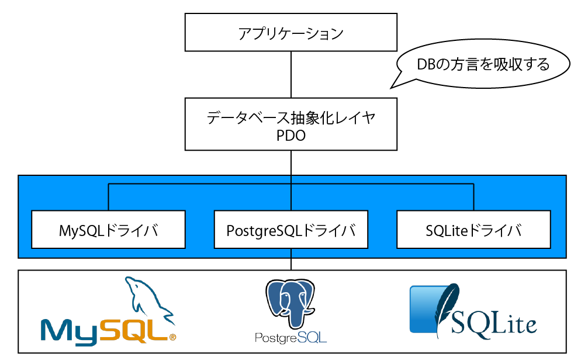

# PDO

## 概要

* PHP Data Object
* PHPで用意されたPHPのプログラム内からDBに接続する`API`
* `ドライバ` (DBを制御する機能)を切り替えることで、複数のDBを操作可能



## 手順

* 事前準備
    * 接続情報の準備
* DBを選択する
* ハンドラを生成する
* 属性の設定
    * DBハンドラの属性の設定
    * エラー属性の設定
    * プリペアドステートメントに関する属性の設定

## 事前準備

### 接続情報の準備

* DBに接続するにはホスト、ユーザー、パス、DB名が必要

```php
// 公開フォルダ/../config.phpの場合
define("USER", "user");
define("PASS", "pass");
define("HOST", "localhost");
define("NAME", "project");
define("TYPE", "mysql");
```

* 次にこのファイルを読み込むファイルを用意

```php
<?php
//公開フォルダ/board/init.php
require_once '../../config.php';
```

## DBを選択する

* DB抽象化レイヤで接続する
    * PDOによる各DBへの接続
* 接続方法はDBごとに**DSN**の構成が異なる
    * なお、オブジェクトを格納する変数は`$pdo`である必要はない
    * `$dbh`でも、`$obj`でもなんでも可

```php
// Mysqlに接続と切断
$pdo = new PDO('mysql:host=localhost;dbname=project;charset=utf8', 'user', 'pass');
// PostgreSQLに接続 (pgsqlは文字コードが設定できない)
$pdo = new PDO('pgsql:host=localhost dbname=project', 'user', 'pass' );
// SQLiteに接続 (ユーザー名やパスワードはありません。)
$pdo = new PDO('sqlite: DBファイルまでの絶対パス');
```

### DBハンドラの生成

* PDOによりDBに接続する時には、new演算子でPDOクラスからオブジェクトを生成する
* このオブジェクトを**DBハンドラ**と呼ぶ
    * ハンドラ: いつも待機していて必要な時に起動されるプログラムのこと
* DBハンドラはPDOクラスとして定義され、DBを操作するためのメソッドが多数定義されている

```php
//DBハンドラの生成
$this->pdo = new PDO($dsn, USER, PASS);
$this->pdo->xxx; // ハンドラのメソッド呼び出し
```

## 属性の設定

### DBハンドラの属性の設定

* PDOクラスの`setAttribute()`を使用するとDBに接続する時にDBハンドラの属性を設定可能

```php
//属性の設定
DBハンドラ->setAttribute(属性名, 属性値);
```

### エラー属性の設定

* エラー情報を取得するモードを`PDO::ATTR_ERRMODE`に設定する
* 何も設定しないと、PDO::ERRMODE_SILENTが有効になり何も表示されない
    * `PDO::ERRMOD_SILENT`: エラーコードのみを設定する
    * `PDO::ERRMODE_WORNING`: E_WORNINGを発生させる
    * `PDO::ERRMODE_EXCEPTION`: 例外を投げる
        * 接続時のエラーを検知してメッセージを表示する
    
```php
//第一引数に属性名、第二引数に属性値を指定
DBハンドラ->setAttribute(PDO::ATTR_ERRMODE, PDO::ERRMODE_EXCEPTION);
```

### プリペアドステートメントに関する属性の設定

* プリペアドステートメント(SQL文のテンプレート)を利用可能にする
    * `PDO::ATTR_EMULATE_PREPARES`に、`false`を設定する

```php
//プリペアドステートメントに関する属性の設定
DBハンドラ->setAttribute(PDO::ATTR_EMULATE_PREPARES, false);
```

# メソッド一覧

| メソッド名 | 説明 |
|:----|:----|
| __construct | PDOインスタンスを生成する時に実行され、DBへ接続する |
| beginTransaction | トランザクションを開始する |
| commit | トランザクションをコミットする |
| errorCode | DBハンドラに関連するSQLSTATEと呼ばれるエラーコードを取得する |
| errorInfo | DBハンドラに関連するエラー情報を取得する |
| exec | SQL文(ステートメント)を実行して、検索結果や更新した時の行数を返する |
| getAttribute | DB接続の属性を取得する |
| getAvailableDrivers | 利用可能なPDOドライバの配列を返する |
| inTransaction | 現在の処理がトランザクション内かどうかを調べる |
| lastInsertId | 最後に挿入された行のIDまたはシーケンス値を返する |
| prepare | SQL文を実行する準備を行い、ステートメントハンドラを返する |
| query | これだけでSQL文を実行して、結果をPDOStatementオブジェクトとして返する |
| quote | SQL文からDB処理に関する特別な意味を無効にする |
| rollBack | トランザクションをロールバックする |
| setAttribute | 属性を設定する |

# ステートメントハンドラ

* PDOStatementクラスを利用してSQL(ステートメント：文章)を操作する
* プリペアドステートメントのバインド機能や検索結果をフェッチする機能がある

#### メソッド一覧

| メソッド名 | 説明 |
|:----|:----|
| bindColumn | 取得したデータ配列内の絡むと指定した変数を結びつけ(バインド)する |
| bindParam | SQL実行前に値を入れる場所を確保しておき、その場所と参照した値を結びつる |
| bindValue | SQL実行前に値を入れる場所を確保しておき、その場所と確定した値を結びつける |
| closeCursor | 連続してSQLを実行する時に現在の接続を開放して、再実行できる様にする |
| columnCount | 取得したデータの中の絡む(表の縦方向に並ぶ列)を返す |
| debugDumpParams | デバッグ用。プリペアドステートメントに含まれる情報を出力する |
| errorCode | ステートメントハンドラに関連するQLSTATEと呼ばれるエラーコードを取得する |
| errorInfo | ステートメントハンドラに関連するエラー情報を取得する |
| execute | プリペアドステートメント(SQL文のテンプレート)を実行する |
| fetch | 検索結果から１行を取得する |
| fetchAll | 検索結果から全てのデータを取得する |
| fetchColumn | 検索結果からカラム(表の縦方向に並ぶ列)ごとの値を返す |
| fetchObject | 次の行を取得し、それをオブジェクトとして返す |
| getAttribute | 属性を取得する |
| getColumnMeta | 検索結果の絡むに対するメタデータ(カラムに関連する情報)を返する |
| nextRowset | 複数の行セットを返すステートメントハンドラで次の行セットに移動する |
| rowCount | SQL文を実行して検索結果や更新・削除された行数を返す |
| setAttribute | 属性を設定する |
| setFetchMode | ステートメントハンドラの標準フェッチモード(取り出す方法)を設定する |
