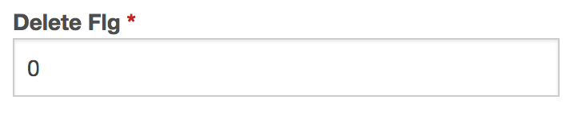

## Migration

* Migrationファイルからテーブル生成
    * [CakePHP](01_cake)
    * [Laravel](02_laravel)

### 書き方

#### create()

* 新規テーブル作成では`create()`を使用しカラムを定義
    * Laravelの`create()`には引数が必要で、CakePHPには不要
    * Blueprintはテーブル定義に使うオブジェクト

```php
// Laravel (２つの引数が必要。第一引数にはテーブル名、第二引数にはfunction(Blueprint $table){...}を記述。)
Schema::create('persons', function (Blueprint $table) {
});
```

```php
// CakePHP (引数なし)
$this->table('persons')
    ->create();
```

#### カラム定義の記述

```php
// Laravel
$table->カラム型('カラム名')->オプション;
// CakePHP
->addColumn('カラム名', 'カラム型',[ オプション ])
```

#### カラムのタイプ

* Laravel: メソッド
* CakePHP: `addColumn()`の第３引数に連想配列の形式で指定

```php
// Laravel
    $table->incremental('id');   // ID 自動採番(主キー)

// CakePHP
->addColumn('カラム名', 'カラム型',[
    'autoIncrement' => true,    // ID 自動採番(主キー)
])
```

##### VARCHARカラム

```php
// Laravel
$table->string('name');
// CakePHP
->addColumn('name', 'string' )
```

##### VARCHAR、長さカラム

```php
// Laravel
$table->string('name',100);
// CakePHP
->addColumn('name', 'string', [
    'limit' => 100,
])
```

##### INTEGERカラム

```php
// Laravel
$table->integer('price');
// CakePHP
->addColumn('price', 'integer')
```

##### TEXTカラム

```php
// Laravel
$table->text('description');
// CakePHP
>addColumn('description', 'text')
```

##### DATETIMEカラム

```php
// Laravel
$table->dateTime('created_at');
// CakePHP
->addColumn('created_at', 'datetime')
```

##### created_atとupdate_atカラムの追加

```php
// Laravel
$table->timestamp(); // created_atとupdated_atはデフォルトでNULL値を許可する
```

##### true,falseカラム

```php
// Laravel
$table->boolean('confirmed');    
```

##### JSONカラム

```php
// Laravel
$table->json('meta');
```

##### カラムにNULLを許可する

```php
// Laravel
$this->string('email')->nullable();
// CakePHP
->addColumn('email', 'string')    
    'null' => true,
])
```

##### カラムにNULLを許可しない

```php
// Laravel
$this->string('email');        // timestamp()で生成するcreated_atとupdated_at以外デフォルトでNULLが許可されない
// CakePHP
->addColumn('email', 'string', [
    'null' => false,
])
```

##### 指定したカラムの値を一意にする

```php
// Laravel
$table->string('email')->unique();
// CakePHP
$table->addColumn('email', 'string', [
]);
$table->addIndex([
    'email',
], [
    'name' => 'UNIQUE_EMAIL',
    'unique' => true,
]);
```

##### デフォルト値の指定

```php
// Laravel
$table->integer('delete_flg')->default(1);
// CakePHP
->addColumn('delete_flg', 'boolean', [
    'default' => 0,
])
```

##### 有効／小数点以下桁数指定のDECIMALカラム

```php
// Laravel
$table->decimal('amount', 5, 2);
// CakePHP
->addColumn('amount', 'decimal')
```

[その他](https://laravel.com/docs/5.4/migrations#columns)

### マイグレーションを盲信しない

* テーブルからマイグレーションファイルを生成時に必ず正しい結果が得られている訳ではない
* 論理削除を行うカラムにデフォルトの値を０と設定した場合
    * CakePHPでマイグレーションファイルを作成した際に`default = false`となってる

[Initial.php](https://github.com/aki-creatist/CakePHP3/blob/develop/config/Migrations/Initial.php)

## テーブル自動生成ファイル作成

### 前提

* DB作成(及びユーザー作成)と設定</a>が済んでいる

### 概要

* テーブルの作成には、Schemaファイルを利用するものとMigrationを利用するものがある
    * CakePHP2.xではSchema、それ以外はMigrationを使用する

### 手順

* DBのテーブルを作成するための構造をPHPファイルで定義
* フレームワークごとのコマンドを使用しテーブルを作成
    * ここでは、１のテーブル作成のためのファイルを用意し、次のページでテーブル作成を実行する

### Schemaファイルの作成

* テーブル作成のSQL構文(DDL)はDBごとに方言があるので、使用するDBによって書き換えが必要
* そこでFWで提供されるスキーマシェルがDBごとの方言を吸収し、異なるDBでも同じテーブルを作成する
    * まずは下記のSQLを実行し、SQLがエラーなく実行できることを確認する
        * [meeting_member](meeting_member.sql)

### スキーマファイルを用意

* 下記のようなスキーマファイルを作成
* `/c/xampp/htdocs/cake2/Config/Schema/`に配置
* 基本ルール
    * テーブル名はスネークケース複数形
    * スキーマファイル名はapp/Config/Schema/schema.phpで固定
    * スキーマクラス名はAppSchemaで固定
* [Config/Schema/schema.php](https://github.com/aki-creatist/CakePHP2/blob/master/app/Config/Schema/schema.php)
    * SQLで書く内容を連想配列方式に置き換えただけ
    * このSchemaファイルは以下のようにすることでSQLとして書き出し可能

```bash
#SQL文として出力
app/Console/cake schema dump
```

### スキーマファイルのパラメータ

* [基本書式](https://github.com/aki-creatist/CakePHP2/tree/master/app/Config/Schema#about)
* [取り得るパラメータ](https://github.com/aki-creatist/CakePHP2/tree/master/app/Config/Schema#param)

## migrationファイルの作成

* [Laravel](https://github.com/aki-creatist/Laravel5/tree/master/database)


```bash
#Laravelマイグレーションファイル生成
php artisan make:migration スネークケースファイル名 --create=テーブル名(スネークケース複数形)
#CakePHPマイグレーションファイル生成
bin/cake migrations create キャメルケースのファイル名
#Bakeを利用した方法
bin/cake bake migration キャメルケースのファイル名
```

* Laravel
    * `/database/migrations/[年]_[月]_[日]_[時分秒]_[作成ファイル名].php`
* CakePHP
    * `/config/Migration/[年月日時分秒]_[作成ファイル名].php`
* 名前のタイムスタンプが含まれているのは、マイグレーション実行順をFWに知らせるための記録
    * 実行順序は作成ファイル名で識別される
* 注意
    * CakePHPは実行命令がmigration`s`
    * キャメルケースとスネークケース
        * FWの種類によってマイグレーションファイルのファイル名の指定がsnake_case<だったりCamelCaseだったりする
        * 共通点は`生成されるマイグレーションファイルは日付_snake_case.php`の形式である点
            * Laravel
                * キャメルケース指定: ○
                * スネークケース指定: ○
            * Cake
                * キャメルケース指定: ○
                * スネークケース指定: ×
* migrationファイルの場所
    * Laravel
        * /database/migrations/
    * CakePHP
        * /config/Migration/
        * 初期状態ではMigrationディレクトリは存在しない
        * マイグレーションファイル生成時に作成される
* 参考ページ
    * [CakePHP](https://book.cakephp.org/3.0/ja/migrations.html)
    * [Laravel](https://laravel.com/docs/5.4/migrations)
* 生成されるファイル
    * personsテーブルを作成するPersonsクラスを作成する場合
        * Laravel
            * `php artisan make:migration create_persons_table --create=persons`
        * CakePHP
            * `bin/cake migrations create CreatePersonsTable`
            * Bakeを利用する場合
            * `bin/cake bake migration CreatePersonsTable`

CakePHPでファイル名の末尾にTableを付けると、テーブル名がxx_tableとなってしまう
 
## 内容を追記する

LaravelとCakePHPでは書き方が異なる

## 比較

* meeting_roomsを作成するmigrationファイル同士を比較
* 条件を揃えるため、既存のDBテーブルからmigrationファイルを生成
* 既存DBからmigrationファイルを生成する方法
    * [Laravel](http://co.bsnws.net/article/203)
    * [CakePHP](https://book.cakephp.org/3.0/ja/migrations.html#id14)
* CakePHPは上記参考サイトの手順で生成
* ファイルをテーブル名ごとに分解して各テーブルのマイグレーションファイルを作成

```bash
bin/cake bake migration_snapshot Initial
```

* またCakePHPはBakeでマイグレーションファイルを作成する際に、カラムなどを指定可能
* 詳しくは[公式ページ](https://book.cakephp.org/3.0/ja/migrations.html#id9)を参照
* [Laravelのマイグレーションファイル](https://github.com/aki-creatist/Laravel5/blob/develop/database/migrations/2017_06_05_203131_create_meeting_rooms_table.php)
* [CakePHPのマイグレーションファイル](https://github.com/aki-creatist/CakePHP3/blob/develop/config/Migrations/20170606151810_meeting_rooms.php)

## TinyintとBoolean</h3>

### プログラムからTinyintを指定する

* 論理削除を実現したい
* 一桁の数値を挿入するカラムを作成する

SQLを直接流し込む場合

```sql
-- SQLからTinyintのカラムを作成する
`delete_flg` tinyint(1) DEFAULT '0' NOT NULL,
```

* しかし、Schemaファイル(Migrationファイル)には型の指定に`Tinyint`を指定する記述がない
* そこで、プログラムからテーブルを作成する際、カラムの型を**Tinyint**にするには下記
    * カラムにTinyintを指定するマイグレーションファイルの記述方法
    * [tinyint](https://github.com/aki-creatist/CakePHP3/blob/69663bf50c0fe52be39de7f255da67de1ea60b2e/config/Migrations/20170606152034_members.php#L30)
    * このようにするとMySQLに`type = tinyint(1)`の`delete_flg`が作成される

## integerではダメなのか？

下記のようにinteger型で作成したらどうか

```php
->addColumn('delete_flg', 'integer', [
    'default' => 0,
    'null' => false,
])
```
 
* 作成されるカラムは`delete_flg  int(11)`になる
* これをlimitを使用し、挿入桁数を１桁に固定したらどうか

```php
->addColumn('delete_flg', 'integer', [
    'default' => 0,
    'limit' =>1,
    'null' => false,
])
```

* この場合に`delete_flg  int(1)`が作成される
* これなら論理削除を実現することが可能

## 結論：integerではダメ

* 数値一桁であればTinyint(1)もint(1)も同じではないか？
* Bakeでソースを焼くと`扱われ方が異なる
    * Tinyintはプログラムからは`Boolean`とみなされる
    * integerはプログラムからは`integer`とみなされる
* 注意するのは１

## 扱いはどのように違うのか？

### 見た目の違い

* intをBakeで焼くとテンプレートファイルの登録フォームは以下のようになる



* tinyintの場合には、以下のようにチェックボックスとなる


### ソースの違い

XxxEntity.php

```php
 /**
  * Member Entity
  *
  * @property int $id
  * @property string $name
  * @property string $email
  * @property bool $delete_flg
  *
  */
```

XxxsTable.php

```php
 $validator
     ->boolean('delete_flg')
     ->requirePresence('delete_flg', 'create')
     ->notEmpty('delete_flg');
```

index.ctp

```html
<td><?= h($member->delete_flg) ?></td>

<!-- 数値の場合には以下のように焼きあがる -->
<td><?= $this->Number->format($member->delete_flg) ?></td>
```

view.ctp

```html
<td><?= $member->delete_flg ? __('Yes') : __('No'); ?></td>

<!-- 数値の場合には以下のように焼きあがる -->
<td><?= $this->Number->format($member->delete_flg) ?></td>
```

tests/Fixture/MembersFixture.php

```php
// 数値
'delete_flg' => ['type' => 'integer', 'length' => 1, 'unsigned' => false, 'null' => false, 'default' => '0', 'comment' => '', 'precision' => null, 'autoIncrement' => null],

// 真偽値
'delete_flg' => ['type' => 'boolean', 'length' => null, 'null' => false, 'default' => '0', 'comment' => '', 'precision' => null],
```
