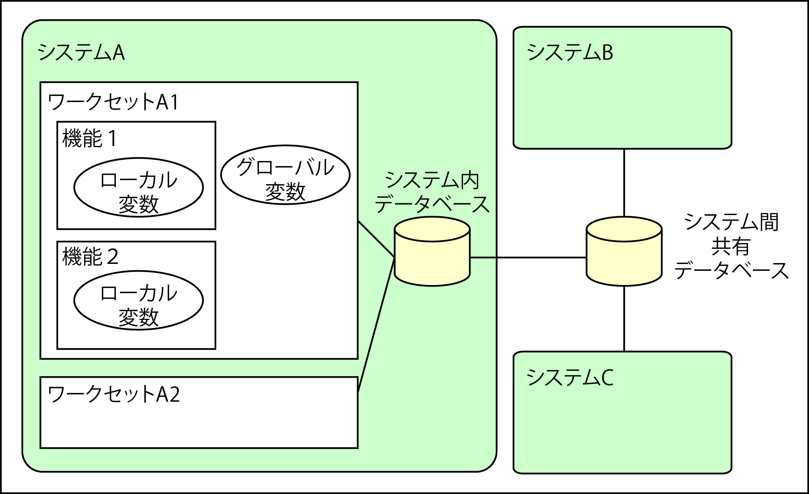
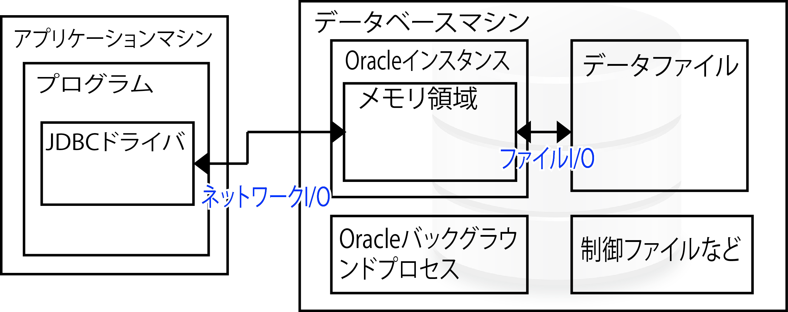

# データベースとは

* データの集まり
* データを蓄積し、効率的に検索したり更新可能
* [API](01)
* [プログラムからTableを作成する](02)

## 主な種類

* MySQL
* MariaDB
* PostgreSQL

## SQL

* データベースを操作するための言語
    * データベース管理ソフトウェアによって若干の差異がある
* Structured Query Languageの略称

## データの保存場所

* スクリプトはメモリという場所に読み込まれて実行される
* データはプログラム実行時はメモリ内部に存在できるが、プログラムが終了するとメモリから一緒に消える
* プログラムが終了する前にデータを別の場所に置くことができればプログラムが終了してもデータは残る

## データベース

* 今回扱うDBは、RDBMSと呼ばれるもの
    * RDBMS: Relational Database Management System
    * データを表形式で保存してあり、各表ごとの関係も保存できる
    * DBにデータを保存しておくとデータの種類が増えてきても決まった手順でデータの保存、検索、更新、削除処理が可能
    * DBは、PHPプログラムなどとは別に独立して動作している
        * 他のプログラムから同じDBにアクセスしてデータを処理が可能
* プログラミング的な観点で言えば、DBはワークセットを越えて、さらにはシステムをすら越えて共有する



データベースのデータを操作するにはデータベースに対してSQL文を発行する

## スキーマ

* スキーマとはデータベースの構造のこと
    * RDBMSでは表に含まれるデータの型や長さ、他の表との関連づけをいう

## CRUD

DBに必要な４つの機能

* Create(作成)
* Read(読み出し)
* Update(更新)
* Delete(削除)

## データベースの仕組み



* Oracleインスタンスは接続してくるプログラムごとに専用サーバープロセスを作成する
    * サーバープロセス以外にも、さまざまなバックグラウンドプロセスが常時起動している
        * モニタプロセスや、ファイルへの書き込みプロセスなど
* Oracleインスタンスから見れば、プログラムはクライアント
    * このクライアントからDBサーバーへの接続のことをセッションと呼ぶこともある
* 基本的にOracleのテーブル定義やテーブルの行データ、各種設定などはファイルに書き出されている
    * そうしないと、DBプロセスがダウンしている場合にデータを失ってしまう
        * そうなるとデータ永続化の目的が達成できない
* OracleインスタンスはディスクI/Oを減らすためにメモリ中にキャッシュや一時データ、制御データなどを保持している
    * SQLを実行するたびにデータファイルの読み込みを行っていたらパフォーマンスが非常に悪くなるため
* アプリケーションからは、JDBCドライバやOracleであればOCIドライバなどを使ってDBサーバーにネットワーク経由でアクセスする

### OracleのSQL実行計画

* Oracleは、プログラムから要求されたSQLの実行を「解析→実行→取得（フェッチ)」の手順で実行する
* 解析では、実行するSQLを解析する
    * 形式が正しいか、実行する権限があるかを確認する
    * 次に解析されたSQLを実行する
* SQLの実行では`オプティマイザ`と呼ばれるものが実行するSQLを分析して実行計画を作成する
    * 実行計画ではSQLを実行するための結合方法やインデックスの使用などが決定される
        * 結合方法は: 基本的にテーブルのデータの統計情報による
        * また、インデックスがあれば、必ずインデックスを使うというわけではない
        * すべて、オプティマイザが作成する実行計画で決まる
* SQLのパフォーマンスが良いか悪いかは、実行計画による部分が大きい
* Oracleが提供するコマンドを使用することで、オプティマイザが作成した実行計画を参照可能
* SQLパフォーマンスのチューニングを行うには、実際に実行計画を参照し、結合方法やインデックスの使われ方を確認するとよい

## MySQLとは

* 世界中で利用されているDB
    * 現在はオラクルが所有
    * オープンソースとして開発が続けられている

### 特徴

* DBを保存する形式を選択できるところが特徴
    * PHPなどサポート言語が多く使いやすい
    * 高速
    * 業務に応じて選択できる
        * MyISAM形式: 速度が要求される処理に適している
        * InnnoDB: MyISAMになかったトランザクション処理に対応

## クエリーとSQL

### クエリーとは

* 管理システム(MySQLなど)に対して行われる処理要求を文字列として表したもの
* データの挿入や更新、削除などの命令に使用される
* リレーショナルデータベースと呼ばれる本格的なDBでは、クエリーの記述にSQLと言う言語を使用する

### SQLとは

* Structured Query Language
    * 「シークェル」と読む
    * IBM社が開発したDBを操作するための言語
    * リレーショナルデータベース上で使用する言語として広く利用される
    * DBにデータを挿入するなどの操作を行うには、このSQLで記述する
    * SQLは、リレーショナルデータベースごとに微妙に違う点があったり、記述方法が全く違ったりすることがある

### コネクションプール

DBコネクションを再利用するための仕組み

* サーバープログラムは大量のリクエストを処理するために、DBコネクションを再利用する
* あるスレッドがDB操作を行う時に、コネクションプールから`空いているDBコネクションを取得`する
    * コネクションプールからDBコネクションを取得した時点で、DBコネクションはOPENする
    * DBコネクションを取得する処理に時間がかかる
    * DBコネクションを再利用することで大幅な性能改善が行える
* コネクションプールは、下記を設定できる
    * 初期コネクション数
    * 最大コネクション数
    * 追加コネクション数
* コネクションプールの初期化時に、初期コネクション数分のDBコネクションを取得する
* サーバープログラムのリクエストの処理がスレッドによって実行されると、必要に応じてコネクションプールにDBコネクションの取得が行われる
* コネクションプールは空いているコネクションを返す
    * 空いているコネクションがなければ、追加コネクション数のDBコネクションを作成する
* リクエストの処理スレッドでコネクションが不要になると、そのままコネクションプールに使用が移る
* コネクションプールは返されたDBコネクションを空きコネクションとして管理して、次に再利用する
* コネクションプール機能は、Webアプリケーションサーバー製品によっては提供されている
    * Webアプリケーションサーバーにコネクションプールがない場合
        * オープンソースでもコネクションプールライブラリが提供されているので、それを利用する

### マスタのキャッシュ

* I/Oの回数を減らすためにはデータキャッシュが有効
    * 多くのアプリケーションで性能のボトルネックになるのは、システム外部へのI/Oが発生する処理
        * DB操作やファイル操作、通信処理など
* キャッシュを適用するデータは、多くの機能から参照されるもので、更新の少ないデータが最適
    * DBのマスタデータなど
* キャッシュを行うデータを決めて、キャッシュを実装する

# Timeセッティング

## アプリでエラーが出る場合

* アプリでタイムゾーン変更でDBエラーが出ることがある
    * 原因はMySQLにタイムゾーンに関する情報が入っていないため
    * タイムゾーンをを保持するmysql.time_zoneテーブルが空であるため
    
```text
ERROR 1298 (HY000): Unknown or incorrect time zone: 'Asia/Tokyo'
```

```sql
-- mysql.time_zoneテーブルの確認
select * from mysql.time_zone;
-- empty setという結果が返ってくれば、設定がされていない

-- empty setだった場合に実行
mysql_tzinfo_to_sql /usr/share/zoneinfo/ | mysql -u root mysql
```