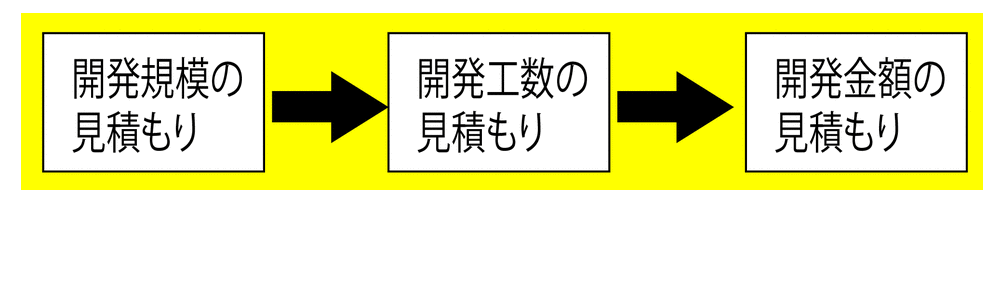
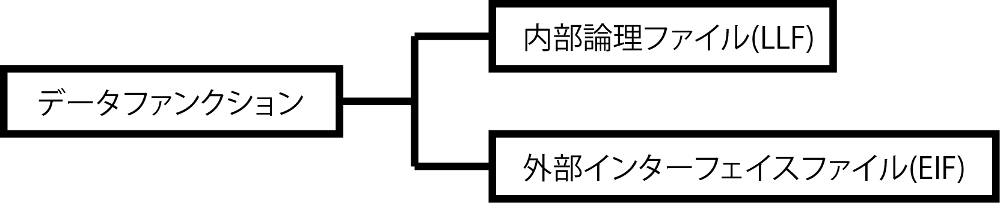
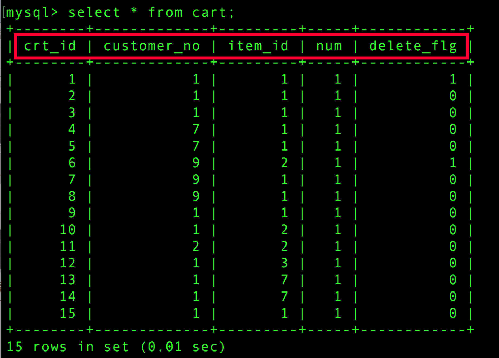
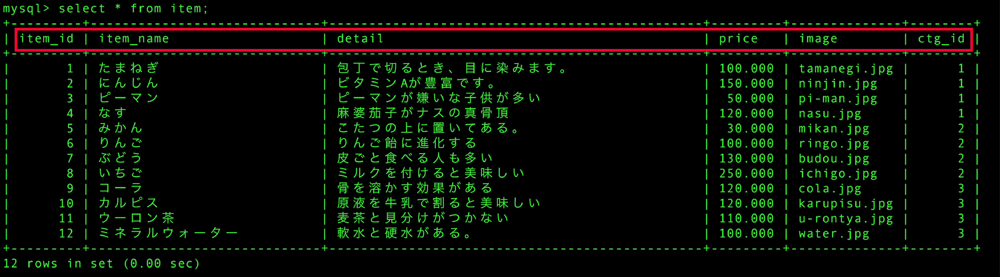

# FP法（ファンクションポイント法）

* `開発規模`を見積もるための手法
* コンピューターシステムの論理的な機能の数に着目を行う
* FP法は、開発言語によらず適用可能な点が特長
* 以下の5の機能を数え、それぞれに難易度を加味してそのシステム全体の機能数を点数化した数値（ファンクションポイント）を求める
    * 外部入力
    * 外部出力
    * 外部照合
    * 内部理論ファイル
    * 外部インターフェース
* そのポイント数を、統計的に得た過去の実績数値から言語別のプログラム数行に置き換える
* 生産性を考慮して全体の「工数」をアウトプット
* アウトプット: `FP数`
* これを組織別に蓄積した過去の実績からプログラム数行に、また、その組織の生産性から工数に換算
* より確かな結果を得るには、その組織が採用しているプログラミング標準や、その組織のメンバーの生産性が必要

## 概要

* `プログラミング言語に依存しない開発規模を見積もるための方法`
    * LOCによる開発規模の見積もり結果は、プログラミング言語に依存する
* 開発規模の見積もりを定量的に測る方法
    * システムのデータと機能の数から開発規模を計測する
    * データと外部との相互作用をもとに、FP数という開発規模を計測する

* FPという単位で開発規模を計測する
    * FP数が多ければ開発規模が大きく、FP数が少なければ開発規模は小さい

## FP数

* FP数を求める材料
    * データファンクション
        * システムが内部で管理するデータのこと
        * 一般的DBが該当する
    * トランザクションファンクション
        * トランザクション: システム外界と行う相互作用
            * データの入力や出力
            * システムの利用者に対するUI(ユーザーインターフェイス)や外部システムとの連携がこれに該当
* システムのFP数は、データファンクションとトランザクションファンクションのFP数を合算することで求められる

## ファンクションの対象

ファンクションの対象になるのは機能要件だけ

* これはシステムの利用者に対して提供される具体的な価値で、システム利用者の何らかの目的を達成するために使われる
    * ユースケースで定義するのも機能要件
* FP数には、機能要件の規模が反映される

### データファンクション

* データファンクションは、システム内部で管理するDBやファイル
* また、それらは`機能要件を実現するためのもののみが対象`になる
* データファンクションは、`システムによって更新されるかどうか`で分類される
    * 内部論理ファイル(ILF)
    * 外部インターフェイスファイル(EIF)
* この分類をファンクションタイプと呼ぶ

### 内部論理ファイル

* 内部論理ファイルは、システムによって`参照・更新`されるデータファンクション
    * 具体的には、システムで管理するDBなどがこれにあたる

### 外部インターフェイスファイル

* 外部インターフェイスファイルは、システムからは参照しかされないデータファンクション
    * システム外部にある`読み取り専用`のデータ

## データファンクションの複雑さを決める

* 複雑さは、以下の２つで評価する
    * データファンクションの`データ項目数`
        * `DET`:Data Element Type
        * DBであれば`列数`が該当する
        * 繰り返しのあるようなものは１つと数える
            * 列に電話番号１と電話番号２があっても１つとみなす
    * `レコード種類数`
        * `RETP`:Record Element Type
        * データファンクションのデータの種類を表す
        * サブクラスのようなものがあればその種類の数になる

## ３段階に評価

* データファンクションの複雑さが決まったら、複雑さを「低・中・高」の３段階に評価する
    * 表1
* FP数を計算する
    * データファンクションとトランザクションファンクションの複雑さを求める
    * 表2
        * データファンクションのファンクションタイプごとに、複雑さに応じた掛け率を定義している
        * データファンクションの数と複雑さに応じた掛け率をかけることで、FP数が算出される

### 例

* 複雑さが「中」の内部論理ファイルが２つ
* 複雑さが「低」の外部インターフェイスファイルが１つある
* FP数は「2×10+1×5=25」

### トランザクションファンクション

* トランザクションファンクションは、システムが外界との相互作用を行うこと
    * つまり、`システムが外界と行うデータの入力や出力`
* トランザクションファンクションも、データの入出力の傾向によって以下に分類可能
    * 外部入力(EI)
        * システムが外部からデータを受け取り、システムの内部のデータファンクションなどに格納するトランザクションファンクション
            * 例えば、画面や外部システムからのデータの受信など
    * 外部出力(EO)
        * システムがデータファンクションに格納されているデータをシステム外部に出力するトランザクションファンクション
            * ただし、データをシステム外部に出力する時にデータの加工を伴うもの
            * データの加工とは、データの計算や画像処理、別のデータの作成のこと
            * つまり、画面への表示や帳票出力など
    * 外部照会(EQ)
        * システムがデータファンクションに格納されているデータをシステムの外部に出力するトランザクションファンクション
            * 外部照会と外部出力の違いは、出力するデータを加工するかどうか
            * 外部照会はデータを加工をしない

* 外部入力→外部からの値を内部に格納する
* 外部出力→内部の値を外部に出力する(データ加工あり)
* 外部参照→内部の値を外部を出力する(データ加工なし)

### トランザクションファンクションの複雑さ

* トランザクションファンクションは１つ１つの画面ではない
    * １つの外部入力に入力画面、確認画面、完了画面という３つの画面があったとしても、これは１つのトランザクションファンクション
        * また、トランザクションファンクションは重複しないように留意
        * 検索画面などは多くの画面から呼び出されるが、同じ検索項目と処理であれば、トランザクションファンクションとして１つとする

### トランザクションファンクションの複雑さを決める

* トランザクションファンクションも複雑さを評価する
    * 以下の２つで複雑さを評価する
        * データ項目数
            * `DET`
            * トランザクションファンクションで入力や出力するデータの項目数
            * 画面で言えば、画面を構成する動的な画面入出力項目
                * 画面の静的なメッセージはデータ項目数にカウントしない
                * 画面に表示するエラーメッセージやボタンなどはデータ項目数にカウントする
        * 関連ファイル数
            * `FTR`
            * トランザクションファンクションを実行する時に更新や参照などで呼び出すデータファンクションの数
                * １回のトランザクションファンクションで、同じデータファンクションを何度も呼び出す場合でも１つとカウント

### ３段階に評価

トランザクションファンクションの複雑さが、データ項目数と関連ファイル数を使って決まったら、複雑さを「低・中・高」の３段階に評価する

### FP数を計算する
    
データ項目数と関連ファイル数から複雑さを「低・中・高」に評価できたら、FP数を計算する

* 表では、トランザクションファンクションのファンクションタイプごとに、複雑さに応じた掛け率を定義している
* トランザクションファンクションの数と複雑さに応じたか掛け率をかけることで、FP数が算出される

### 例

* 複雑さが「中」の外部入力が２つ
* 複雑さが、「低」の外部出力(EO)が２つ、
* 複雑さが低の外部照会が３つあるとする
* FP数は「2×4+2×4+3×3=25」
