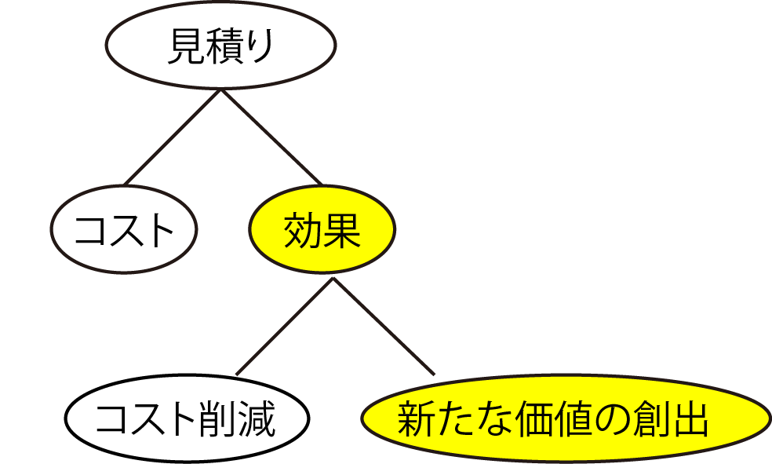

# 効果の見積もり

## 効果の見積もりの２つの面

* 効果は「コスト削減」と「新たな価値の創出」



## 今までのシステム化投資は合理化

* 情報の伝達を電子化して年間何人分もの工数を削減したりするもの
    * 大量の計算を機械化して時間を削減したりするもの
* 行っている業務の意味や事業上の価値は変わらないが、時間や間を省くことでコストを削減
* コスト削減が主な目的

## 新たな価値の創出

* 合理化のためのシステム化投資をする時代は終わった
* 現在の業務にはない時間手間をかけて、新たな価値を創出するのが現代

```text
例えば、今まで「天候」という要素を加味していなかった企業が、
天候との相関関係を見ながら過去3年分の全国の販売データを毎週分析して販売予測を立て、
週の生産計画に基づいて先日付在庫残高計算の結果と合わせて週の原材料発注数量を決める、といったもの
```