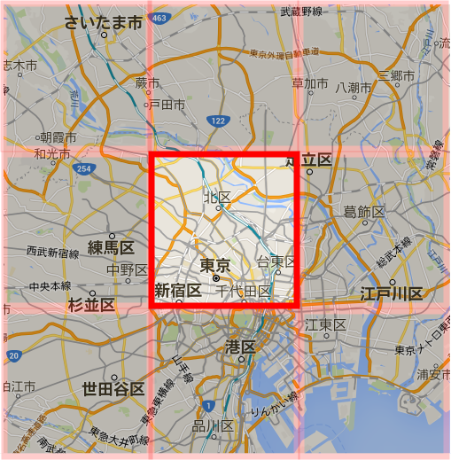
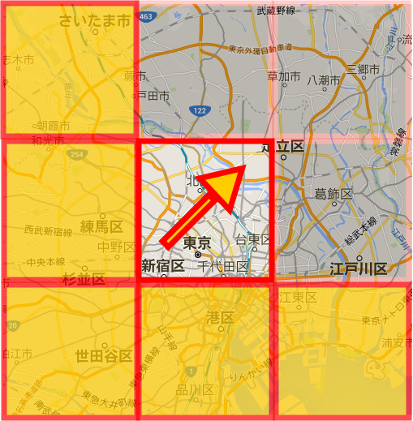

# Ajaxでクライアント/サーバー間をつなぐ

## Ajax

* `Asynchronous JavaScript + XML`の略
    * JSを使った非同期データ通信を行う技術のこと
    * JSで非同期にダウンロードすること
* ユーザーの操作によって必要なデータだけを取得可能になる
* さらに、JSとCSSを高度に利用することにより、柔軟なUIを提供可能になる
    * JSもCSSの技術の応用方法がAjaxとして広まった
* ユーザーの画面操作に応じて画面表示とサーバーへのデータ取得を検討する必要がある
* JSでよりリッチなユーザーインターフェースを実装するための技術
* 豊かなインターネットアプリケーションを作るためのクライアントテクノロジを表すために作られたマーケティング用語
    * 豊かなインターネットアプリケーション: XMLHttpRequestオブジェクトが中心
* Ajaxは、通常は何らかのJSライブラリを経由する形で、Web開発に多様されている

## サーバーとクライアントの世界を理解する

* これまでは必要なファイルを自分のコンピューターに保存し、ブラウザで動作を確認してきた
* しかし、これはあくまで特殊な状況と考えるべき
* 一般的なWebページは、自分のコンピューターではなく、サーバに保存されている
* ブラウザを使って、閲覧したいページをサーバーに要求をする
* その際に、サーバーの場所、閲覧したいページの場所を指定するのが、`http://  .jp/`のようなURL(Uniform Resouce Locator)という書き方
    * Server:給仕人: Webページというサービスを提供するサーバー
    * client:依頼人: これを依頼するコンピューター

## Ajaxの前提条件

* 要求を送るために必要なものは、URLとHTTP動詞だけ
    * 応答ハンドラを登録可能にしてあると役に立つ
    * 応答ハンドラは２種類
        * 成功した要求を処理するもの
        * 失敗した要求を処理するもの
* 非同期要求では、要求の状態が更新されるたびに、`onreadystatechange`ハンドラが非同期的に呼び出される
    * 言い換えれば、要求の処理が最終的に終わるのはここ
    * そのため、ハンドラはコールバックなどの要求オプションにアクセスするための何らかの手段を必要とする

## 静的なページと動的なページ

Webページと一口に言っても、様々な種類がある

* ブラウザからページを要求されると、サーバーがあらかじめ用意されていたファイル(コンテンツ)をそのまま返送するパターン
    * 単なるファイルのやり取りであり、コンテンツも固定的でいつも変化しないため、静的なページと呼ばれる
    * もっとも基本的なページ
* サーバーからあらかじめ用意されていたファイルが返されるまでは１と同じ
    * そのファイルにJSのコードが含まれているパターン
    * JSのコードはブラウザで実行され、様々な変化に富んだページを見せてくれる
* サーバー側には最終的なページのイメージは用意されていない
    * ただ、データの塊とそれを加工するためのプログラムが用意されている
    * サーバーでは、ブラウザから要求を受け取るとプログラムを実行し、HTMLによるページを作成した上で、ブラウザに返送する
    * この場合、ブラウザの方は１と同じく受け取ったページを表示するためだけの存在になる
* 最後は２と３の複合パターンで、サーバー側でHTMLやJS、CSSを含んだコンテンツを作成し、ブラウザに返送する
    * ブラウザ/サーバーの双方でプログラムを実行する
    * 巷にあるページの多くは、この４のパターンからできていることがほとんど
    * jQueryとは、このようなクライアント/サーバーのやり取りの中で、あくまでその一部を担うものに過ぎない

２〜４のようなページのことを、コンテンツが動的に変化するという意味で動的なページと呼ぶ場合がある

## Ajaxを利用したページの動作確認

[Googleマップ](https://maps.google.co.jp/)

* 現在地周辺の地図が表示されていることを確認する
* 地図上の拡大したい部分を拡大する
* 地図をマウスでドラッグすることで地図の中を移動する

## 従来のWebアプリの仕組み

* ページでリンクをクリック
* サーバーに要求
    * この間はユーザーは待ち状態
    * 要求: 
        * ブラウザのアドレス欄からURLを指定
        * ハイパーリンクや`送信`ボタンをクリックするetc
* サーバーでの処理結果をHTML形式で応答
* ページ全体を再描画

サーバーに何かしら要求すると以下のような事態になる

* サーバーが応答するまで、ユーザーは待っていなければいけない
* ページ全体が書き換わってしまう

## Ajaxの仕組みと特徴

* ブラウザの要求によって、サーバーが処理を行い、データを返送する流れが裏側で行われる
* Ajaxではサーバーとの通信が(ブラウザそれ自体の機能ではなく)ページの中で動いているJSによって行われる
    * 従来
        * ページでリンクをクリック
        * ページ上でイベントが発生
        * サーバーに要求
            * この間はユーザーは待ち状態
    * JSでサーバーに要求
        * この間もユーザー側は操作を続けられる
        * サーバーでの処理結果をHTML形式で応答
        * サーバーでの処理結果をテキストやXMLなどの形式で応答
        * ページ全体を再描画
        * 受信した結果を使って、ページの**必要なところだけ**を書き換え

サーバーからの応答もJSが受け取り、JSの機能によってページの更新を行う

## Googleマップの動きを理解する

* Googleマップで表示されている地図は、小さな画像がタイル上に敷き詰められているようなイメージで構成されている

* 最初は必要な部分の地図画像だけをダウンロード
* マウスで地図を矢印の方向にドラッグ
    * 薄くなっている部分はいつでもダウンロード待機の部分
    

* 表示に必要な部分(黄色の部分)を新たにダウンロード
    * マウス移動のイベント処理で地図を細かくダウンロードすることで、地図上の自由に移動可能に見せている
    * 世界中の、画像をあらかじめダウンロードしておくのは、データ容量という意味で現実的ではない
    * 表示する領域とその周辺だけをまずはダウンロードしておく
    * そして、マウスのドラッグによって地図を移動するのに合わせて、必要な地図をJSで追加的にダウンロードしている
    * これによって、Googleマップでは画面を切り替えることなく、スムーズに地図の表示を移動させることができている

