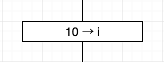

# アルゴリズムとは

## 概要

* アルゴリズムとは、問題や課題を解決するための処理手順を、もれなく表現したアイディアや考え方のこと
* アルゴリズムそのものは、日常生活でも様々なところで使われる
* 料理のレシピ、音楽の楽譜、取扱説明書はアルゴリズム
* 人向けのアルゴリズムは、文字や記号、イラストなどで描き表される

### アルゴリズム＝手順

* アルゴリズムとは手順のこと
    * ただの手順ではない
    * 問題や課題を解決するための処理手順を、もれなく表現したアイディアや考え方
        * 料理のレシピ
        * 音楽の楽譜
        * 家電などの取扱説明書

### 料理のレシピはアルゴリズム

* 作ったことのない料理をちゃんと作るには、その料理のレシピが必要
    * レシピには以下が手順を追って書かれている
        * 必要な食材の種類と分量
        * 食材の処理の仕方(どのような大きさに切るか)
        * 調理法(煮る、焼く、炒める、など)
        * 味つけの仕方
    * 書かれている内容はレシピを見れた再現が可能
    * 言い方を変えれば、レシピとは`ある料理を作りたい`という課題を解決するための手順(＝アルゴリズム)を、文章や写真を使って表現したもの
        * 楽譜は`ある曲を演奏する`という課題を解決するための手順
        * 取扱説明書は`商品を使う`という課題を解決するための操作手順
    * 『何か問題や課題を解決するための処理手順を表現した物』に我々は日常から触れている
    * これらは正確には`アルゴリズムが表現されたもの`
* アルゴリズム自体は、`アイディアや考え方`であり、目に見えない、形のないもの
* それを人に伝えるためには、見える化しなくては再現可能なものにならない

## アルゴリズムとプログラム

* プログラムは手順を見える化したもの
* プログラミング言語はコンピュータに指示をする人工言語

### アルゴリズムをプログラミング言語で書いたもの＝プログラム

* 業務は人間とコンピュータで分担されている
* コンピュータは人間の指示がなければ動かない
* 手順をあらかじめ指示する必要がある
* コンピュータにアルゴリズムを伝えるには、アルゴリズムをコンピュータにわかる表現方法で記述する
* その表現方法がプログラミング言語
    * そして、アルゴリズムをプログラミング言語で記述したもののことをプログラムと呼ぶ
    * また、プログラムを記述する作業をプログラミングと呼ぶ
    * プログラムと呼んでいるものは、コンピュータに実行して欲しい処理手順をプログラミング言語で見える化したもの
* どのようなコンピュータでも必ずプログラムが必要
    * プログラムは別名、ソフトやアプリとも呼ばれる
        * Webブラウザやメールソフト、WordやPhotoshopなどのソフトはもちろんプログラム
        * WindowsやMac、AndroidなどのOSもプログラムの集合体
        * スマホのアプリも実態はプログラム

## プログラム作成におけるアルゴリズム

* プログラム作成は、企画、設計、プログラミング、デバッグと進む
* アルゴリズムは設計段階で必要となる

### プログラミングする

* 設計でアルゴリズムが固まれば実装工程、つまりプログラミングに移る
* 別名: コーディング
    * コーディング: プログラミング言語を使って、アルゴリズムをプログラムにしていくこと

### プログラムをデバッグする

プログラムが完成したら、動作テストを行う

### プログラムのドキュメントを作成する

* プログラムが完成したら、ドキュメントを作成
    * ドキュメントとは、資料や文書のこと
    * プログラマ向けのドキュメントと、ユーザー向けのドキュメントがある
* なぜドキュメントが必要になるか
    * プログラムを作った人が、その後に保守・管理までを担当するとは限らない
    * 長年使われるプログラムであれば、同じ会社や同じチームが担当していても、中の人が入れ替わってしまっている可能性もある
    * そのような場合でも、プログラムの不具合を修正したり、新たな機能を追加すべく改良したりする際にと作業を進められるようにするため
* ユーザー向けのドキュメント
    * いわゆる取扱説明書
    * そのプログラムで何ができるのか、実行したい機能はどのようにすれば使えるのかなどを、ユーザーの視点で記載
    * プログラムはユーザーが使えなければ無意味
    * ユーザー向けのドキュメントはプログラムと同じくらい重要

## いいアルゴリズムとは
    
* わかりやすい
* 高速
* 効率的
* 再利用しやすい
    
### わかりやすい

* アルゴリズムは、できるだけわかりやすいものが良いアルゴリズム
    * 複数の人間で作業をする場合は特に、他の人が見てすぐわかるようなアルゴリズムでなくては、理解や説明に時間がかかる
    * 複雑で難解なアルゴリズムは、正しい結果を返すかどうかの検証が難しく、間違いを見つけにくい

### 高速

* 高速: 実行してから、結果を得られるまでの時間が短いということ
* 同じ正しい結果を得られるアルゴリズムであれば、短い時間で結果の出るアルゴリズムの方が、良いアルゴリズム

### 効率的

効率的というのは、プログラムを実行した際に使用するメモリの領域ができるだけ少ないということ

### 再利用しやすい

* 過去に書いたプログラムをそのまま、あるいは部分的に再利用するという方法がある
* 過去のプログラムを利用できる割合が増えれば、その分、新たにプログラミングにかける時間は少なくて済む

## なぜアルゴリズムを勉強する必要があるのか

* いいプログラムを作るため
* プログラムの良し悪しを判断するため
* プログラム作成過程全体を効率化するため
* プログラミング技術向上のため

### 良いプログラムを作るため

* 良いプログラム: 高速で、効率的で、汎用的
* アルゴリズムを勉強する一番の目的は、良いアルゴリズムを作れるようになるため

### プログラム作成過程全体を効率化するため

* 設計段階でアルゴリズムをしっかり検討し、十分に良いアルゴリズムが作成できていれば、途中で大幅な修正を行わずに済む
    * 結果的に実装時間を全体的に削れる

### プログラミング技術向上のため

* 最初にアルゴリズムをしっかり学んだ人とそうでない人では、その後、作るプログラムのレベルに違いが出てくる

## 手順がアルゴリズムであるための条件

* アルゴリズムの条件は、正しい結果が得られること
* 必ず終わること

### 正しい結果が得られる

* アルゴリズムは`問題や課題を解決するための手順`
    * 問題が解決するというのは、正しい答えが出たり、望み通りの結果が得られたりするということ
    * 得られる結果が間違っていてはアルゴリズムとは呼べない

### 必ず終わる

* アルゴリズムには終わりが必須
    * しかし、途中の処理や手順が間違っていると、一旦処理が開始されたアルゴリズムが終わらなくなってしまうことがある
    * そういう状態を無限ループと呼ぶ

## アルゴリズムの３つの基本形

* アルゴリズムには３つの基本形がある
* 初めからひたすら順に処理する手順が、順次構造
* 条件式で判定して実行する処理を切り替える手順が、選択構造
* 条件を満たす間同じ処理を繰り返す手順が、反復構造

アルゴリズムの手順には３つの基本形がある

* アルゴリズムで使われる手順は、基本この３つのみ
    * どんな複雑に見えるアルゴリズムでも、この３つの手順の組み合わせから出来ている
    * 逆に言えば、このたった３つの手順さえ覚えれば、今後ほとんどのアルゴリズムが書き表せる

### ①順次構造[初めから順番に処理する手順]

```text
ドラえもんがのび太のママから`ちょっとお使いに行ってきて`とお使いを頼まれる場面が出てくる
しかし、ドラえもんだって、中身はコンピュータ
本当は`ちょっとお使いに行ってきて`という内容のプログラムだけでは、ままの覗くお使いを正確には実行不可
お使いをちゃんと実行してもうには、`お使い`と言う仕事をアルゴリズムで記述が必須
アルゴリズムにするにはまずは、お使いを細かい処理に分解する
そもそも、なぜママがお使いを頼むことになったかといえば、夕食のすき焼きの準備を始めた時に、しらたきを買い忘れたことに気がついたため
そこで、ママの望むお使いを、具体的な処理に分解する
```

* お使いを分解
    * スーパーに行く
    * しらたきを買う
    * 家に帰る
* この３つの処理を１〜３の順番で実行させる場合**上から順番に、実行してもらいたい処理を書く**
* 順次構造: 実行して欲しい処理を、実行して欲しい順に、上から並べて書く

### ②選択構造[処理を選んで実行する手順]

```text
ドラえもんが無事にスーパーにたどり着いたとする
練り物の棚を見てしらたきがあれば、順次構造のアルゴリズムだけでも、滞りなくお使いは実行される
しかしもし、しらたきが売り切れていたら`しらたきを買う`という処理が実行できない
お使いがここで中断する
そんなまさかの事態を想定して、あらかじめ回避するために使うのが２つ目の選択構造
```

* 選択構造というのは条件判断の処理を１つ挟むことで、その時の状況に応じて実行する内容を手順のこと
    * 今回の例でいえば、スーパーに着いたドラえもんに、`しらたきがあるか？`という条件判断の処理をまず実行させる
    * 判断の結果は、YesかNo
    * もし、Yesであれば、最初の予定通り、しらたきを買って帰らせる
    * しかし、判断の結果がNo、すなわち、しらたきが品切れの場合は、何か代わりになるものを買って帰ってもらうという処理を書き加える必要がある
    * ここで大事なのは、`別のものを買う`という処理を終えた後の処理をちゃんと指示しておくこと
    * `別のものを買う`という処理から、`家に帰る`の前に矢印を引っ張っておく
    * もし、この矢印がないと、糸こんにゃくを買ったドラえもんは、スーパーの出口で、途方にくれてしまう
    * 選択構造は、条件によってその先の処理が分かれる（＝分岐する)ことから、別名、分岐構造(条件分岐)とも呼ばれる
    * また選択構造において、条件判断を行う分のことを条件式と呼ぶ
* 選択構造が使えると、アルゴリズムのバリエーションが広がる

### ③反復構造[同じ処理を繰り返す手順]

* 同じ処理を繰り返す場合には、手順を省略して次のように書ける
* このような処理を、反復構造(または繰り返し構造)と呼ぶ
* 高速で効率的なアルゴリズムを作るためのポイントは、この反復構造をうまく使いこなせるかどうか
* コンピュータは正確に何万回でも、何百万回でも、盲目と延々と同じ処理を実行する
* 最初に反復構造を用いたアルゴリズムを正しく記述できていれば、必ず正しく高速で実行してくれる

## アルゴリズムの記述方法

* 流れ図は、プログラミング言語を使わずにアルゴリズムを記述する方法
* 流れ図は別名、フローチャートともいう
* 流れ図では、図形記号を使ってアルゴリズムを記述する
    * 処理と手順を図解で直感的に表現する流れ図は、アルゴリズムを作成時に処理や手順に間違いがないかを確認可能
    * 他の人にわかりやすく伝える道具にもなる

### アルゴリズムを流れ図で表す

* 流れ図というのは、名前のまま、アルゴリズムの処理の流れである手段を、幾つかの図形記号を使って描き表した図
* 別名フローチャート
* フロー(flow)＝流れ、チャート(chart)＝図で、流れ図を英語にしたのがフローチャート
* 他にもいろいろな記号はあるが、この６つを覚えておけば、ほとんどのアルゴリズムは書き表せる

### 間違えやすい点

* 処理記号や判断記号の横から流れ線を入力してはいけない
    * 必ず上から入力
* 判断記号から出る流れ線には、YesとNoをはっきり書く
    * 描き忘れると、アルゴリズムとして成り立たない
* 入力線や出力線のない処理記号を作らない
    * アルゴリズムは開始の端子記号から始まり、終了の端子記号まで進む
    * 入力のない処理記号は、実行されることがない
    * 出力のない処理記号は、そこでアルゴリズムが終わってしまう
    * 処理を実行するには、処理記号の入力線と出力線を忘れずに
* 処理記号の入力線や出力線は１本だけ
    * 別方向から来た流れ線は、処理記号の前で合流させる
    * また、処理記号から流れ線が２本位情報出力することはない

## アルゴリズムの記述方法②

* アルゴリズムの記述方法には、擬似言語というものもある
* 擬似言語は、プログラミングには使えない
* プログラミング言語に依存せずアルゴリズムを記述可能

### 擬似言語の記述方法

擬似言語で使われる要素は、どのプログラミング言語にも共通している要素

* 順次構造の書き方
    * 擬似言語の場合は、開始と終了については、特に記述しない
        * 処理は、１つずつ行頭に`・`をつけて記述し、処理ごとに改行
        * 順次構造の場合は、処理を上から下へ、箇条書きのように順番に書いていくだけ
* 選択構造の書き方
    * 選択構造の場合は、処理の左側に両端が矢印の垂直線を引く
    * Yesの場合の処理とNoの場合の処理の間を水平線で区切る
    * 条件式の行頭には`・`は書かない
* 反復構造の書き方
    * 反復構造の場合は、他の２つと同じく、条件式、繰り返す処理を上から順番に書く
    * それらの処理の左側に垂直な線を引き、その上橋とした端に■をつけ、■の横に条件式を書く
    * 条件式がYesの間は、中の処理を何度も繰り返す
    * Noになると、繰り返し処理は終了し、反復構造の外に出て次の処理に移る

### データ型とは

* データの種類のこと
    * 宣言する変数のデータ型によって、それぞれのメモリ上に何区画分の領域を確保するのかが変わる
    * そのため、変数を宣言する際には、必ず変数名と一緒にデータ型を指定する
        * 整数型
            * 整数型は正の整数、０、負の整数
        * 実数型
            * 小数点以下の値を持つ数値を表すデータ型で、浮動小数点型とも呼ばれる
            * 3.14などは数の種類としては整数だが、小数点以下の表記があるため、実数型として扱われる
        * 文字列
            * 文字を表すデータ型

### 擬似言語で変数を宣言する

* 行頭に◯印をつけて、日本語で変数のデータ型を指定
* データ型の後に、コロン(:)と変数名を書く

```text
◯整数型:i
◯文字型:c
```

* 複数の変数を一行で宣言することも可能
    * 例: 整数型の変数minとmaxを宣言
        * カンマで区切って並べて書く

```text
◯整数型:min, max
```

```text
//java
char c;
int i;
//Swift
var c:String
var i:Int
//php
$c;
$i;
//js
var c;
var i;
```

### 変数へデータを代入するには

* 一旦宣言した変数には、最初に宣言したデータ型の範囲内で自由にデータを入れることができる
* 変数にデータを入れることを代入と呼ぶ
* 変数を宣言してから、最初に行う代入のことは、特に変数の初期化と呼ぶ
* 変数には、データ型にあったデータを一つしか入れることができない

#### フローチャートで変数にデータを代入する

* 代入したいデータの値を書き、その次に`→`、その右に変数名を書く
* 例: 整数型のiという変数に10という整数のデータを代入するには以下の図のように書く



#### 擬似言語で変数にデータを代入する

* 擬似言語の場合は、矢印の向きがフローチャートと**逆**
    * 行末にセミコロンは入らない
    
```text
・i ← 10
```

#### 各言語で変数にデータを代入する

* プログラミング言語を使ったプログラムでは、変数名と代入するデータを等号で繋ぶ

```text
i = 12;
```

* 左辺の変数iに、現在のiを加えた値を代入する

```text
i = i + 1;
```

* 変数を宣言時に扱うデータが決まっている場合は、宣言と同時に変数にデータを代入可能

```text
car c = 'a';
int i = 12;
```

* 文字列変数に代入する文字は、上のようにシングルクォートで囲む

### 変数のデータを参照するには

* 変数には、別の変数のデータを使って計算した結果を代入可能
    * 例: 変数iの値(10)に20を加算したっ結果を、変数iに代入したい場合

```text
int i = 10;
int k;
k = i + 20;
```

* ここで、kにi+20の計算結果を代入するためには、iの中に入っているデータ(10)を持ってきて、計算する必要がある
* このように、他の変数からデータをコピーして持ってくることを**参照**と呼ぶ
* この場合、`変数kは変数iを参照している`
* 変数は自分の値を参照して代入することも可能
    * `i = i + 1;`

## 配列について

* 複数の変数をまとめて使いたい時は、配列を使う
* 配列は同じデータ型のデータを、一度に大量に操作可能
* データの入れ物のことを要素、要素に振られた番号を添字という

### 変数には限界がある

* １個の変数にはそれぞれ、データは１個ずつ
* 整数型の変数には整数を１個、文字型の変数には文字を１個しか入れられない

## 三角形の面積を計算するアルゴリズム

* わかることから処理に分解して手順を考える
* 四則演算の処理には算術演算子を使う
* 助産を表す`/`と`%`の違いに注意

### 処理に分解して手順を考える

* 三角形の面積の公式は`三角形の面積＝底辺の長さ×高さ÷２`
* この計算過程が、どのようなデータと処理から成り立っているのかを考える
    * まずデータとして必要なのは、`底辺の長さ`と`高さ`
        * それぞれ変数を用意して、代入する
* 次に、実際に計算する処理を考える
    * `底辺の長さ`と`高さ`を掛け合わせて２で割、`面積`を出す
* ただ計算しただけでは、計算結果がいくらになるのかを確かめられない
* 計算した結果のデータは、もうひとつ別の変数を用意して、代入することにする
* そして、`面積`のデータをコンピュータのディスプレイに表示させる
    * プログラムの実行結果をディスプレイに表示させることを、プログラミング用語では`標準出力に出力する`と言う
* 三角形の面積を計算するアルゴリズムは、これで終了
* 必要な変数は、`底辺の長さ``高さ``面積`を代入する実数型変数が３つ
* 処理は順次構造
* 標準出力というのはコンピュータにとって一番当たり前に使う出力装置という意味
    * 標準出力といえばディスプレイを指す

### アルゴリズムの流れを表すフローチャートを作る

* 順次構造なら、変数と処理の手順がわかれば、もうフローチャートはほぼ完成
* まず、実数型変数を３つ用意する
    * 変数名は、底辺の長さを代入する変数をbase、高さを代入する変数をheight、面積を代入する変数をareaとする
* 次に、baseとへいghtにデータを入力
    * ここで入力というのは、キーボードなどの入力装置を使って、コンピュータにデータを入力することを指す
    * キーボードからの入力を、特に標準入力と呼ぶ
    * 標準入力というのはコンピュータのデータ縫う力装置という意味
* base×height÷２を計算して、結果をareaに代入する
* 最後に、areaのデータを出力
    * フローチャートでは、変数は宣言しなくてもよい
        * 変数を用意する処理は書かない

以上の処理をフローチャートで書くと以下のようになる

### 四則演算を表す算術演算子

* 今回の処理では、四則演算を行っている
* 四則演算というのは、たす(加算)、引く(減算)、かける(乗算)、割る(徐算)、の４つの基本的な計算のこと
* プログラムでは、四則演算は`算術演算子`という記号を使って記述する
* アルゴリズムを書く際にも、算術演算子を使うようにする
    * 扱いにくさを感じるのは、余りを求める`%`
    * 13を3で割ると、商は4、余りは1となる
    * ひとつの計算式から、『商』と『余り』といったように２つの値が算出される

算数では、

```text
13÷3＝4…1
```

と書く

* つまり、この`13÷3`という計算式には、『商を求める機能』と『あまりを求める機能』の２つが同居している
* プログラミングでは、この２つの機能を分離して、商を計算する方の徐算を`/`で表し、余りを計算する方の徐算を`%`という記号で表す
* 今回の例では`13/3`は4、`13%3`は1となる
    * 徐算では、商が０になることもあれば、余りが０になることもある
    * `２÷３`は商は０、余りは２となり    
    * 算術演算子で表すと`2/3`は０、`2%3`は２となる
    
### アルゴリズムを擬似言語で書く

* 三角形の面積を計算するアルゴリズムを、擬似言語で書いてみる
* 擬似言語で書く場合は、最初に変数を宣言する

```text
◯実数型:base,height,area
・baseとheightを入力する
・area←base*height/2.0
・areaを出力する
```
