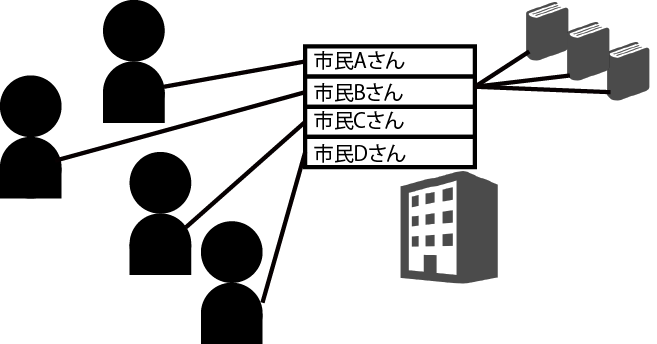
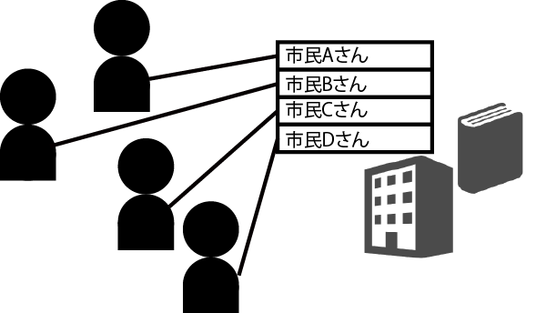
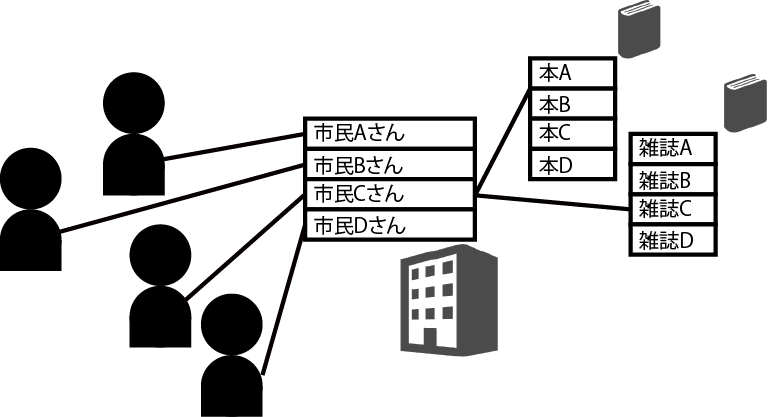
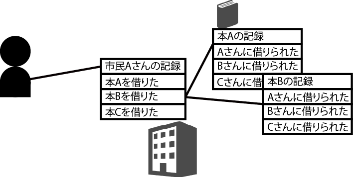
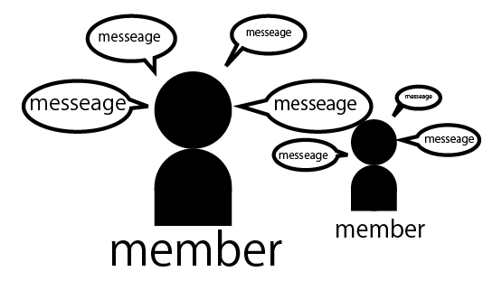

# 複数のテーブルの連携

* CakePHP3には、複数のDBテーブルを関連づけて処理するための仕組みが用意されている
* テーブルの関連付けの基本となる４つのアソシエーション
    * １対１: hasOne
    * １対多: hasMany
    * 多対１: belongsTo
    * 多対多: hasAndBelongsToMany

## 目次

* 関連付けとアソシエーション
* 外部IDについて
* エンティティを用意する
* MembersTableクラスの用意
* MessageTableクラスの用意
* MembersとMessagesの関係
* Membersのデータ取得
* Membereの詳細を表示する
* Membersデータの新規作成
* Membersデータ更新
* Messagesのデータ取得処理
* Messagesのデータ取得
* Messageの新規作成
* Messageのデータ更新
* Messagesの削除

## 関連付けとアソシエーション

* DBというのは、１つのテーブルだけでは完結しない
* 複数のテーブルが関連づけのため**アソシエーション**と一般に呼ばれる機能が用意されている
    * アソシエーション: あるテーブルと別のテーブルがどのような関係にあるかを示すための機能
* このアソシエーションには、いくつかの関連がある

### has One

* あるテーブルのレコードと、別のテーブルのレコードがそれぞれ`1対1`の関係で関連づけられている場合
    * 例: 街の住民のテーブルと、図書館の利用者登録テーブル
        * 図書館の利用者テーブルにあるレコードは、必ず住民テーブルにあるレコードと１対１で関連づけられる
        * ある図書館の利用者が、複数の住民に関連づけられていることはない
        * 図書館の利用者テーブルは、住民テーブルとhas Oneの関係にある
        * この関係は、逆の立場から見ると必ずしも成立するわけではない
        * つまり、住民テーブルのレコードの中には、図書館利用者テーブルと関連づけられていないものもある
            * 住民は必ず図書館の利用登録をしているわけではないため
        * アソシエーションは、**どちらを主にして関係を考えるか**が重要     
        * この例の場合、図書館利用者テーブルが主で、これに住民テーブルが関連づけられている、と考える



#### has Many

* `１対多`の関係
* あるテーブルのレコードに、別のテーブルにある複数のレコードが関連づけられている、という場合
    * 例: 図書館の利用者テーブルと、図書のテーブル
        * 利用者は、一度に何冊でも本を借りられる
        * ある利用者のレコードには、いくつもの図書データが関連づけられている
        


#### belongs To

* `多対１`の関係
* `has Many`を**逆方向から見るとbelongs To**の関係になる
* つまり、`あるテーブルにある複数のレコードが、別のテーブルの同じレコードに関連づけられる`、という場合
    * 例: 図書データにある多数のレコードが、利用者テーブルの一人のレコードに関連づけられる、ということ



#### belogs To Many

* `多対多`の関係
* あるテーブルにある複数のレコードが、別のテーブルの複数レコードに関連づけられる、というもの
    * 例: 図書館の利用者テーブルと、本の貸し出し記録テーブル
        * ある利用者は、何冊もの本の貸し出し記録がある
        * ある本はそれまで何人もの利用者にも貸し出されている
        * このように、お互いが複数の相手と関連する場合にこれが用いられる
        


### ２つのテーブルを用意する

* 実際に関連づけを行う
    * まずは、テーブルを用意
    * `members`と`messages`という２つのテーブルを作成する
    * `members`と`messages`が`１対多`の関連で関連づけられるようにする
    * `members`のレコードの１つに、`messages`の複数のレコードが関連づける
        * これは、簡単なメッセージ投稿システムのDBをイメージするとよい
            * `members`: 利用者を管理するテーブル
            * `messages`: 投稿されたメッセージを管理するテーブル

#### membersの構成

* id: プライマリキー
* name: 利用者の名前を保管する
* [SQL](members.sql)

#### messagesの構成

* id: プライマリキー
* members_id: 関連するmembersのID
* comment: 投稿されたメッセージ
* [SQL](messages.sql)

### 外部ID

* ポイントは、`messages`テーブルにある`members_id`という項目
* これは`外部ID (外部キー)`と呼ばれる働きをするもの
* 外部ID: 関連づけられるテーブルのIDを保管するもの
    * ここでは、`messages`テーブルに、関連する`members`のレコードのIDを保管するために用意してある
    * 外部IDは、このように`テーブル名_id`という名前でつけられるのが一般的

### エンティティを用意する

* 以下のファイルを作成する
    * `Model`/`Entity`/[Member.php](Member.php)
    * `Model`/`Entity`/[Message.php](Message.php)
* アソシエーションに関する機能は、エンティティには特に用意することはない

### MembersTableクラスの用意

* `Member`のテーブルクラスを作成
    * src/Model/Table/[MembersTable.php](MembersTable.php)
* `MembersTable`クラスでは、テーブルクラスの初期化処理と、バリデーション関係の処理を用意
* 今回のポイントは、初期化処理をしている`initialize()`

```text
$this->table('members');
$this->displayField('name');<br>
$this->primaryKey('id');
```

* `table()`でテーブル名を設定
* `displayField`でデータを表示する際のフィールド名をnameに設定
* `primaryKey`でプライマリキーのフィールド名を設定

アソシエーション部分

```text
$this->hasMany('Messages', [
    'foreignKey' => 'members_id'
]);
```

* これが、アソシエーションの設定
* `hasMany`は先ほどの`１対多 (has Many)`のアソシエーション設定を行うためのメソッド

呼び出し方

```text
$this->hasMany( 関連するテーブル , [ 設定情報の連想配列 ]);
```

* `Message`を第一引数に設定
* エンティティクラス名はMessageだが、ここで設定する値は`Messages`
* また第二引数の連想配列には、`foreignKey`を指定
    * これは、テーブルに用意した外部キーのフィールド名
    * これにより、`members_id`を外部キーとして認識するようになる

#### 他のアソシエーション設定メソッド

* has One
    * `$this->hasOne( 関連するテーブル , [ 設定情報の連想配列 ]);`
* has many
    * `$this->hasMany( 関連するテーブル , [ 設定情報の連想配列 ]);`
* belongs to
    * `$this->belongsTo( 関連するテーブル , [ 設定情報の連想配列 ]);`
* belongs to many
    * `$this->belongsToMany( 関連するテーブル , [ 設定情報の連想配列 ]);`

### MessageTableクラスの用意

* テーブルクラス`Table`/`MessagesTable.php`作成
    * この`MessageTable`は、`MembersTable`側からhasManyで関連づけられる側のテーブルクラス
    * 基本的に、関連づけられる側には、特別な処理などは不要
    * 一般的なテーブルクラスとして作成して構わない
        * ただし、今回は、この`MessageTable`側から、`MembersTable`側へ関連づけられる設定を用意してある

```text
$this->belongsTo('Members', [
    'foreignKey' => 'members_id',
    'joinTyep' => 'INNER'
]);
```

* `belongsTo`は、`多対１(belongs to)`のアソシエーションを設定するためのもの
* belongs toは、has manyの逆方向からのアソシエーション
    * これを用意する
        * Memberのデータから、Messageのデータから、関連するMemberを取得可能になる
    * この`belongsTo()`も、使い方は`hasMany`と同じ
    * 第一引数には`Members`を指定する
    * 第二引数には、`foreignKey`として`members_id`が指定されている
        * これは、`hasMany`の場合とほぼ同じ
* 重要なのはその後の`joinType`という値の設定
    * `belongs to`は、SQLで`Inner Join`と呼ばれる結合によって処理される
    * 両者の接続方式が、hasOneやhasManyなどとは異なる
        * このため、`joinType`を明示的に`'INNER'`に設定している

#### ルールチェッカーについて

* `buildRules`
    * これは、`ルールチェッカー(rules checker)`と呼ばれるオブジェクトを返すもの
    * `Messages`に`members_id`が用意されているかを明示的にチェックするための仕組み
        * (Membersテーブルには外部キーはなかったため、このメソッドは用意されていなかった)

```text
public funciton buildRules(RulesChecker $rules)
{
    $rules->add($rules->existsIn(['members_id'], 'Members'));
    return $rules;
}
```

* 引数に渡される`RulesChecker`インスタンスの`add()`を使い、ルールを追加している
* 引数には、`RulesChecker`の`existsIn()`を使う
* これは、第一引数の配列にあるフィールドが、第二引数のテーブルに全て用意されているかをチェックするもの
* これで、ちゃんと用意されていれば、trueが`add`されるが、なければfalseが`add`され、ルールチェックでエラーになる

### データアクセス(複数テーブルの連携)

* これまで単一のテーブルに対する操作を見てきた
* 次に関連するテーブルのデータもむ
* これを簡単に実現するために、CakePHPでは、テーブル同士の関連性は、**モデルの中に定義**する

#### n:1の検索　belongsTo

* 例: 会議と会議室の関係
    * ある会議室では複数の会議が開催される(n)
    * それに対して、ある会議では１つの会議室しか使いない(1)
    * これを会議モデルから見たのが、n:1の関係

この関係を会議モデルでは、下記のように定義

```text
//belogsTo(n:1)の定義

// app/Model/Meeting.php
public $belongsTo = array(
    'MeetingRoom' => array (
        'className' => 'MeetingRoom',        // 識別名
        'foreignKey' => 'meeting_room_id',    // 関連先Modelクラス名
        'conditions' => '',                    // 外部キー
        'fields' => '',                        // 関連先抽出条件
        'order' => ''                        // 取得結果並び順
);
```

* Modelクラスのメンバー変数`$belongsTo`に、配列をセットする感じ
* 配列であるため、あるモデルから複数のbelongsTo連携も可能
* 識別名は基本的に関連先のModelクラス名
    * 例: 同じモデルと抽出条件を変えて複数連携させたい場合
        * この識別名を変更して複数定義可能
* classNameは関連先のModelクラス名
    * 今回の例ではMeetingRoom(会議室)
* foreignKeyは、どの項目を外部キーとするか
* 外部キーの基本は、`関連先モデル名 + _id`
* conditionsは関連先データの絞り込み条件
* 例: 関連先にレコード区分などという項目があれば、ここで絞り込める
    * 書式は`find()`の`conditions`と同じ
* fieldsは関連先データのうち特定項目だけを取得する際に使う
    * 書式はfind()のfieldsと同じ
* `order`は検索結果の並び順を指定
    * 書式はfind()のorderと同じ

#### 動作確認

* Bakeで生成したサンプルで、会議室情報と会議情報を登録
* MeetingsController.phpのindex()の先頭に、下記の１行を追加

```bash
vim app/Controller/MeetingsController.php
```

```diff
  public function index() {
    
+     debug ($this->Meeting->find ('all', array()));
```

この状態でブラウザから`http://localhost/meetingman/meetings`にアクセス

下記のように検索結果が表示される

```text
//n:1の検索結果
array(
    (int) 0 => array(    // １軒目のデータ
        'Meeting' => array(
            'id' => '1',
            〜中略〜
        ),
        'MeetingRoom' => array(
            'id' =>
            'name' => '大会議室'
        ),
        'Member' => array()
    ),
    (int) 1 => array(    // ２件目のデータ
            〜中略〜
    )
)
```

このように、会議(Meeting)を検索しただけなのに、会議室(MeetingRoom)の呪法も取得できてしまう

#### 1:nの検索　hasMany

* 前述の会議と会議室の関係を、逆に会議室の側から見ると、1:nの関係になる

この関係を、会議室モデルでは下記のように定義している

```text
//hasMany(1:n)の定義
public $hasMany = array(
    'Meeting' => array(                    // 識別名
        'className' => 'Meeting'           // 関連先モデルクラス名
        'foreignKey' => 'meeting_room_id', // 外部キー
        'dependent' => false               // 削除時に従属データも削除するか
        'conditions' =>                    // 関連先抽出条件
        'fields' =>                        // 取得項目数
        'order' =>                         // 取得結果並び順
        'limit' =>                         // 最大取得件数
        'offset' =>                        // 取得開始件数
        'exclusive' =>                     // 関連データ削除時に一括削除
        'finderQuery' =>                   // 関連モデル検索時の独自SQL
    )
);
```

* 今度はモデルクラスのメンバー変数`$hasMany`に配列をセットしている
* 識別名classNameforeignKeyconditionsfieldsについては、belongsToと同じ
* `dependent`は、このデータを削除したいときに、従属データも削除するか
    * 例ではfalse(削除しない)をセットしている
* `order`は関連先データの並び順を指定
    * 書式はfind()のorderと同じ
    * ここにMeeting.id DESCと指定すれば、たて会議室を昇順で検索しても、会議室情報は降順で取得される
* `limit`は関連先データの最大読込件数
    * 書式はfind()のlimitと同じ
* `offset`は関連先データが複数件取得できた場合に、何件目から取得するか
    * 書式はfind()のoffsetと同じ
* `exclusive`は、従属データを削除する際に、
    * (A)複数件の従属データをdeleteAll()で一括削除するか
    * (B)delete()を従属データの件数文発行するか
    * 設定値はtrue(一括削除)かそれ以外(各行削除)で指定する
        * パフォーマンスはtrueのほうがいい
        * コールバックメソッドを使うなら指定しないほうがいい
            * `deleteAll()`はコールバックメソッドを呼ばないため
* `finderQuery`は、関連モデルを検索する際に独自のSQLを発行したい場合に設定
    * SQLを書いてしまうとDBに依存してしまうため、あまり使わない項目

##### 動作悪人

Bakeで生成したサンプルでMeetingRoomController.phpのindex()の先頭に、下記の１行を追加

```text
//app/Controller/MeetingRoomsController.php
public function index() {

    // ↓この１行を追加
    debug ($this->MeetingRoom->find ('all', array()));
    
    $this->MeetingRoom->recursive = 0;
}
```

この状態でブラウザからhttp://localhost/meetingman/meeting_roomsにアクセス

下記のように検索結果が得られる

```text
//1:nの検索結果
array(
    (int) 0 => array(
        'MeetingRoom' => array(        // １件目のデータ
            'id' => '1',
            'name' => '大会議室'
        ),
        'Meeting' => array(
            (int) 0 => array(        // １件目の子レコード
                'id' => '1',
                'start_time' => '2017-05-10 13:00:00',
                'end_time' => '2017-05-10 14:00:00',
                'meeting_room_id' => '1',     // ←外部キー指定あり
                'title' => '定例経営会議',
                'gidai' => '社員食堂のメニューについて',
            ),
            (int) 1 => array(        // ２件目の子レコード
                'id' => '2',
                'start_time' => '2017-05-11 14:00:00',
                'end_time' => '2017-05-11 15:00:00',
                'meeting_room_id' => '1'        // ←外部キー指定あり
                'title' => '役員会',
                'gidai' => '来月の目標設定について',
            )
        )
    ),
    (int) 1 => array(            // ２件目のデータ
        〜中略〜
    )
);
```

* 今度は、会議室を検索したら、その会議室を指定している会議情報も取得できた
* モデル形式の配列が２つ並んでいた
    * 前述のbelongsToは、主となるレコードに対して関連レコードが１件だったため
* 子レコード`Meeting`の下に、添え字をつけて複数のレコードを格納している
    * hasManyは関連レコードを複数件持つ可能性があるため

●hasOneについて

* モデルには、hasManyの兄弟分として$hasOneというメンバー変数がある
* これは、hasManyと類似
    * しhasManyが従属データが複数(1:n)
    * hasOneは従属データは１件(1:1)
* あまり使用はしない
    * 正規化して同じレコードにするか、hasManyのlimitを１にするだけで対応可能なため

#### n:nの検索　hasAndBelongsToMany

* 例: 会議とメンバーの関連
    * ある会議には、複数人(n)の出席者がいる
    * ある人は、複数の会議(n)に出席する
    * つまり両者はn:nの関係になる

この関係を、メンバーモデルでは下記のように定義している

```text
//hasAndBelongsToMany(n:n)の定義
public $hasAndBelongsToMany = array(
    'Meeting' => array(
        'className' => 'Meeting',    // 識別名
        'joinTable' => 'meetings_members',    // 関連先モデルクラス名
        'foreignKey' => 'member_id',    // 関連テーブル名
        'associationForeignKey' => 'meeting_id',    // 関連先モデルへの外部キー
        'unique' => 'keepExisting',    // 唯一の関連データとみなすか
        'conditions' => '',            // 関連先抽出条件
        'fields' => '',                // 取得項目名
        'order'    => '',                // 取得結果並び順
        'limit' => '',                // 最大取得件数
        'offset' => '',                // 取得開始件数
        'finderQuery => '',            // 関連先モデル検索時の独自SQL
        'deleteQuery => '',            // 関連先モデル削除時の独自SQL
        'insertQuery => ''            // 関連先モデル登録時の独自SQL
    )
);
```

* `joinTable`は関連テーブル(中間テーブル)の名前
    * モデル名ではないことに注意
* また、n:n関連の場合は、関連テーブルに両モデルへの外部キーを持っている
    * `foreignKey`は自モデルのレコードを示す外部キー項目をを指定する
    * `assosiationForeignKey`は関連先モデルのレコードを示す外部キー項目を指定する
* `unique`は、登録時や更新時の関連テーブルのレコードの扱いを指定する
    * 初期値であるtrueを指定するとこれまでの自モデルの関連レコードを全部削除してから１件だけ登録し直す
        * 例: 更新データに１件の関連情報もセットしておく
    * これは、更新時に自モデルの情報と関連情報をセットで持ち回る使用の場合には有用
    * でも、設計思想として、自モデルを更新する際に関連情報を全て持ち回るのは不便な場合もある
        * シンプルではある
    * そんな時には、ここに'unique' => 'keepExisting'とセットしておく
        * そうすれば既存の関連は削除されない
* `finderQuery`,`deleteQuery`,`insertQuery`
    * それぞれ関連先モデルを、検索削除登録する際に、SQL文を直接使いたい時に指定する

#### 動作確認

* ユーザーを登録して、どれかの会議情報と関連づける
* のindex()の先頭に、下記の１行を追加

```bash
vim app/Controller/MembersController.php
```

```diff
  public function index() {
+     debug ($this->Member->find ('all', array()));
```

* この状態で、ブラウザから、http://localhost/meetingman/Membersにアクセス
* 下記のような検索結果が表示される

```text
array(
    (int) 0 => array(
        'Member' => array(        // １件目のデータ
            'id' => '1',
            'name' => 'AKI',
            'email' => 'aki@aaa.com'
        ),
        'Meeting' => array(
            (int) 0 => array(
                'id' => '2',        // １件目の子レコード
                'start_time' => '2017-05-11 14:00:00',
                'end_time' => '2017-05-11 15:00:00',
                'meeting_room_id' => '1'        // ←外部キー指定あり
                'title' => '役員会',
                'gidai' => '来月の目標設定について',
                'MeetingsMember' => array(    // 関連モデル
                    'id' => '4',
                    'meeting_id' => '2',
                    'member_id' => '1'
                )
            )
        )
    ),
    (int) 1 => array(        // ２件目のデータ
    〜中略〜
    )
)
```

* 今度は、メンバーを検索したらその人が出席予定の会議情報も取得できた
* 取得データの形式は、1:nの時と類似している
    * 関連先モデルの中に関連モデル(Meetingmember)の内容が格納されていることを確認する

#### 関連テーブルの範囲

* 範囲はModelクラスのパラメータ$recursiveで指定が可能

| 値 | 読み込み範囲 |
| -1 | 関連テーブルは読み込まれない |
| 0 | 関連レコードが１件だけの隣のモデルまで読み込む(belongsTo・hasOneで繋がる隣のモデルまで読み込む) |
| 1 | 関連レコードが複数件となる隣のモデルまで読み込む<br>(hasMany・hasAndBelongsToManyで繋がる隣のモデルまで読み込む) |
| 2 | 上記１で関連するモデルのさらに隣のモデルまで読み込む |
| 3 | 上記２で関連するモデルのさらに隣のモデルまで読み込む |

この値を適切に指定することで、必要な情報を芋づる式に取得することが可能になる

* 大きくしすぎると、当然のように、パフォーマンスが悪化する
* ３なんて指定すると、場合によっては全テーブルの大半を検索してしまうなどということもある
* そんな場合、検索前に暫定的に不要なモデルとの関連を解消してやれば、無駄な検索を行わすに済む
    * 関連の解消は下記のメソッドを使う

```text
unbindModel (【パラメータ:配列】,【今回だけ？:bool】)
```

* 第一引数のパラメータは、関連の種類と識別名を指定する
* 第二引数には直後の検索１回だけの関連を解消するか、それ以降も解消するかを指定する
    * 省略時の初期値はtrue
    * 例: 会議室情報を検索する際に、メンバー情報は欲しいけど、会議室情報は不要という場合は、下記のように指定する

```text
//app/Controller/MeetingsController.php
    // ↓以下を追加
    $this->Meeting->unbindModel (
        array ('belondsTo' => array ('MeetingRoom'))
    );
    debug ($this->Meeting->find('all', array()));
    // ↑以上を追加
    
    $this->Meeting->recursive = 0;
```

* これで、会議情報を検索しても、芋づる式に会議室情報まで検索されることはなくなる
* 逆に、普段は関連づけをしていないけれど今回だけ芋づる検索したい！という場合には、bindModel()を使用する

```text
bindModel (【パラメータ:配列】,【今回だけ？:bool】)
```

* 第一引数のパラメータは、関連の種類と関連情報を指定する
* 第二引数には関連付けが直後の検索１回だけか、それ以降も続くかを指定する
    * 省略時の初期値はtrue

## アソシエーション利用のデータアクセス

* アソシエーションを利用する場合、DBアクセスの基本を、`Members`モデルの実装から確認

### MembersとMessagesの関係

* `Members`と`Messages`というモデルを作成した
* モデル間の連携の次に、具体的にDB・アクセスを行う



* 一人のメンバーは複数のメッセージを持っている(Member has Many Messages)
* 一つのメッセージにメンバーは一人(Message belongs to Membar)
* `Messages`には、関連する`Members`にデータを示す外部キー`が用意されている
* これによってその`Messages`がどの`Members`によって投稿されたのかがわかるようになっている
* `Messages`を投稿する際には、必ず投稿者の`Members`のデータを示すIDを外部キーに指定するようになっている
    * `Members`側は、普通のモデルと全く同じ
    * `Messages`側にのみ、外部キーが用意されていた

#### Members側のアクセス

* データ作成(Create)
    * これは、普通に作成すればいいだけ
* データ取得(Read)
    * Membersのデータ取得酢の物は普通の合うセスと同じになる
    * ただし、取得したそれぞれのMemberwsには、関連するMessagesがあるはず
    * これらも含めて取り出せることを考えなければならない
* データ更新(Update)
    * Membersのデータ削除そのものは通常と同じ
    * 削除した場合、そのデータに関連づけられているMessagesのデータをどうするか考える必要がある

#### Message側のアクセス

* データ作成(Create)
    * データ作成時には、そのデータが関連づけられるMembersデータのIDを、外部キーに指定する必要がある
* データ取得(Read)
    * Messagesのデータ取得そのものは普通のアクセスと同じ
    * 取得したそれぞれのMessageには、関連するMembersがある
        * それらも合わせて取得することを考えなければならない
* データ更新(Update)
    * 外部キーを変更し、別のMembersデータと関連づけられるようにする場合は、外部キーの指定を正しく行う
* データ削除(Delete)
    * これは、普通のアクセスと同様に、ただ削除するだけでいい

### Membersのデータ取得

* `Member`側の処理
* 最初に、基本とも言えるデータの取得(Read)から
* データの一覧は、`index`アクションとして作成するのが一般的

```text
public function index()
{
    $this->set('members',$this->paginate($this->Members));
    $this->set('_serialize',['members']);
}
```

* ページネーションで使った`paginate()`でMembersのデータを取得し、それをmembers変数に設定する
* またデータの初期化などに用いられる`_serialize`変数には`members`を指定する
* ページネーションを使用
    * `initialize()`で`$this->loadComponent('Paginator');`を実行
    * `paginator`コンポーネントをロードするのを忘れないように注意
* membersとして渡されたデータは、index.ctp側で出力する

```text
//src/Controller/MemsController.php
<tbody>
<?php foreach ($members as $member): ?>
<tr>
    <td><?= $this->Number->format($member->id) ?></td>
    <td><?= __($member->name) ?></td>
    <td class="actions">
        <?= $this->Html->link(__('View'),
            ['action' => 'view', $member->id]) ?>
        <?= $this->Html->link(__('Edit'),
            ['action' => 'edit', $membr->id]) ?>
        <?= $this->Form->postLink(__('Delete'), ['action' => 'delete',
            $member->id],
            ['confirm' => __('Are you sure you want to delete #{0}?',
            $member->id)]) ?>
    </td>
<?php endforeach; ?>
</tbody>
```

* `foreach ($members as $member)`として、`$members`から順にデータを`$member`に代入していく
* そして、`$member->id`、`$member->name`というようにしてデータのIDやnameの値を出力していく
* この辺りは、普通のDB・アクセスとなんら変わらない
* 合わせて、データの内容を表示するView、編集するEdit、削除するDeleteといったリンクも用意

```text
<?= $this->Html->link(__('View'), ['action' => 'view', $member->id]) ?>
```

* これは`Htmlヘルパー`というものの機能を使用している
* Htmlヘルパーは、HTMLタグを出力するための機能を提供するもの
    * `link()`は`<a>`タグによるリンクを生成する
    * アクションとIDを連想配列にまとめて渡す
    * そのアクションにアクセスするためのURLを生成し、リンクを作ってくれる
        * `'action' => 'view', $member->id ]`
        * 例: `ID = 1`ならば、${Domain}/members/view/1といったアドレスへのリンクが作成される

### Membereの詳細を表示する

* Membersのindexに作成されたViewリンクで表示されるページについて
* indexでは、Viewリンクをクリックすると、`http://localhost:8765/members/view/1`といったアドレスになる
* viewアクションでは、合わせて送られたID番号をもとに`Members`のデータを取得
* そのデータに関連づけられた`Messages`のリストも取得して表示する
* アクションメソッドは以下のようになる

```text
public function view($id = null)
{
    $member = $this->Members->get($id, ['contain' => ['Messages']
    ]);
    $this->set('member', $member);
    $this->set('_serialize', ['member']);
}
```

これを見ればわかるように、実はDBからデータを取得しているのは、わずか一文だけ

```text
$this->Members->get($id, ['contain' => ['Messages']]);
```

* `get()`は、引数に指定したIDのデータを取得する
    * しかしアソシエーションを利用する場合
    * 第二引数に`contain`というキーを用意
    * それに関連するモデル名を指定する
    *   get下データに関連づけられている別のモデルのデータもまとめて取り出し可能

取り出したデータの出力 - Membersのデータ

```text
//src/Template/Mems/view.ctp
<div class="row">
    <h4><?= __('Name') ?></h4>
    <?= $this->Text->autoParagraph(h($member->name)); ?>
</div>
<div class="row">
    <h4><?= __('Mail') ?></h4>
    <?= $this->Text->autoParagraph(h($member->mail)); ?>
</div>
```

* `$member`の値を取り出し出力するだけ
* 問題は、関連する`Messages`データ

```text
//src/Template/Mems/view.ctp
<table cellpadding="0" cellspacing="0">
    <tr>
        <th><?= __('Id') ?></th>
        <th><?= __('Members Id') ?></th>
        <th><?= __('Title') ?></th>
        <th><?= __('Comment') ?></th>
    </tr>
    <?php foreach ($members->messages as $messages): ?>
    <tr>
        <td><?= h($messages->id) ?></td>
        <td><?= h($messages->members_id) ?></td>
        <td><?= h($messages->title) ?></td>
        <td><?= h($messages->comment) ?></td>
        <td class="actions">
            <?= $this->Html->link(__('View'),
                ['controller' => 'Messages',
                'action' => 'view', $messages->id]) ?>
            <?= $this->Html->link(__('Edit'),
                ['contoller' => 'Messages',
                'action' => 'edit', $messages->id]) ?>
            <?= $this->Form->postLink(__('Delete'),
                ['controller' => 'Messages',
                'action' => 'delete', $messages->id],
                ['confirm' => __('Are you sure you want to delete # {0}?' ,
                $messages->id)]) ?>
        </td>
    </tr>
    <?php endforeach; ?>
</table>
```

* アソシエーションを設定している場合
    * 関連する`Messages`のデータは、`member->messages`という形でまとめられている
* ここからデータを順に変数に取り出し、繰り返し処理していく
    * 関連する全ての`Messages`を処理できる

### Membersデータの新規作成

* 専用のフォームを用意したページを作る
* フォームを送信したらその内容を保存するような形で実装する
* まずは、フォームから作成

```text
<?= $this->Form->create($member) ?>
<fieldset>
<legend><?= __('Add Member') ?></legend>
<?php 
    echo $this->Form->input('name');
    echo $this->Form->input('mail');
?>
</fieldset>
<?= $this->Form->button(__('Submit')) ?>
<?= $this->Form->end() ?>
```

* `$this->Form->create($member)`で、コントローラー側から渡された`$members`を指定して、`<form>`を作成する
* そして`$this->Form->input`でnameとmailの入力フィールドを作成する
* あとは、このフォームの送信処理を`add()`として用意しておくだけ

```text
public function add()
{
    $member = $this->Members->newEntity();
    if ($this->request->is('post')) {
        $member = $this->Members->patchEntity($member,$this->request->data);
        if ($this->Members->save($member)) {
            $this->Flash->success
                (__('The member has been saved.'));
            return $this->redirect(['action' => 'index']);
        } else {
            $this->Flash->error(
                __('The member could not be saved.');
    }
    $this->set(compact('member'));
    $this->set('__serialize', ['member']);
}
```

* まず`newEntity`で新しいエンティティのインスタンスを用意

```text
$member = $this->Members->newEntity();
```

* あとは、`patchentity`を使い、送信されたフォームの内容を新しいエンティティにマージ
    * `$this->Members->patchEntity($member, $this->request->data)`
* そして`save`で保存すれば完了

```text
$member = $this->Members->patchEntity($member, $this->request->data);
if ($this->Members->save($member).....
```

* 基本的にはアソシエーションを設定していないモデルの場合と同じ
* Membersには外部キーもないため、ごく普通のモデルと考えて処理して構わない

### Membersデータ更新

* データの更新
* indexでは、Editというリンクを用意
* これをクリックすることで、アドレスで編集ページにアクセスするようになる
    * 例: `http://localhost:8765/members/edit/1`
* editアクションにデータを編集するためのフォームページを用意
* その表示と、送信した際のデータ更新処理を用意すればいい
    * データの更新をするフォームのテンプレート(edit.ctp)は、下記の具合にフォームを用意

```text
<?= $this->Form->create($member) ?>
<fieldset>
    <legend><?= __('Edit Member') ?></legend>
    <?php 
    echo $this->Form->input('name');
    echo $this->Form->input('mail');
    ?>
</fieldset>
<?= $this->Form->button(__('Submit')) ?>
<?= $this->Form->end() ?>
```

* 見ればわかるように、addアクション用のテンプレートとほぼ同じ
* フォームタグの生成は、`$this->Form->create($member)`というようにフォームヘルパーを使用して行う
* また、`Form->input`を使い、nmaeとmailの編集フィールドを作っている

こうして作成されたフォームの送信処理は、下記のように`edit()`で実装

```text
public function edit($id = null)
{
    $member = $this->Members->get($id, [
        'contain' => []
    ]);
    if ($this->request->is(['patch', 'post', 'put'])) {
        $member = $this->Members->patchEntity($member, $this->request->data);
        if($this->Members->save($member)) {
            $this->Flash->success(
                __('The member has been saved.'));
            return $this->redirect(['action' => 'index']);
        } else {
            $this->Flash->error(
                __('The member could not be saved.'));
        }
    }
    $this->set(compact('member'));
    $this->ser('_serialize', ['member']);
}
```

* まず、`Members`の`get`を使い、指定のIDのインスタンスを取得
* このとき第二引数に`contain`オプションを用意
    * 関連する`Messages`インスタンスも含めて`$member`変数に取り出す

```text
    $member = $this->Members->get($id, [
        'contain' => []
    ]);
```

* データの更新は、基本的には通常のデータ更新処理と同じ
* `Members`の`patchEntity()`を使い、`$member`に送信フォームの値をマージする
* そして`save`を呼び出してインスタンスを保存する

```php
$member = $this->Members->patchEntity($member, $this->request->data);
if ($this->Members->save($member)) {
```

* これでデータの更新が実行される
* 基本的には、ごく普通の更新処理と変わらない

#### Memberの削除

* データの削除は、更新と同様、indexで表示されるリストに用意した`Delete`リンクをクリックして行う
* このリンクは、`/members/delete/ID番号`というアドレスに`POST`送信するようになっている
    * そのため、deleteアクションに削除の処理を用意すれば、データの削除が行える

実際にindexにアクセスしたとき、Deleteリンクは下記のように出力されている

```text
<form name="post_xxx" 
    style="display:none;" 
    method="post" 
    action="/members/delete/ID番号">
    <input type="hidden" name="_method" value="POST" />
</form>
<a href="#" onclick="if (confirm(○○))
    { document.post_xxx.submit(); }
    event.returnValue = false;
    return false;">Delete</a>
```

* `method="post" action="/members/delete/ID番号"`と指定したフォームを用意
* `<a>`タグからこのフォームのsubmitを実行して送信している
* deleteアクションを用意

```text
public function delete($id = null)
{
    $this->request->allowMethod(['post', 'delete']);
    $member = $this->Member->get($id);
    if ($this->Members->delete($member)) {
        $this->Flash->success(
            __('The member has been deleted.'));
    } else {
        $this->Flash->error(
            __('The member could not be delete.'));
    }
    return $this->redirect(['action' => 'index']);
}
```

* `Members`の`get()`を使い、指定したIDのインスタンスだけを取り出す

```text
$member = $this->Member->get($id);
if ($this->Members->delete($member)).....
```

* あとは、`Members`の`delete()`を使い、インスタンスを削除するだけ

## アソシエーション利用のデータアクセス

* アソシエションの外部キーを置いているMessages側でもCRUD実装の際には注意すべき点がある

### Messagesのデータ取得処理

* アソシエーションによるモデルのCRUDについて考える
* 今回は、`Messages`側の処理について
* まずは、データの一覧表示から
* これは、indexアクションとして作成することになる
* `Members`と`Messages`
    * `Messages`側に、関連する`Members`のデータのID番号を記録する外部キーが用意されている
* データを検索する
    * `Messages`だけでなく、この外部キーに設定されているIDのMembersデータも合わせて取り出したい

```text
public funcion index()
{
    $this->paginate = [
        'contain' => ['Members']
    ];
    $this->set('messages', $this->paginate($this->Messages));
    $this->set();'_serialize', ['messages']
}
```

* ここでは、まずページネーション時に必要となる`contain`オプションを設定しておく

```text
$this->paginate = [
    'contain' => ['Members']
];
```

* `contain`というのは、前回、getでデータを取得する際、引数として用意したのと同じ値
* これを連想配列として用意しておく
* `contain`には、'Members'を指定
    * この`Messages`が`Members`と関連づけられていることを示しておく
* `paginate`には、ページネーションの設定などが保管されている
    * これに、用意した連想配列の値を設定する
    * あとは、`paginate()`を使い、`Message`のデータを取得し、messagesに設定する

```text
$this->set('messages', $this->paginate($this->Messages));
$this->`set`('_serialize', ['messages']);
```

* `$this->Messages`を引数に指定して、`paginate`を呼び出している
* そして、`'_serialize'`には、messagesを指定しておく
    * この部分は、`Member`の処理と全く同じ
    * 違いは、事前に`contain`を設定しておく、というだけ
    * これをあらかじめ指定しておく
        * アソシエーションを設定した状態でページネーションを行うようになる
* `Messages`に関連する`Members`を検索するような処理は全くない
    * そうした処理は、必要ない
    * ただ`contain`を指定して`Messages`を検索する
        * それぞれの`Messages`データに関連する`Members`データも一緒に抜き出される
* あとはテンプレート側で、受け取った`Messages`の値を出力していくだけ
* これは`<table>`タグ内で繰り返しを使い、`$message`から順に値を取り出し出力していけばいい

```text
<?php foreach($messages as $message): ?>
<tr>
    <td><?= $this->Number->format($message->id) ?></td>
    <td><?= __($message->title) ?></td>
    <td><?= $message->has('member')?
        $this->Html-link($message->member->name,
            ['controller' => 'Members', 'action' => 'view',
            $message->member->id]):'' ?>
    <td class="actions">
        <?= $this->Html->link(__('View'),
['action' => 'view',
            $message->id]) ?>
        <?= $this->Html->link(__('Edit'),
['action' => 'edit',
            $message->id]) ?>
        <?=  $this->Form->postLink(__('Delete'),
            ['action' => 'delete',
$message->id],
            ['confirm' => __('you want to delete # {0}?',
            $message->id)]) ?>
    </td>
</td>
```

* 以下を出力している
* `Messages`のタイトル`title`
* その`Messages`を投稿した利用者の`Members`データの名前`name`

```text
$message->title
```

* `foreach`で`$message`に`Messages`インスタンスが代入されるため、そのtitleを出力するだけ
* この`Messages`に関連づけられる`Members`データのnameは、`$message->member->name`のようになる
    * memberプロパティに、関連するMembersインスタンスが設定されている
* 今回もMessageのtitleを表示する他に、ViewEditDeleteといったアクションのリンクを出力させてある
* 以後、これらのリンク先のアクションを実装していく

### Messagesのデータ取得

* Viewリンクの処理から
* これは、viewアクションとして用意される
* `/view/1`というように、表示するデータのID番号を指定してアクセスする
* そのデータの詳細が表示されるようにする

```text
public function view($id = null)
{
    $message = $this->Messages->get($id, [
        'contain' => ['Members']
    ]);
    $this->set('message',$message);
    $this->set('_serialize', ['message']);
}
```

* これも、`Members`のviewアクションと基本的には変わらない

```text
$message = $this->Messages->get($id, [
    'contain' => ['Members']
]);
```

* まず、`get`でID番号を指定して`Messages`のデータを検索する
* このとき、第二引数にオプションとして`contain`を用意しておく
    * これでインスタンスが得られる
    * あとはそれを`message`に代入し、`_serialize`の設定を行うだけ

```text
$this->set('message', $message);
$this->set('_serialize', ['message']);
```

こうしてデータが得られたら、あとはテンプレートで出力する

```text
<table class="vertical-table">
    <tr>
        <th><?= __('Member') ?></th>
        <td><?= $message->has('member') ?
                $this->Html->link($message->member->name,
                ['controller' => 'Members',
                'action' => 'view',
                $message->member->id]) : '' ?>
        </td>
    </tr>
    <tr>
        <th><?= __('id') ?></th>
        <td><?= $this->Number->format
                ($message->id) ?></td>
</table>
<div class="row">
    <h4><?= __('Title') ?></h4>
    <?= $this->Text->autoParagraph(
            h($message->title)); ?>
</div>
<div class="row">
    <h4><?=  __('Comment') ?></h4>
    <?= $this->Text->autoParagraph(
            h($message->comment)); ?>
</div>
```

* ここでは、コントローラーから渡された`$messages`の中から必要な値を出力している
* `Message`の内容は、こんな具合に指定すれば得られる

```text
$message->title
$message->comment
```

* この`Messages`データに関連づけられている`Members`データ
    * `$message->member`という値に保管されている
* 例: 投稿した人の名前を出力する
    * `$message->membeer->name`という具合に指定すれば名前を取得可能
* アソシエーションの方式は、`Members`と`Messages`で異なるが関連するデータの扱いは全く同じ
    * Membersから見ればMessagesはhas many、Messagesから見ればMembersはbelongs to
    * インスタンスの中に、関連するモデル名のプロパティがある
    * そこに関連モデルのインスタンスが代入されている

### Messageの新規作成

* 続いて、`messages`の新規作成
* これは、addアクションとして用意する

```text
public funcion add()
{
    $message = $this->Message->newEntity();
    if ($this->request->is('post')) {
        $message = $this->Messages->patchEntity
            ($message, $this->request->data);
        if ($this->Messages->save($message)) {
            $this->Flash->success(
                __('The message has been saved.'));
            return $this->redirect(['action' => 'index']);
        } else {
            $this->Flash->error(
                __('The message could not be saved.'));
        }
    }
    $members = $this->Messages->Members->
        find('list', ['limit' => 200]);
        $this->set(compact('message', 'members'));
        $this->set('_serialize', ['message']);
}
```

* ここでは、まず新しいエンティティのインスタンスを作成する
* `$message = $this->Messages->newEntity();`
* そして、これに送信されたフォームの内容をマージし、`save()`でその内容を保存する

```text
$message = $this->Message->patchEntity($message,
    $this->request->data);
if ($this->Messages->save($message)).....
```

* 処理の流れとしては、基本的なフォーム送信と保存の方法と同じ

```text
<?= $this->Form->create($message) ?>
<fieldset>
    <legend><?= __('Add Message') ?></legend>
    <?php 
        echo $this->Form->input('members_id',
['options' => $members]);
        echo $this->Form->input('title');
        echo $this->Form->input('comment');
    ?>
</fieldset>
<?= $this->Form->button(__('Submit')) ?>
<?= $this->Form->end() ?>
```

* `$this->Form->create($message)`としてフォームタグを生成
* `$this->Form->input`で入力フィールドを作成するのが基本
* ただし、今回は関連する`Members`を設定するという項目が追加されている

```text
echo $this->Form->input('members_id', ['options' =>$members]);
```

* 外部キーと同じ、`members_id`という名前で用意している
* 第二引数に、`'options'`として`$members`を指定している
* この変数は、コントローラー側で、`$this->Messages->Members->find`を使って取り出したもの
* `Messages`内の`Members`にある`find`を呼び出す、というところがちょっと変わっている
* そして呼び出すメソッドは第一引数に'list'を指定している
    * 、`find('list', ['limit => 200])`
    * こうすることで、`Members`の名前のリストを配列にまとめて取り出し可能
    * limitを指定しているので、最大２００まで
    * listは、データの値を配列として取り出すのに使うもの
* IDではなく`Members`の名前が取り出される
    * displayFieldで指定した項目の値が、listでは配列として取り出されるようになったため
    * `$this->displayField('name');`

`Members`のテーブル(`MembersTable`)クラス

### Messageのデータ更新

* editアクションとして用意
* あらかじめフォームを表示したテンプレートを用意
* アクセス時にそのフォームに編集するデータの内容を設定しておく
* そして送信したら、送られたデータをもとにデータを更新する
    * `Members`の更新処理と同じ

```text
public function edit($id = null)
{
    $message = $this->Messages->get($id, [
        'contain' => []
    ]);
    if ($this->request->is(['patch', 'post', 'put'])) {
        $message = $this->Message->patchEntity
            ($message,$this->request->data);
    if ($this->Messages->save($message)) {
        $this->Flash->success(
            __('The message has been saved.'));
        return $this->redirect(['action' => 'index']);
    } else {
        $this->Flash->error(
            __('The message
could not be saved.'));
    }
    $members = $this->Message->Members->
        find('list', ['limit' => 200]);
    $this->set(comopact('message', 'members'));
    $this->ser('_serialize', ['message']);
}
```

ここまでは、まずIDを指定して`Message`データを取り出しておく

```text
$message = $this->Messages->get($id, [
    'contain' => []
]);
```

* 例によって、第二引数には`contain`を用意しておく
* しかし、値は空のまま
* `Messages`
    * `contain`による`Members`の指定は行わない
    * belongs to で関連づけられているため
        * 外部キーで、関連する`Members`が指定されている
* `Members`には外部キーなどの関連するモデルの情報はない
* `contain`で取り出すときは関連する`Messages`を含むという指定した
* あとは、送信されたフォームのデータを`patchEntity`で`$message`にマージ
* saveで保存するだけ

```text
$message = $this->Message->patchEntity($message,
    $this->request->data);
if ($this->Message->save($message)).....
```

```text
<?= $this->Form->create($message) ?>
<fieldset>
    <legend><?= __('Edit Message') ?></legend>
    <?php 
        echo $this->Form->input('members_id',
            ['options' => $members]);
        echo $this->Form->input('title');
        echo $this->form->input('comment');
    ?>
</fieldset>
<?= $this->Form->button(__('Submit')) ?>
<?= $this->Form->end() ?>
```

* 基本的には、新規作成のadd用フォームと同じ
* フォーム作成時に`$message`を指定しておけば、その値を使ってフォームが生成される
    * `$this->Form->create($message)`というようにする

### Messagesの削除

* データの一覧を表示するindexでは、テンプレートにDeleteリンクを用意してある
* これは、以下のような形でリンクを生成するようになっていた

```text
<?= $this->Form->postLink(__('Delete&),
    ['action' => 'delete', $message->id],
    ['confirm' => '__(○○, $message->id]) ?>
```

これは、実行すると、例えば以下のような形でタグが出力される

```text
<form name="post_xxx" style="display:none;"
    method="post" action="/messages/delete/1">
    <input type="hidden" name="_method"
value="POST"/>
</form>
<a href="#" onClick="if (confirm(○○))
    {document.post_xxx.submit(); }
    evet.returnValue = false;
    return false;">Delete</a>
```

`/message/delte/ID番号`という形で送信されたら削除すればいい

```text
public function delete($id = null)
{
    $this->request->allowMethod(['post', 'delete']);
    $message = $this->Messages->get($id);
    if ($this->Message->delete($message)) {
        $this->Flash->success(
            __('The message has been deleted.'));
    } else {
        $this->Flash->error(
            __('The message could not be deleted.'));
    }
    return $this->rediret(['action' => 'index']);
}
```

ここで行なっているのは、ごく一般的な削除処理そのまま

```text
$message = $this->Message->get($id);
if ($this->Message->delete($message)).....
```

* まず、`Message`の`get`を使って指定したIDの`Messages`インスタンスを取得
* `delete()`を使ってこれを削除する
* ここまでのCRUDは、CakePHP3の機能を使って自動生成したものの抜粋

#### ファイルをダウンロードする

* httpのレスポンスは`HTML画面`だけとは限らない
* 例えば、リンクをクリックした時にファイルをダウンロードしたい場合もある
* そんなときには、`CakeResponse`を使用する
* 例: ファイル・ダウンロードのアクションは、下記のように実装する

```text
//app/Controller/MeetingRoomsController.php
// ファイルをダウンロードするアクション

public function sendFile ($id = null) {

    $setting = array(
        // ファイルの種類
        'type' => 'txt',
        // 名前をつけて保存に表示されるファイル名
        'name' => 'super txt',
        // ダウンロードファイルの内容
        'content' => file_get_contents ('c:/yourFilePath/aaa.txt'),
    );
    
    // 定義されていない種類のファイルを出力する場合は
    // MIMEをセットする
    $this->response->type (array ('txt' => 'text/plain'));
    
    // レスポンスヘッダの組み立て
    $this->response->type ($setting['type']);
    $this->response->download ($setting['name']);
    
    // 画面表示は行わず、レスポンスを直接セット
    $this->autoRender = false;
    $this->response->body ($setting['content']);
}
```

* これだけで、ファイル・ダウンロードができるようになる
* 今回の例では、静的コンテンツを返す場合を想定して、画面を表示しないようにしテイル
* しかし、画面を表示するようにして画面ファイルの中でファイルの生成をする
    * 例: ダウンロードするユーザーごとにダウンロードファイルの中身が変わると行ったシステムなど

## 独自入力チェックルールの作成

* それでは、前述のルールに当てはまらないチェックや、他の項目の入力によってチェック内容が変わる相関チェック
* そんな場合には、モデル・クラス内にメソッドとして「独自の入力チェックルール」を作成する
* 例: `会議室のダブルブッキングが生じないようチェック`要件を`独自入力のチェックルール`として実装

独自入力チェックの例

```text
/* app/Model/Meeting.php */

public $validate = array(
    〜省略〜
    'start_time' => array(        // 開始日時
        'datetime' => array(
            'rule' => array('datetime'),
        ),
        'isDoubleBooking' => array(
            'rule' => array
            'message' => '予約済みです',
        ),
    ),
    【省略】
);

/**
 * この時間帯の会議室は使用されていないか
 * @param array $check 「入力項目名 => 入力値」形式の配列
 * @return boolean true:チェックOK、false:チェックNG
 */
public function is DoubleBooking($check) {
debug ($check);        // 引数を表示してみる

    // 入力内容を取得
    $key => key ($check);            // 項目名の取り出し
    $val => array_shift ($check);    // 入力値の取り出し
    $room_id = $this->data ['meeting']['meeting_room_id'];    // 入力値(会議室ID)の取り出し
    
    // 検索条件組立
    $query = array(
        'conditions' => array(
            'Meeting.meeting_room_id' => $room_id,
            'Meeting.start_time <' => $val,
            'Meeting.end_time >' => $val,
        )
    );
    // この時間に開催中の会議はあるか
    $this->recursive = -1    // 関連テーブルは不要
    $count = $this->find('count', $query);
    
    if ($count >=1) return false;
    return true;
}
```

##### 動作確認

* ブラウザで会議を登録し、その会議と時間帯が重なるような会議を登録する
* 引数`$check`に`項目名`と`入力値`が`配列形式`で引き継がれる
* `独自入力チェックルール`は、これをもとにチェックして結果を`boolean`で返す形になる
* `関連チェック`として他の項目(上記サンプルでは会議室ID)の入力値が知りたい場合
    * `this->data`の中に格納されているためそちらを参照する
