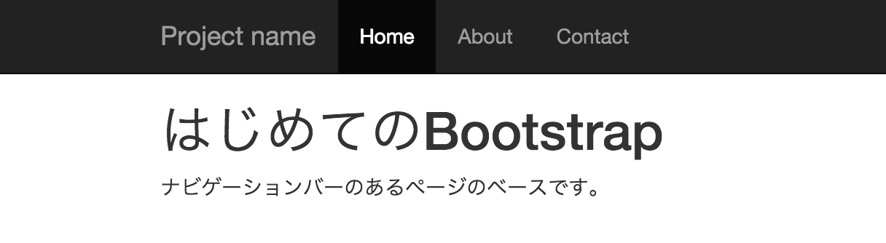
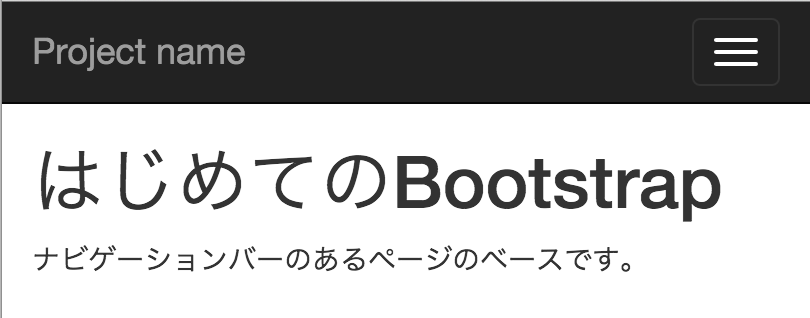
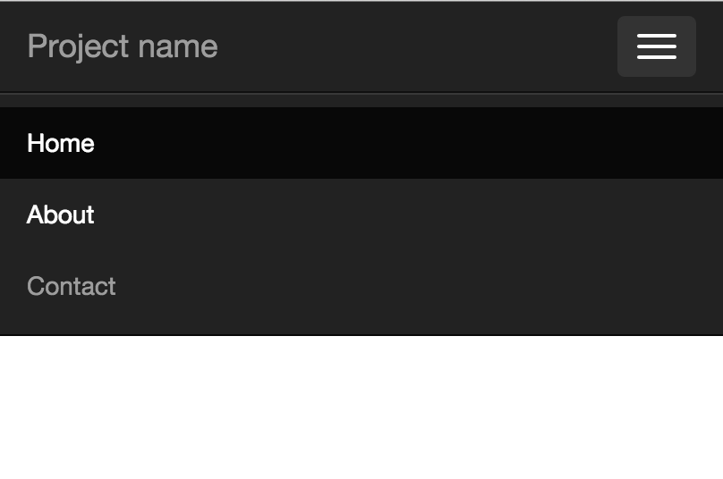

# Webページ作成

## 最も単純なページを作成

[index.html](index.html)

## Starter templateの利用

[startar.html](startar.html)

* スマートフォン向けに「viewport」を設定し、画面の幅を端末サイズに合わせる
    * ここは決まり文句として捉えて構わない
* 「コンテンツ」と「ナビゲージョンバー」を話すために「margin-top」の設定をしている
    * この設定がないと、コンテンツがナビゲーションバーに隠れてしまう
* "navbar"が「ナビゲージョンバー」を表すクラスで、この「div」タグ内で「ナビゲーションバー」を実装する
    * "navbar-inverse"は色を「デフォル色」から反転させ、黒色にするクラス
    * "navbar-fixed-top"クラスで、ナビゲーションバーを上部に固定する
* ブラウザの幅が小さい時に隠れたメニューを表示するボタン
    * このリストがナビゲーションバーの項目になる
    * コンテンツは"dontainer"クラス内に記述

### 表示

### 幅を変えて表示

### メニューを押下

* インタラクティブな操作はJSで実装されている
    * インタラクティブな操作: 「ボタンをクリックするとメニューが表示される」etc,,
* 前提としてbootstrap.jsを読み込んでおく必要がある

