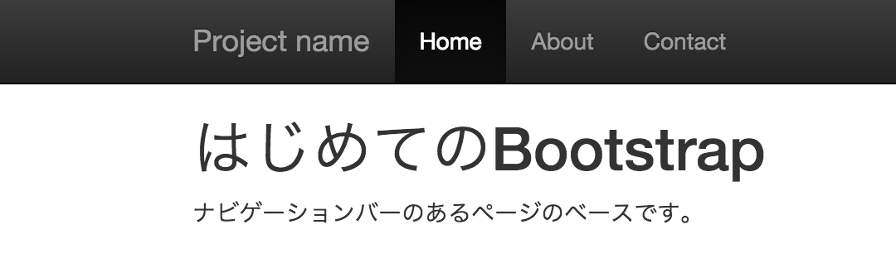

# テーマの利用

## bootstrap-theme.css

スタイルに「ドロップシャドウ」や「グラデーション」を加えるオプションCSS

## 手順

bootstrap.cssの後にbootstrap-theme.cssを読み込む

```html
<link href="css/bootstrap.min.css" rel="stylesheet" media="screen">
<link href="css/bootstrap.theme.min.css" rel="stylesheet" media="screen">
```


