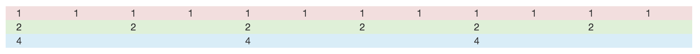
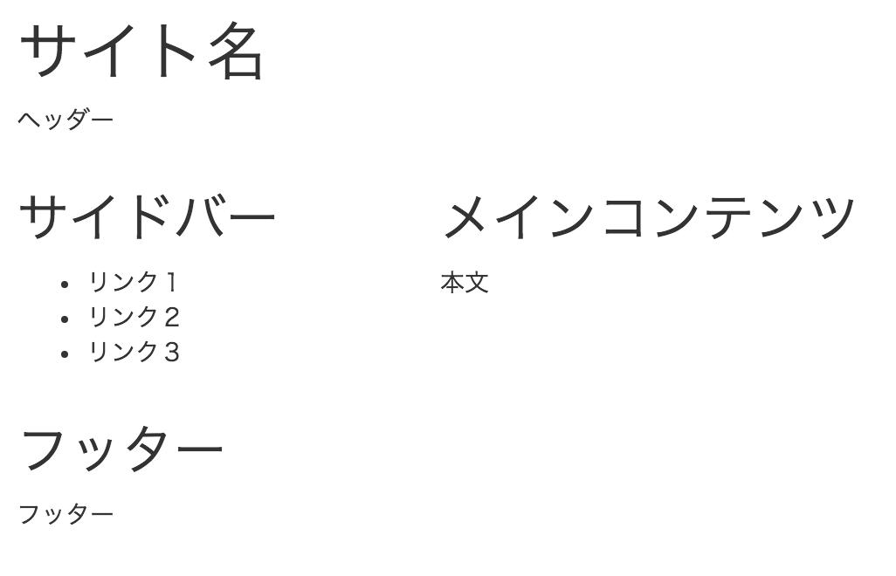

# Bootstrapのレイアウト

* レイアウトを12分割してグリッドレイアウトを構成する
* 12個のブロックを自由に組み合わせることで、複雑な構成も簡単に実現できる

## 手順

* 各行を`
タグ`で囲む
* その中に列ブロックとして`
タグ`を記述
    * 数字の合計が`12`になるように構成する
* [grid](grid.html)

## 表示

## 一般的なWebサイトのレイアウトを表現

* [grid_02](grid_02.html)

## 表示

