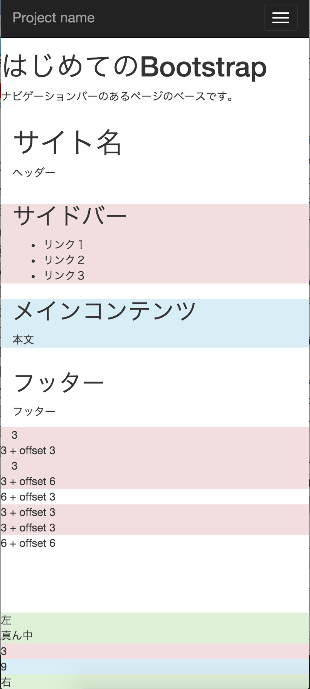
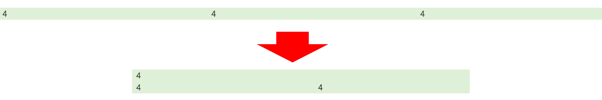

# ブロックサイズの変更

* グリッド・レイアウトはレスポンシブに対応している
* 横にブロックが並ぶグリッド・レイアウトの画面幅が992px未満の場合
    * モバイル向けのレイアウトになり、縦に並ぶように変化する
    

## モバイル向けのグリッドを制御したい場合

* 列ブロックのclassに、`col-xs-数字`を追加する
    * 各ブロックの変化後のサイズを指定可能

## 例

* 変化前のレイアウトは、`４列、４列、４列`が１行に収まっている
* 変化後には`12列`で１行、`６列、６列`でもう１行できるようになる

