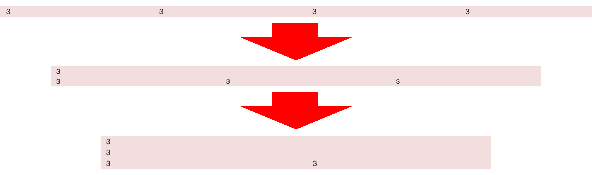

# レイアウト制御

* `XXXpx未満`など、幅を指定可能
    * スマートフォンとタブレットでレイアウトを区別するなど可能になる
    * ４段階でレイアウトを制御できるようにクラスが用意されている
        * `col-xs-XX`: eXtra Small
        * `col-sm-XX`: Small
        * `col-md-XX`: MeDium
        * `col-lg-XX`: LarGe

## 各クラスの特徴

<table>
    <tr>
        <th>クラス</th>
        <th>.col-xs-XX</th>
        <th>.col-sm-XX</th>
        <th>.col-md-XX</th>
        <th>.col-lg-XX</th>
    </tr>
    <tr><th>対象</th>
        <td>スマートフォン (768未満)</td>
        <td>タブレット (768px以上、 992px未満)</td>
        <td>デスクトップ (992px以上、 1200px未満)</td>
        <td>大きな デスクトップ (1200px以上)</td>
    </tr>
    <tr>
        <th>コンテナの 最大幅</th>
        <td>自動 (幅一杯)</td>
        <td>750px</td>
        <td>970px</td>
        <td>1170px</td>
    </tr>
    <tr>
        <th>列の最大幅</th>
        <td>自動</td>
        <td>60px</td>
        <td>78px</td>
        <td>95px</td>
    </tr>
</table>

* `.col-xs-XX`以外は、画面の幅が対象とする幅よりも小さくなった場合、グリッドを縦に積む

## 例

* 幅が「992px以上」の場合は、「３列、３列、３列、３列」が「１行」に収まる
* 幅が「768px以上、992px未満」の場合は、「１行目は12列」「２行目は４列、４列、４列」になる
* 幅が「768px未満」になった場合に、「１、２行目は12列」「３行目は６列、６列」になる

## オフセット用クラス

オフセット用のクラスも以下が用意されている

* .col-sm-offset-XX
* .col-md-offset-XX
* .col-lg-offset-XX

これらの「クラス」や「ネスト」を利用して、自在に「レスポンシブ・デザイン」対応のレイアウトを構築できるのが、Bootstrapのグリッド・レイアウトの強み
