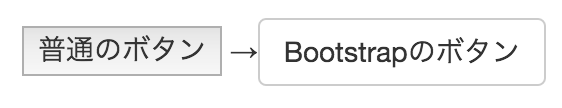
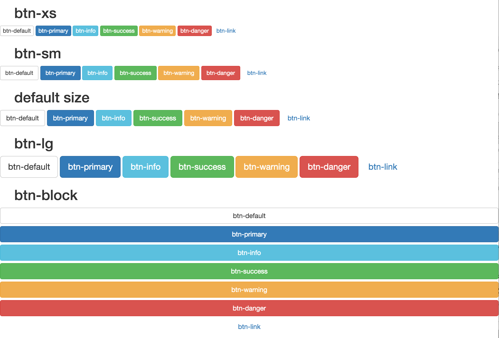
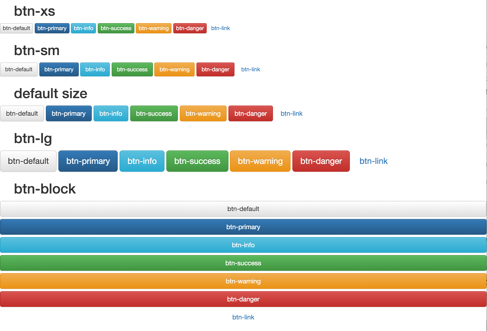

# ボタン

## ボタンのスタイリング

* `class名`に`btn`と`btn- (種別)`を加える


## ブラウザの標準のボタンと比較

```html
<button>普通のボタン</button>
→<button class="btn btn-default">Bootstrapのボタン</button>
```



### aタグ」や「inputタグ」に対しても、適用可能

```html
<a href="#" class="btn btn-default">Bootstrapのボタン</a>
<input class="btn btn-default" type="button" value="Bootstrapのボタン">
<input class="btn btn-default" type="submit" value="Bootstrapのボタン">
```

## ボタンの「色」や「大きさ」を変える

### 色に関するボタンのクラス

カッコ内は、デフォルトテーマにおける色で、この色はカスタマイズ可能

* btn-default (白色)
    * 指定しない場合と同じ
* btn-primary (青色)
* btn-success (緑色)
* btn-info (水色)
* btn-warning (黄色)
* btn-danger (赤色)
* btn-link
    * ボタンとしての見栄えを無効化し、テキストリンクと同じ見栄えにする

### サイズ」に関するクラス

大きさは、`btn-xs < btn-sm < 無指定 < btn-lg`

* btn-xs
* btn-sm
* btn-lg
* btn-block
    * ブロックサイズいっぱい(例えば、divの幅いっぱい)の大きさ
    　
### 設定例

[botton](button.html)

### 表示



**bootstap-theme.css**を読み込んだ場合は、**ドロップシャドウ**と**グラデーション**が効く



## ボタンをクリック不可にする

* `disabled属性`を追加する
    * ボタンの色が薄くなり、クリックできなさそうな見栄えになる
* 機能はそのまま残るので注意

### disabledのなし/ありを比較

```html
<button class="btn btn-primary">クリックできる</button>
<button class="btn btn-primary" disabled="disabled">クリックできない</button>
```


