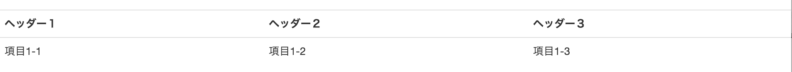
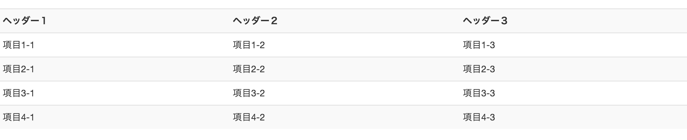
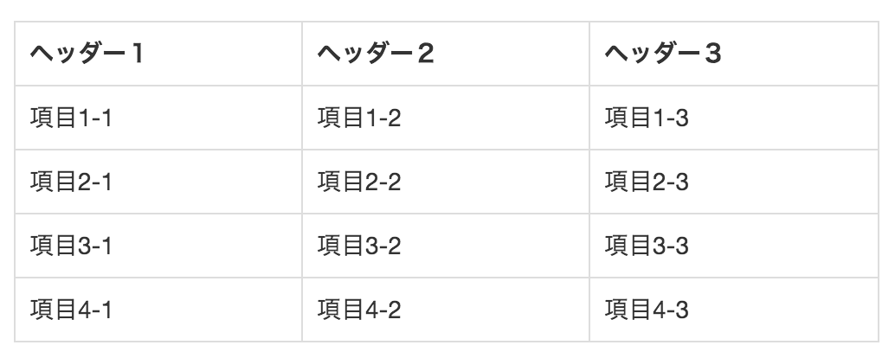
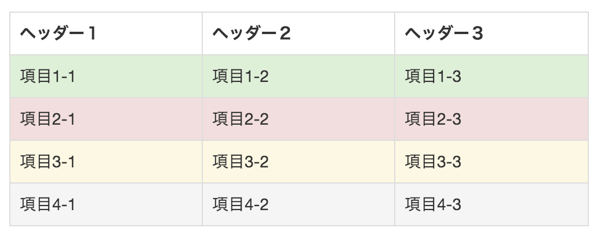
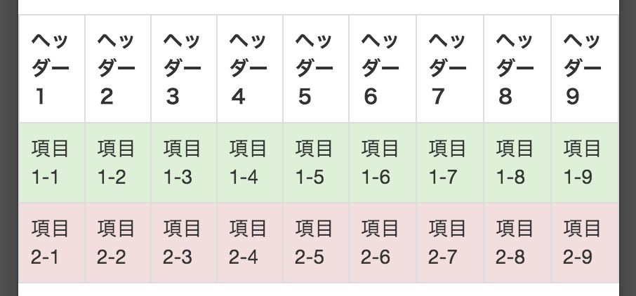
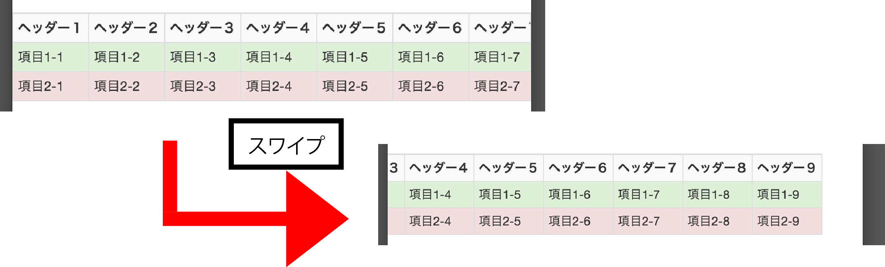

# テーブル

## テーブルのスタイリング

* `tableタグ`の`class名`に`"table"`を加える



```html
<table class="table">
<tr>
    <th>ヘッダー１</th>
    <th>ヘッダー２</th>
    <th>ヘッダー３</th>
</tr>
<tr>
    <td>項目1-1</td>
    <td>項目1-2</td>
    <td>項目1-3</td>
</tr>
</table>
```

## テーブルを縞模様にする

* `class~"table"`に`table-striped`を追加
    * ヘッダー行と偶数行目に背景色ができる
* 縦模様は、CSS3の`:nth-childセレクタ`で実現されている
    * IE8」では機能しない
    
```html
<table class="table table-striped">
</table>
```



## テーブル各セルに罫線を入れる

* `class="table"`に`table-bordered`を追加
    * コーナーは「角丸」になる
    
```html
<table class="table table-bordered">
</table>
```



## 特定の行に背景色をつける

`trタグ`の`class`に、下記のいずれかを指定

* succes
* danger
* warning
* active
    * `table-striped`の場合に使われる、デフォルトの背景色
    * [table](table.html)



## レスポンシブ・デザイン対応のテーブル

* Bootstrapはレスポンシブ・デザイン対応の「テーブル・クラス」を提供している
* `tableタグ`で、`<div class="table-responsive">`を囲む
    * 狭い画面(768px未満)では、テーブルが横にスクロール可能になる
* [responsive_table](responsive_table.html)



