# フォーム

* `inputタグ`に`class="form-control"`を指定

```html
<form>
    <fieldset>
        <legend>フォームサンプル</legend>
        <label>名前</label>
        <input type="text" class="form-control" placeholder="名前を入力してください">
        <p class="help-block">入力のためのヘルプをここに書けます。</p>
        <button type="submit" class="btn btn-default">送信</button>
    </fieldset>
</form>
```

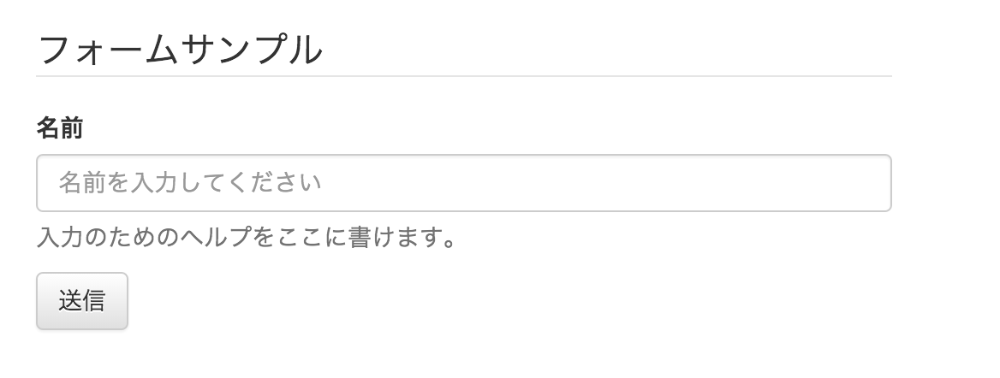

* 入力フィールドにフォーカスを当てると青色にハイライトされる

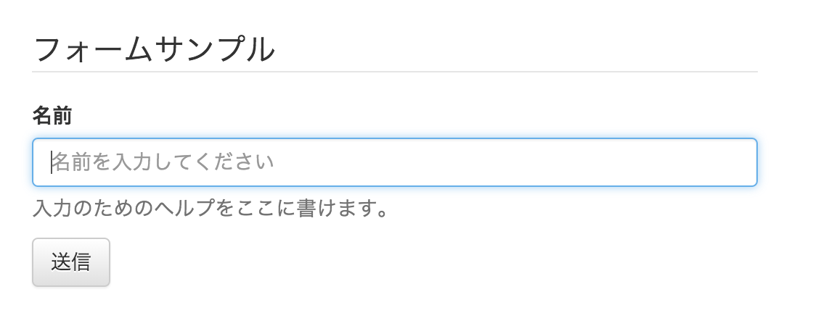

## 入力補助

* 入力補助のための`ヘルプ`を書くために、`help-blockクラス`も用意されている
* `textarea`や`selectタグ`も同様に、`class="form-control"`を付ける

```html
<label>コメント</label>
<textarea class="form-control" row="3"></textarea><br><br>
```

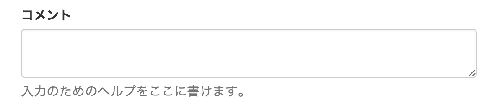

```html
<label>性別</label>
<select class="form-control">
    <option>男性</option>
    <option>女性</option>
</select>
```

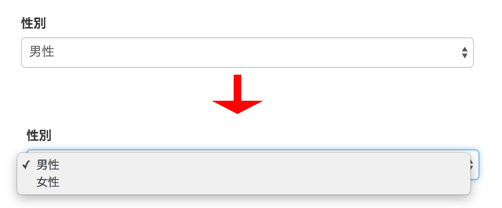

* `input``textarea``select`の幅は、デフォルトで100%にセットされている
* 幅を小さくする場合は、直接CSSを書くか前述のグリッド・レイアウトを使う

## 入力フィールドをグループ化する

* `labelタグ`と`別の入力タグ`の組み合わせに対して`<div class="form-group">`を囲む
    * `inputタグ`、`selct`、`textarea`
* `グループ`間では、間隔が適切に調整される

```html
<form style="width:500px; margin:50px">
    <fieldset>
        <legend>フォームサンプル</legend>
        <div class="form-group">
        <label>名前</label>
        <input type="text" class="form-control" placeholder="名前を入力してください">
        </div>
        <div class="form-group">
        <label for="email">メールアドレス</label>
        <input id="email" type="email" class="form-control" placeholder="メールアドレスを入力してください">
        </div>
        <button type="submit" class="btn btn-default">送信</button>
    </fieldset>
</form>
```

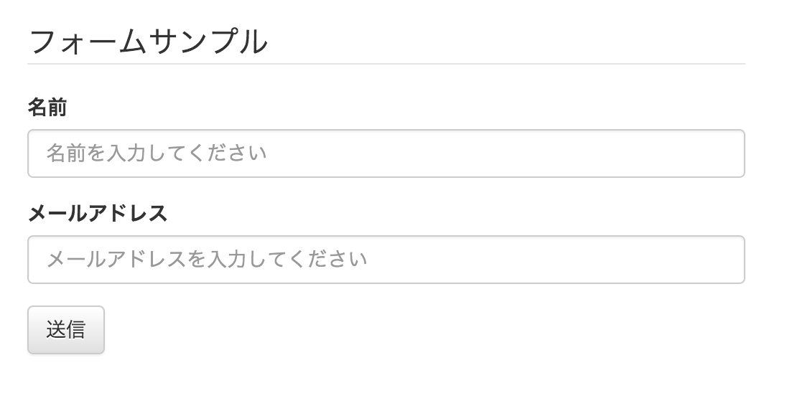

* グループ化`しないと、以下のように入力フィールドの間隔が詰まって、窮屈に感じられる

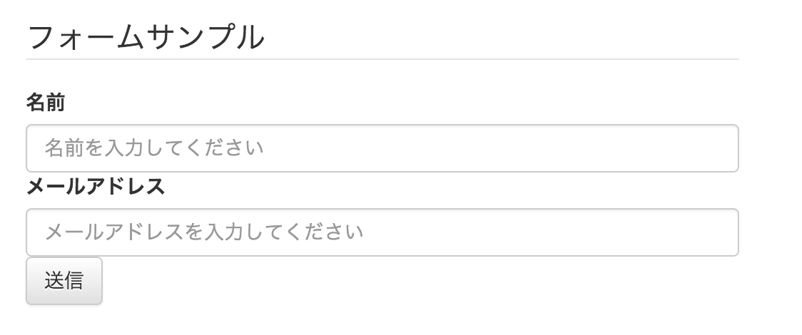

## 入力フィールドのサイズを変更する

* `inputタグ`の`class`に`"input-lg"`または、`"input-sm"`を加える

```html
<input class="form-control input-lg" type="text" placeholder="largeサイズ">
<input class="form-control" type="text" placeholder="デフォルトサイズ">
<input class="form-control input-sm" type="text" placeholder="smallサイズ">
```

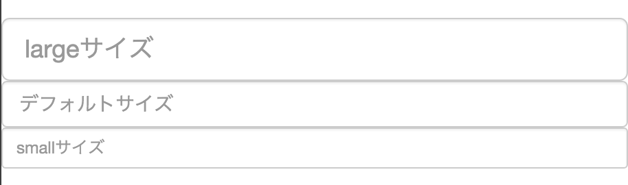

* 幅を変更するために、`グリッド・レイアウト`も利用可能

```html
<div class="row">
    <div class="col col-md-4">
        <input class="form-control input-lg" type="text" placeholder="col-md-4">
    </div>
    <div class="col col-md-4">
        <input class="form-control" type="text" placeholder="col-md-4">
    </div>
    <div class="col- col-md-4">
        <input class="form-control input-sm" type="text" placeholder="col-md-4">
    </div>
</div>
```

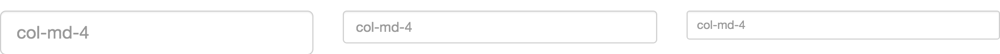

## 次にフォームのレイアウトをカスタマイズ

### インラインフォームを作る

* フォームを１行に収めたい場合に、`インラインのフォーム`を利用可能
* `formタグ`のclass名に`"form-inline"`を追加

```html
<form class="my-inline form-inline">
    <input class="form-control" type="text" name="email" placeholder="メールアドレス">
    <input class="form-control" type="password" name="password" placeholder="パスワード">
    <div class="checkbox">
        <label>
            <input type="checkbox" name="rememberme">ログインしたままにする
        </label>
    </div>
    <button type="submit" class="btn btn-primary">ログイン</button>
</form>
```

* `inputタグ`の幅がデフォルトの100%になってしまい、このままでは１行に収まらなくなってしまう
* `inputタグ`の幅を指定できるようにclass名に`"my-inline"`を追加する
    * class名は任意
* 以下のように`my-inlineクラス`と`form-inlineクラス`以下の、`テキストフィールド`と`パスワードフィールド`の幅を`180px`に指定する`CSS`を設定する
   
```html
<style>
.my-inline.form-inline input[type="text"],
.my-inline.form-inline input[type="password"]{
    width: 180px;
}
</style>
```

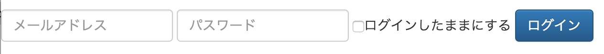

* インライン・フォームでは`ラベルの出力`は不要
* 全ての入力フィールドに`ラベル`を付与することが推奨
    * スクリーンリーダーなどの支援ツールから読み込まれることも想定
* Bootstrapでは、インライン・フォームでラベルが表示されないように`sr-onlyクラス`が用意されている
    * `sr`: Screen Readerの略

```html
<form class="my-inline form-inline">
    <div class="form-group">
    <label class="sr-only">メールアドレス</label>
    <input class="form-control" type="text" name="email" placeholder="メールアドレス">
    </div>
    <div class="form-group">
    <label class="sr-only">パスワード</label>
    <input class="form-control" type="password" name="password" placeholder="パスワード">
    </div>
    <div class="checkbox">
        <label>
            <input type="checkbox" name="rememberme">ログインしたままにする
        </label>
    </div>
    <button type="submit" class="btn btn-primary">ログイン</button>
</form>
```

### 縦レイアウトのフォームを作る

* `入力フォーム`と`ラベル`のセットを縦に並べるレイアウト
* 縦に並べる場合は、`formタグ`のclass名に`"form-horizontal"`を追加
* [stripe](stripe.html)

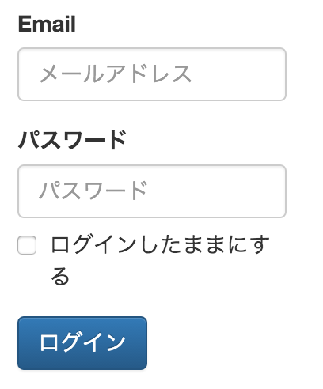

* グリッド・レイアウトは、レスポンシブ・デザインに対応している
* グリッド・レイアウトでフォームを作った場合は、以下のように画面の幅が狭い場合に、`ラベル`が`入力フィールド`の上に移動する

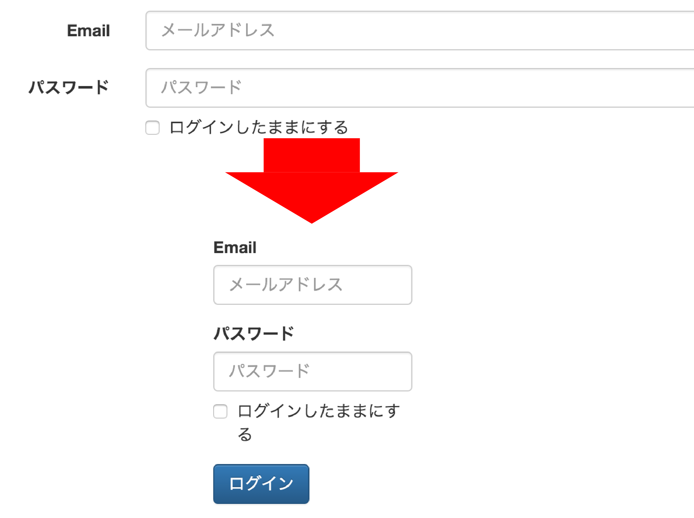

* グリッド・レイアウトに菅んするクラスの他に、`labelタグ`のclass名に`"control-label"`を追加している

### 入力フィールドの状態を変更する</h3>

* 入力フィールド`のスタイルを変更して、ユーザーに状態を伝える
    * 入力エラーがある場合に、`フィールドを赤色`にして異常を示す
    * エラーが取れた際に`フィールドを緑色`にして、正常に回復したことを示す
* 対象入力フィールドのグループにクラスのいずれかを追加する
    * `has-warning`
    * `has-error`
    * `has-success`

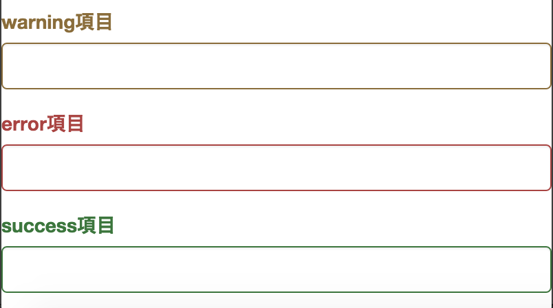

* それぞれ、フォーカスすることで影がつく

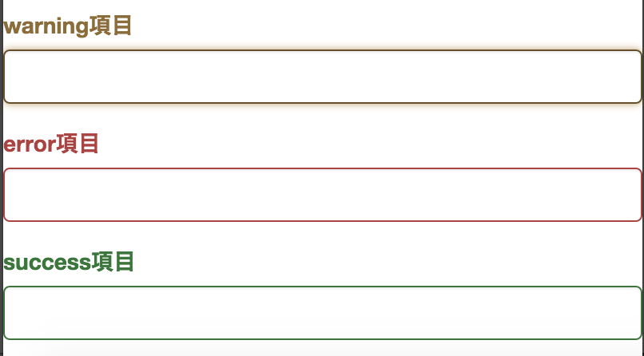

* `ラベル`にも、色を反映させるためには`labelタグ`のclassに`control-label`を追加する

### 入力フィールドを拡張する

* `input-groupクラス`を使う
    * 入力フィールドの前後に`入力補助ラベル`をつける
    * `ボタン`を付ける
    * `input-group`を付けた`divタグ`内に入力フィールドを加えて、下記のいずれかのクラスを付けた要素を追加する
        * `"input-group-addon"`
        * `"input-group-brn"`

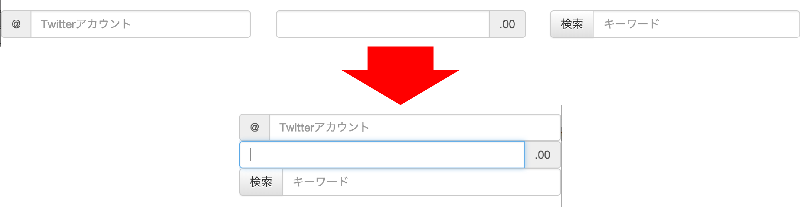

