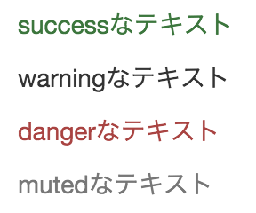
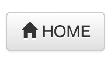
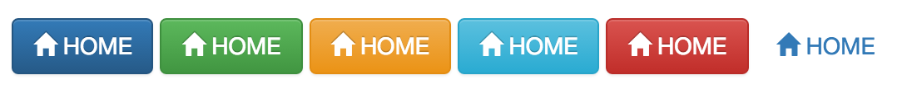

# その他の便利なスタイル

## テキストの色を変える

* `ボタン`や`フォーム`の`インプットフィールド`のように、テキストにも以下のクラスをつけて色を変えられる
* `クラス名`には、以下を指定可能

```html
<p class="text-success">
    successなテキスト
</p>
<p class="text-warnint">
    warningなテキスト
</p>
<p class="text-danger">
    dangerなテキスト
</p>
<p class="text-muted">
    mutedなテキスト
</p>
```



### アイコンを使用する

* Bootstrapには160種類もの様々なアイコンが用意されている
* ボタンやドロップダウン、ナビゲーション、ラベル等と組み合わせて使用する
* アイコンを加えたい箇所にspanタグを記述し、そのclass名に"glyphicon gyphicon-(アイコン名)"を追加

```html
<a href="#" class="btn btn-default"><span class="glyphicon glyphicon-home"></span> HOME</a>
```



* アイコンの色は、親要素の色に合わせて変化する
* [ボタンのクラスを変えた場合の例](glyphicon.html)



### レスポンシブ・デザイン用のユーティリティ

* `レスポンシブ・デザイン`を実現したい場合、特定の画面サイズの場合に、`表示・非表示`を制御する
* [幅の調整](width.html)

| クラス | 幅 |
|:----|:----|
| visible-xs | スマートフォン(768px未満)で表示 |
| visible-sm | タブレット(768px以上、992px未満)で表示 |
| visible-md | デスクトップ(992px以上、1200px未満)で表示 |
| visible-lg | 大きなデスクトップ(1200px以上)で表示 |
| hidden-xs | スマートフォン(768px未満)で非表示 |
| hidden-sm | タブレット(768px以上、992px未満)で非表示 |
| hidden-md | デスクトップ(992px以上、1200px未満)で非表示 |
| hidden-lg | 大きなデスクトップ(1200px以上)で非表示 |

