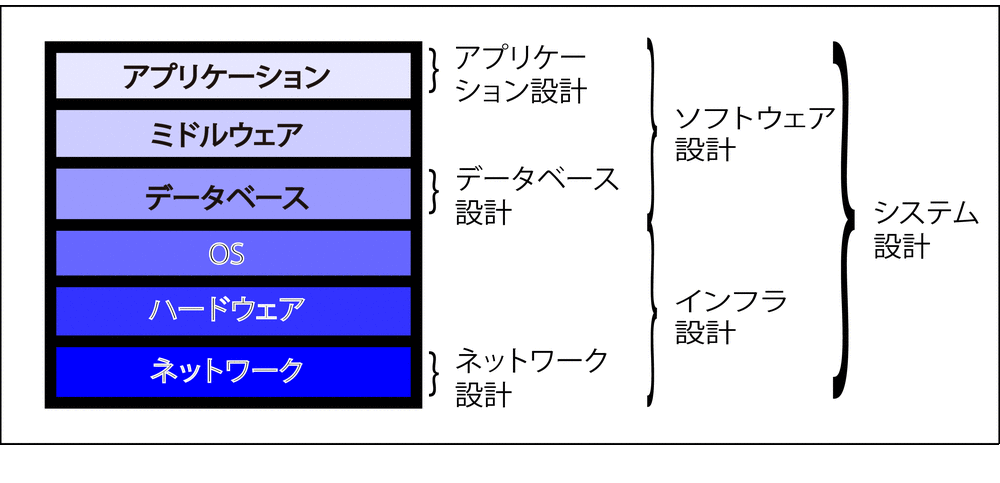

# ミドルウェア

* `ミドルウェア`とは
    * Webサーバ
    * Webアプリケーションサーバー
    * `ESB`(Enterprise Service Bus)
        * `SOA`を実現するもの
            * `Service Oriented Architecture`
    * HTTPのようなネットワークプロトコルの実装
    * マルチスレッド管理
    * データベース接続を含めたトランザクション機能などを提供
* ミドルウェア製品
    * ミドルウェアメーカーの出荷時に完成されている
        * 設定(コンフィグレーション)することはあっても、ミドルウェア自体を設計することではない

