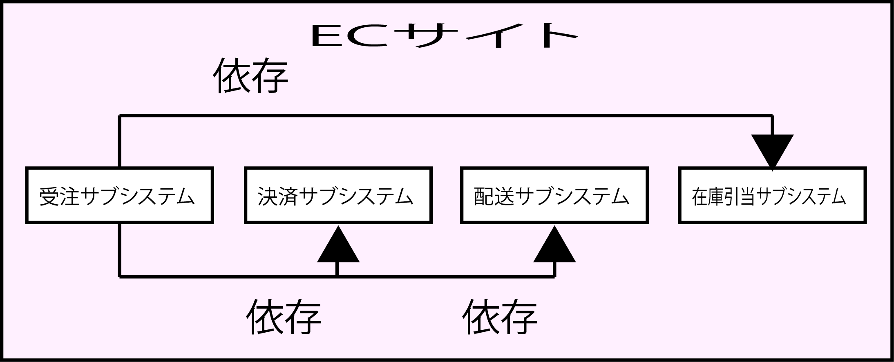

# サブシステム分割

* 依存関係整理の方法
* 注: オブジェクト指向とは無関係

## 前提

* システムは規模に応じて複雑さを増す
* 人間が見通せる範囲には限界がある
システムの全体を押さえている人がいなければ、ある機能の仕様が他の機能にどのように影響するかがわからなくなる
    * システムが正しく動作するか判断できない
* システムの複雑さを抑えるためには、システムの規模をある程度の大きさに抑える
* 要件自体をある程度の大きさでいくつかに分類すれば、１つ１つは小さくな
* 大きいものを１つ作るより、小さいものをたくさん作るほうがわかりやすい

## 分割の単位は機能ごと

* サブシステム分割は機能的な役割
    * 垂直関係の依存関係の整理
    * 業務アプリケーションであれば、ビジネスユースケースのような、まとまった業務単位に分割する
* サブシステム分割をしても、サブシステム間が密接に結合していては無意味
    * サブシステム間で`疎結合`になるためには、次の２点に注意
        * コードの密接な結合
        * データベースの密接な結合

## ECサイトの例

* 以下のようなECサイトの機能は、サブシステムとして分割可能
* 例: ECサイトの受注サブシステム
    * 以下のサブシステムが連携しないと受注処理ができないとする
        * 決済サブシステム
        * 配送サブシステム
        * 在庫引当サブシステム
    * 受注サブシステムのクラスはどのように決済サブシステムの機能を利用するか
        * 外部のクレジットカード決済会社などのシステムにネットワークから同期接続
        * 与信や決済
        * 決済サブシステムは決済用のクラスをAPIとして提供していることになる
    * 受注サブシステムからは、普通に考えればクラスを直接呼び出す
        * サブシステム間の依存が`循環しない`ようにしなければならない

* 受注サブシステムは決済サブシステムに`依存する`のであれば、
* 決済サブシステムが、受注サブシステムに`依存しないようにする`必要がある
    * 例: 決済サブシステムに受注サブシステムの「買い物かご」オブジェクトを渡すのはNGということ

* DBの密接な結合の場合、以下をする必要があるとする
    * 受注サブシステムが商品を表示
    * 買いものかごに商品を入れる時に、その商品の在庫状況を`引き当て`
        * 引き当て
            * 在庫は実際の在庫である実在庫と帳簿上（コンピュータ上）の在庫引当に分けられる
                * 例
                    * 他の顧客3人からそれぞれ1個づつ、合計3個注文を受けている
                    * 倉庫に現物が10個あったとすると、実在庫は10個
                    * 午前中の注文なので午後から出荷作業をする予定
                    * 実在庫は10個、在庫引当は10個－3個＝7個
                    * 販売（受注）が出来るのは現物の10個ではなく7個
    * 在庫情報は在庫引当サブシステムで管理するが
        * 商品一覧では５０件ごとにページングするため
        * パフォーマンスを考量して商品情報と在庫状況をJOINして表示したい
        * すると、受注サブシステムは
            * `在庫引当サブシステムのクラスを呼び出すことはしていない`が、
            * `SQLレベルで結合`することになる
                * SQLレベルでの結合は、クラスを呼び出すよりも`ハード`(硬直的)な結合の仕方
                * クラスの呼び出しであれば、コンパイルなどで検知することもできるが、
                * SQLではgrepでもしない限りわからない
                * 仮に在庫状況テーブルが変更されていたとしても、SQLを実行しないとわからないのでシステムの保守性は落ちるが、パフォーマンスは高くなる
                    * その意味では、SQLについても単体テストを作成するとよい
                        * 単体テストを実行することで、SQLの問題を発見可能
