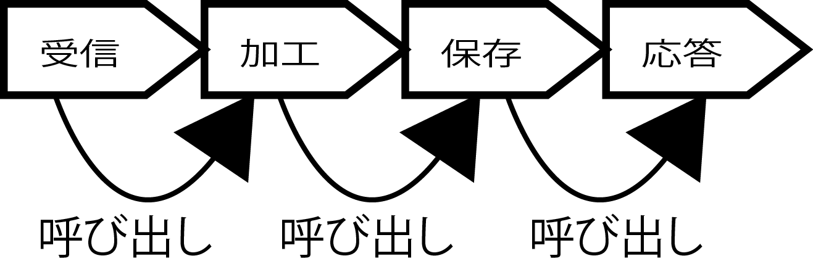
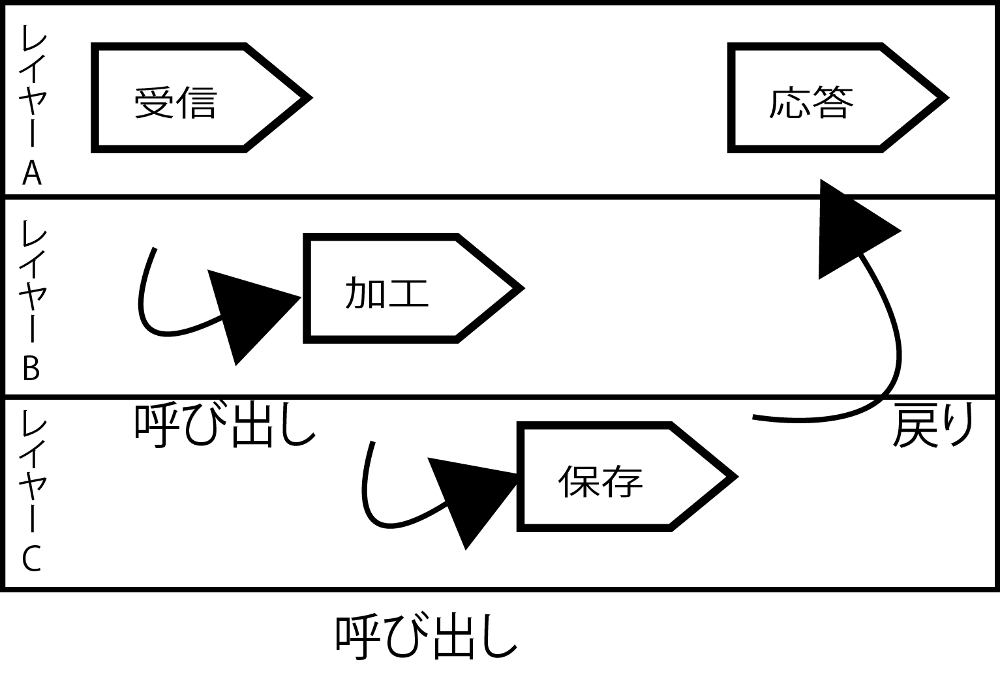
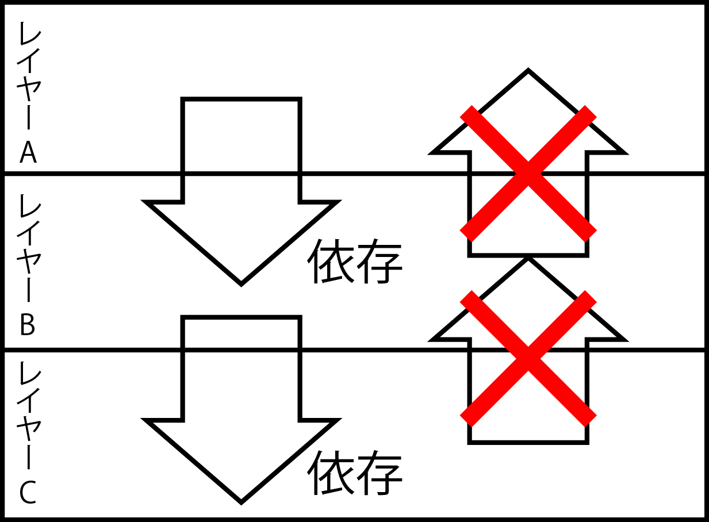
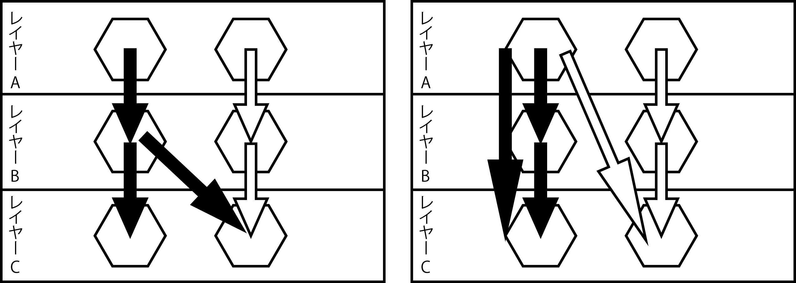

# レイヤー (直交化)

## 概要

* レイヤーは、アーキテクチャ設計の基本的な手法

## 目次

* システムの直交性
* レイヤーアーキテクチャ
* レイヤーのJavaでの実装
* レイヤーの問題点

## システムの直交性

**データベースの変更がネットワーク用のユーティリティ影響を与えない**という考え方

ここでのユーティリティは有用性や効用の意味

直交性はシステムの独立性や分離性を保つための方法

* 以下がシステムを構築するための概念
    * 設計
    * 製造
    * テスト
    * 拡張
* 直交 = 直角に交わる
* ２つのベクトルが直交している場合は片方のベクトルを変更をしても、もう一方のベクトルには無影響
* システムのある機能における「直交」した設計とは

## レイヤーアーキテクチャ

業務アプリケーションの処理４種類

* 受信
    * 入力チェック（入力値の妥当性チェック）
* 加工
    * システムに保存する形式に変換
* 保存
    * データベースや外部のシステムに保存
* 応答
    * 処理結果をシステムの利用者に返す

## パイプラインアーキテクチャ

これら４つの処理の依存関係を整理して、それぞれの処理の保守性を高めるには

* それぞれの`処理の間にインターフェイスを定義`
* 呼び出し順序をつける

* それぞれの処理をクラスにすれば、`パイプラインアーキテクチャ`になる
    * パイプライン処理とは、処理要素を直列に連結し、ある要素の出力が次の要素の入力となるようにして、並行に処理させるという利用技術
    * デザインパターンで言う`Chain Of Responsibility`
* 処理を変更するには、パイプラインの設定を変更して`呼び出す処理の実装を切り替える`

## 階層化

* 受信と応答は同じような実装になることが多い
* 処理を階層的に配置してレイヤーを構成

* 各階層がレイヤー
* ここでは３層のレイヤーが構成
    * レイヤーＡの受信処理からレイヤーＢの加工処理を呼び出し
    * 次に、レイヤーＢの加工処理からレイヤーＣの保存処理を呼び出し
    * レイヤーＣの保存処理からレイヤーＡへの応答処理は、「呼び出し」ではなく`戻り`になる
* レイヤーの考え方はスタックの呼び出しと同じ
    * メソッドを呼び出す時には、メソッドからメソッドへの呼び出しは階層的に行われる
        * 呼び出し先のメソッドが終了すると呼び出し元のメソッドの処理が継続される
            * スタックを重ねて最下層のレイヤーを処理すると、上のレイヤーに順番に処理を返していく
* レイヤーアーキテクチャによって、`行き（呼び出し）と帰り（応答）の処理を共通化`することが可能
    * 上位レイヤーから下位レイヤーを呼び出すというルールがわかっていれば、直観的にレイヤー間の依存関係を整理可能
    * レイヤーにすることで、上位レイヤーは直接の下位レイヤーだけを知ればよいことになる
        * レイヤーＡに所属するクラスは、レイヤＢに所属するクラスしか知らない
        * レイヤーＡに所属するクラスが、レイヤーＣのクラスを直接利用することは禁止されている
            * つまり、`レイヤーＣはレイヤーＢによって隠蔽されている`    
            * このように隠蔽することを`ブラックボックス`とも呼ぶ

**レイヤーＣが変更されてもレイヤーＡには影響が及ばず、**

**レイヤーＢだけ変更の影響を吸収できる**

* 「自由にクラスを呼び出せたほうが便利じゃないか？」
* 否！ブラックボックスを進めたほうがクラス間に依存関係が減る
* システムの構造としての`複雑さが軽減`する

### OSI参照モデル

* レイヤーアーキテクチャは、参照モデルでも使われている
    * OSI: ネットワークプロトコルの説明で有名
* アーキテクチャとしても基礎知識

| 層 | 内容 |
|:----|:----|
| アプリケーション層 | (WWW、メール) | 
| プレゼンテーション層 | (HTML) | 
| セッション層 | (HTTP) | 
| トランスポート層 | (TCP、UDP) | 
| ネットワーク層 | (IP) | 
| リンク層 | (Ethernet) | 
| 物理層 | (光ファイバー、電話線) | 

レイヤーアーキテクチャは、Webアプリケーションでは一般的に使用されている

| 層 | 内容 |
|:----|:----|
| Presentation Layer | サービスの提供、情報の表示 | 
| Domain Layer | ビジネスロジックの提供 | 
| Data Source Layer | (データベース接続、メッセージング) | 
