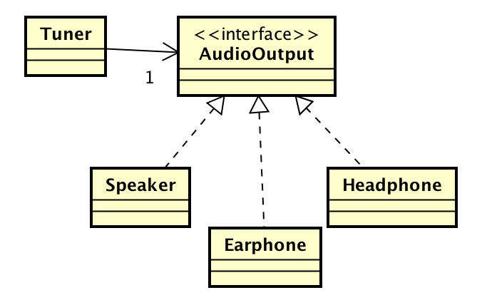

# 依存性の注入(DI)

## DI

* DI: Dependency Injection
    * 依存性の注入
* クラスの呼び出し元と、呼び出すクラスとの間を疎結合にするための仕組み
    * 実装クラスのインスタンスは外部から注入
    * DIを行うためには依存性を注入してくれるファクトリクラスが必要

## DIコンテナ

* コンテナ(Container)
    * コンポーネントを実行するための仕組み

## 概要

### 仕様

* Tunerクラスはラジオのチューナーを表す
* Tunerクラスには外部出力としてSpeakerクラスが1つ付いている
* Tunerクラスがラジオの電波を受信して、Speakerクラスから音声を出力可能
* TunerクラスはSpeakerクラスに直接関連
    * Tunerクラスは、Speakerクラスと直結している
* スピーカー標準装備のラジオチューナー


* スピーカーをヘッドホンに付け替えるには、TunerクラスからSpeakerクラスヘの直接の関連を解消する
    * Tunerクラスからの音声出力を抽象化したAudioOutputインターフェイスを定義する
    * これはポリモーフイズム

#### 疎結合



* `疎結合`に変更
    * TunerクラスからはAudioOutputインターフェイスにだけ関連
    * AudioOutputインターフェイスを実装したクラスには依存していない
* Tunerクラスが、AudioOutputインターフェイスの実装クラスであるSpeakerクラスやHeadPhoneクラスのインスタンスをどのように解決するのか

```php
//実装クラスの解決＝フィールドの初期化
public class Tuner
{
    private AudioOutput audioOutput;

    public void sound(AudioOutputStream audioOutputStream)
    {
         this. audioOutput.sound (audioOutputStream);
    }
}
```

* TunerクラスのaudioOutputフイールドは、いつ、どのように初期化されるのか
    * 次のように、Tunerクラスのコンストラクタで実装クラスのインスタンスを作成しては元も子もない

```php
public class Tuner
{
    private AudioOutput audioOutput;

    public Tuner()
    {
        this.audioOutput = new Speaker(); // これではSpeakerに接続してしまう
    }

    public void sound(AudioOutputStream audioOutputStream)
    {
         this. audioOutput.sound (audioOutputStream);
     }
}
```

#### AbstractFactoryパターン

* インスタンス生成のためのパターン
* `インスタンス作成をする過程を隱ペい`したファクトリクラスを作成するパターン
    * 依存性を注入してくれるファクトリクラスを`DIコンテナ`と呼ぶ
* Audiooutputインターフェイスを実装したインスタンスを作成する役割を、Tunerクラスではなく、AbstractFactoryパターンを使って他のファクトリクラスに委譲
* AudiooutputFactoryクラスを定義する
    * AudioOutputインターフェイスを実装したインスタンスを生成する仕組みはTunerからは完全に隠ぺいされる
    * AudioOutputFactoryクラスには`createAudiooutput()`を定義
    * AudioOutputインターフェイスを実装したインスタンスを生成して戻り値で返す
    


* AudioOutputFactoryクラスが実装クラスを決め打ちしていても動的に解決していてもTunerクラスには無関係

```php
public class Tuner
{
    private AudioOutput audioOutput;

    public Tuner()
    {
        AudioOutputFactory factory = new AudioOutputFactory();
        this.audioOutput = factory.create(); // AudioOutputFactoryに委譲
    }

    public void sound(AudioOutputStream audioOutputStream)
    {
        this.audioOutput.sound(audioOutputStream);
    }
}
```

* AudioOutputFactoryクラスを毎回newしてインスタンスを作成するのはメモリ効率が悪い
    * AudiooutputFactoryクラスのインスタンスを`シングルトンパターン`を使ってシステム(正確にはClassLoader)に1つにするように変更する
    * Audiooutputpactoryクラスをシングルトンにする
    * `getlnstance()`を呼び出すと、唯ーのインスタンスが返される

```php
public class AudioOutputFactory
{
    private static AudioOutputFactory instance = new AudioOutputFactory();

    private AudioOutputFactory()
    {
    }
    
    private static AudioOutputFactory getInstance()
    {
        return instance;
    }
}
```

```php
public class Tuner
{
    private AudioOutput audioOutput;

    public Tuner()
    {
        AudioOutputFactory factory = AudioOutputFactory.getInstance();
    }
    
    public void sound(AudioOutputStream audioOutputStream)
    {
        this.audioOutput.sound(audioOutputStream);
    }
}
```

* AudioOutputFactoryクラスがシングルトンになることで、Tunerクラスも変更される
* TunerクラスはAudiooutputFactoryクラスに`依存`
    * AudioOutputFactoryクラスの変更がTunerクラスに影響する
    * Tunerクラスにしてみれば、ほしいのはAudioOutputクラスのインスタンスだけ
        * ファクトリクラスとTunerクラスの依存関係を逆にすることも可能

#### 依存関係を逆にする

* Tunerクラスには`setAudioOutput()`を追加
    * ファクトリクラスからAudioOutputインターフェイスを実装したインスタンスを受け取る
    * ファクトリクラスはAudioFactoryと名前を変えて、`createTuner()`を追加
        * Tunerクラスのインスタンスを作成する
        * `crateAudioOutput()`で作成したインスタンスをTunerクラスの`setAudioOutput()`で渡す
        


* Tunerクラスからインスタンス生成についての責務がー切なくなる
    * AudioFactoryクラスにインスタンス生成の処理が集約
    * Tunerクラスがインスタンス生成処理に依存することはなくなる
* Tunerクラスから実行するAudioOutputインターフェイスの実装クラスヘの依存はなくなった
* 実装クラスのインスタンスは外部から注入されている

## DIのメリット/デメリット

* DIを使ったAudioFactoryクラス
    * メリット: TunerクラスがAudioOutputインターフェイスを実装したインスタンスの生成方法に依存しない
    * デメリット: TunerクラスはAudioOutputインターフェイスの実装クラスについてすべてを決定できていたがDIにすることで`setAudioOutput()`やコンストラクタで外部に公開されてしまう
        * `setAudioOutput()`が呼ばれると、Tunerクラスが持っていたSpeakerクラスがHeadphoneクラスに変更されることがある
        * つまりDIを使うことで、クラスが持っていた責務を外部に委讓し、依存関係を減らすことができるが、その分、クラスの内部構造を少し外部に露呈することになる