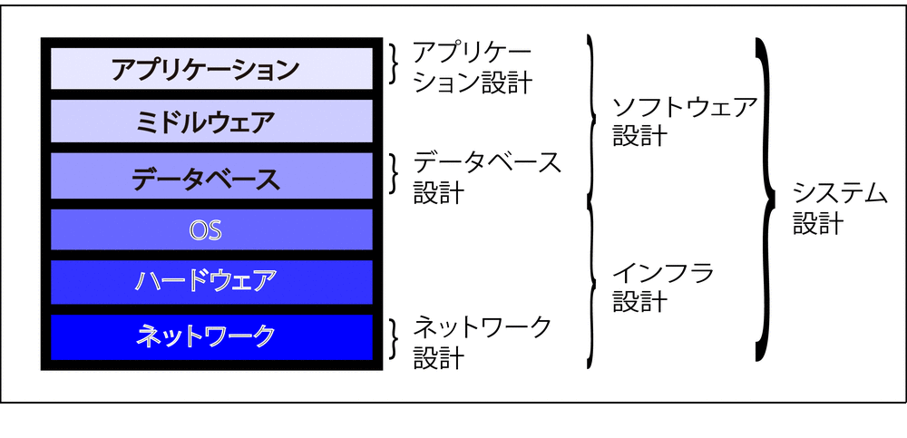

# ソフトウェア設計

## 概要

* 以下を総称してソフトウェア設計とする
    * [データベース](01_db)
    * [ミドルウェア](02_middle)
    * [アプリケーション](03_app)

## 方法
    
* [アプローチ](99_method)

## TODO

* [外部設計](https://github.com/aki-creatist/upstream/tree/master/ph_03)
* [内部設計](https://github.com/aki-creatist/upstream/tree/master/ph_04)
    