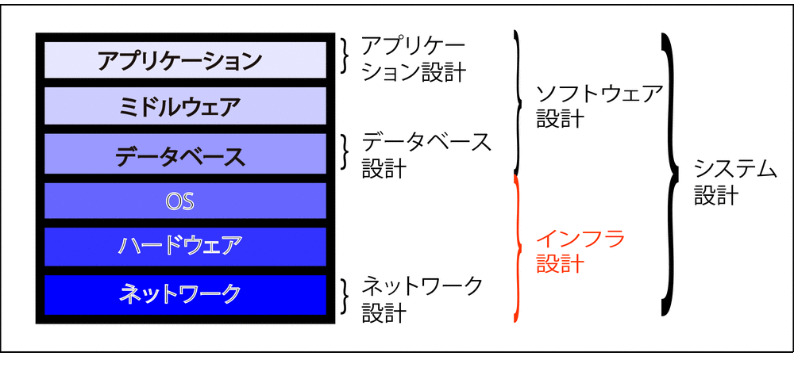

# インフラ設計

* 以下を総称してインフラ設計とする
    * [ネットワーク](AWS)
    * ハードウェア
    * OS

## システムインフラ設計と配置設計

### システムインフラ設計

* 非機能要件定義の内容を踏まえ、システムインフラ設計を行う

システムインフラ設計とは、`システムを実現するためにネットワークやハードウェアを構成すること`
    * インフラ設計で重要な点は、セキュリティ、信頼性、効率（性能、パフォーマンス）
    * システムを開発したら、サーバーマシンなどに配置する必要がある
    
### 配置設計

* システムをどのようにサーバーマシンなどに配置するのかを設計する
* 配置設計を行うには、システムインフラ設計がある程度終わっている必要がある
    * 配置設計は、内部設計と併せて行う必要がある
        * 配置設計は、開発が始まる前に行う必要がある
    * 配置方法によっては実装方法に影響がある
        * 例: JavaにはWARやEARといったWebアプリケーションの配置方法がある
            * WARの構成を考える必要がある
            * WARの配置で内部設計や実装に影響が及ぶ
                * システム全体を1つのWARにするのか
                * サブシステムごとにWARにするのか
                    * サブシステムは独立性が高いのか
                    * あるいは強く依存し合っているのか
            * Javaでは、配置することをデプロイメントとも言う
    * 例: JavaではWARごとにClassLoaderが異なる
        * WAR間でのクラスインスタンスの共有は簡単には行えない
