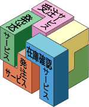

# アプリケーションアーキテクチャ

## 定義

```text
システムのコンポーネント、コンポーネント同士の環境との間の関係、およびその設計と進化を支配する原理に体現された、システムの基本的な構造
```

* コンポーネントとコンポーネント同士と環境の間の関係
    * コンポーネント
        * システムの基本構造を構成する構成要素
        * システム内部でコンポーネントがどのように連携し合い、ユーザーや外部システムといったシステムの外部とどのように連携するか、ということ
        * 無秩序に設計されたクラスなどではなく、`あるまとまった機能を再利用できるように汎用的に設計`したもの

```text
コンポーネントが連携するための設計コンセプトに沿ったシステムの基本構造
```

## コンポーネント

* EJB
    * SessionBeanやEntitiyBeanといったコンポーネントを定義したアーキテクチャ
* サービス指向アーキテクチャ）は，アプリケーションなどをコンポーネント化（部品化）し，それらを組み合わせてシステムを作る設計手法
* SOAもServiceと言ったコンポーネントを定義したアーキテクチャ


