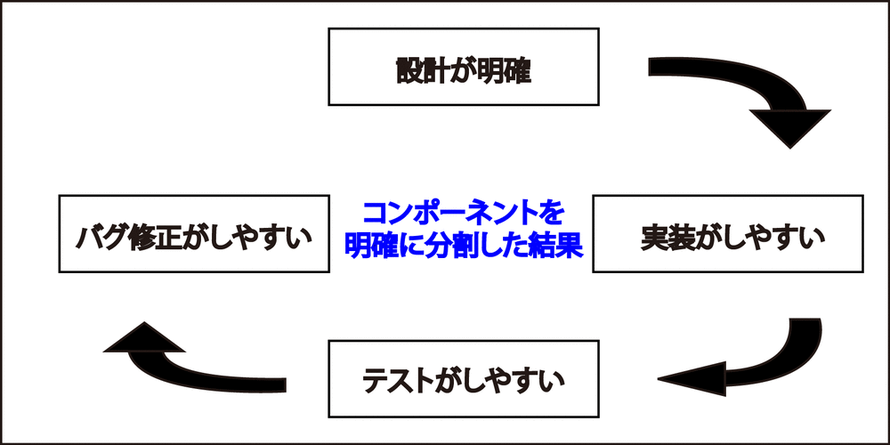
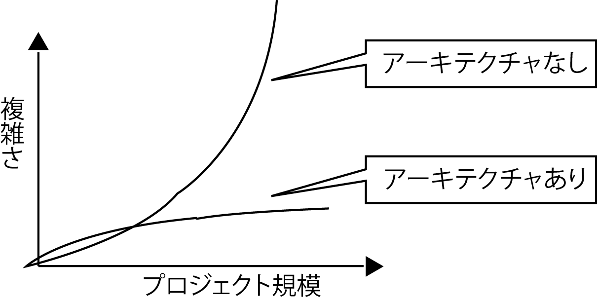
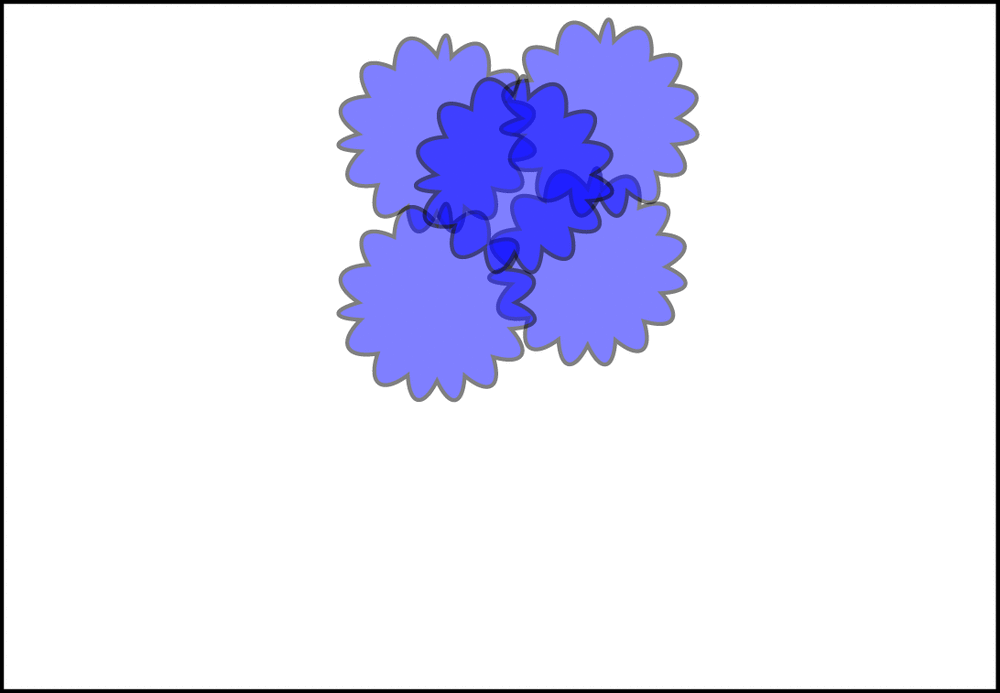
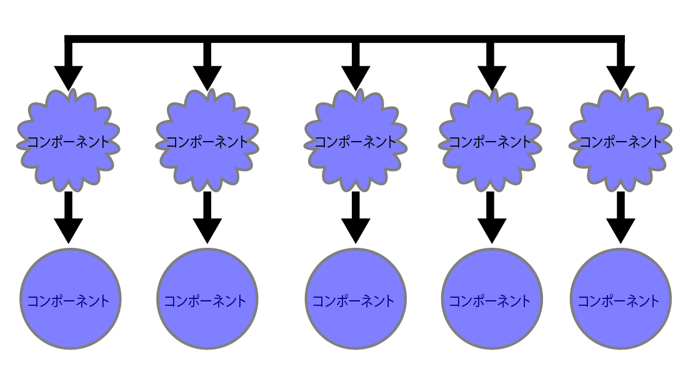
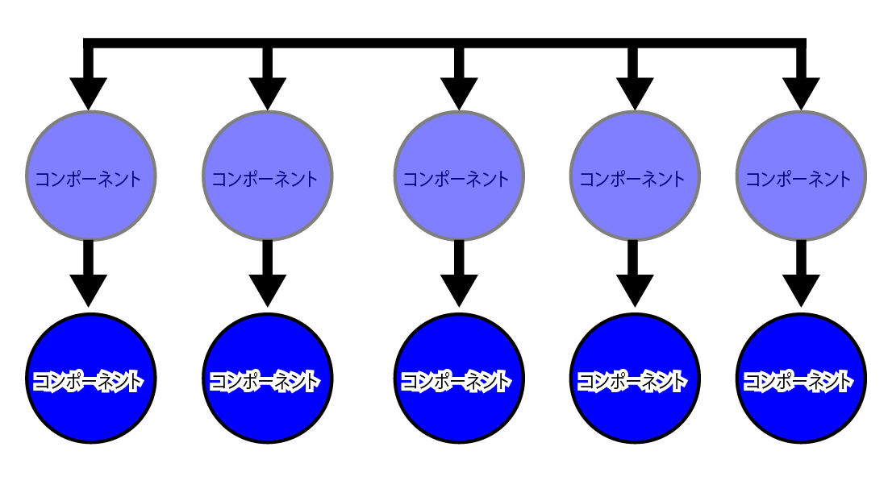

# 保守性の向上

アーキテクチャを設計することで、ソフトウェアの複雑さを抑え、保守性を向上可能

* 保守性とは
    * 修正のしやすさに関するソフトウェア製品の能力
        * ソフトウェアにある欠陥の診断または故障原因の追究
        * ソフトウェアの修正箇所を識別するためのソフトウェア製品の能力

## ソフトウェアの修正のしやすさ

* 保守性を阻害する要因は、ソフトウェアの複雑さ
* ソフトウェアの複雑さは、システムの規模に対して線形比例以上に大きくなる

## 複雑さを一定のレベルに抑える

* アーキテクチャを設計することで、システムの複雑さを一定のレベルに抑える
    * ソフトウェアの保守性を高められる
    * コンポーネント(部品)の役割が明確になる
    * 大きなシステムを小さい単位で開発可能

## アーキテクチャがない場合

* ソフトウェアの複雑さが増す
    * 設計が難しい
    * 実装が難しい
    * テストが難しい
    * バグの修正が難しい
* 負の循環に陥る
* 結果的にプロジェクト全体が失敗する

## ソフトウェアの複雑さとは

* ソフトウェアの本質的な特性に関する先天的なもの
* 設計方法やプログラミング方法による後天的なもの

### ソフトウェアの本質的な特性に関する先天的なもの

* ソフトウェアは自由度が高い(柔軟性)
    * 目で直接見えない(不可視生)
* 最近ではソフトウェアの見える化が進められている

### 設計方法やプログラミング方法による後天的なもの

* 設計方法やプログラミング方法による後天的なもの
    * コードの重複
    * 長いコード
    * 役割が複数あるクラス

## リファクタリング

* ソフトウェアの理解や修正を簡単にするために設計や実装を再構成すること
    * ソフトウェアの振る舞いを変えずに、内部設計や実装だけを修正する
    * ソフトウェアの後天的な特性の多くは、リファクタリングで改善するソフトウェアの問題と同じ
    * リファクタリングは、アーキテクトになるための重要な素養の１つ

