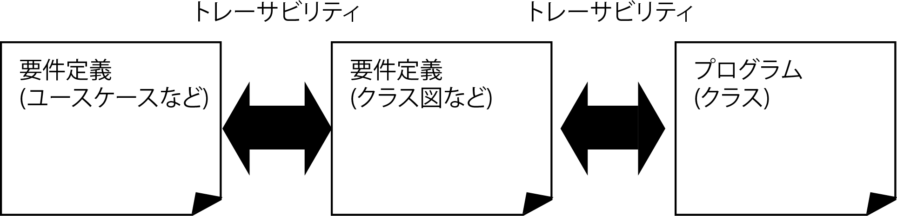
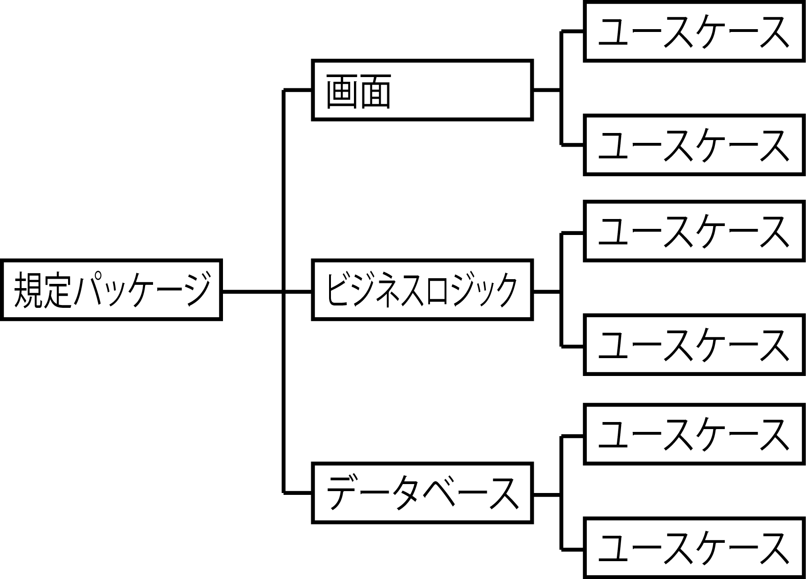

# 機能適切性の向上

指定の条件下でソフトウェアを使用した時、明示的および目次的にニーズを満たす機能を果たすソフトウェア製品の能力

* ユースケースなどで記述された機能要件を元に下記を判断
    * ソフトウェアで漏れなく正しく実装したかどうか
    * ソフトウェアが機能要件を実現しているか
* 実装されていない機能があれば、ユーザーは不満
* 実装されていない機能があれば、まず利用に耐えられない

## トレーサビリティ

* トレーサビリティ
    * ユースケースで定義された機能要件が、どのクラスで実現されているかを確認できること
    * システムの確保はシステムの保守性の向上にも寄与する
        * 仕様書や設計書といったドキュメントと、実際のプログラムのトレーサビリティ
    * トレーサビリティを実現するには
        * システムを構成するプログラムの基本構成が明確に定義されている必要がある
        * 要件定義や設計のドキュメントが明確に定義されていること

* 設計書の体系とプログラムのパッケージやクラス名の体系を合わせる
* パッケージとはクラスを分類するためのものユースケース単位にサブパッケージを定義
    * ３種類のパッケージを定義し、
        * 画面プログラム
        * ビジネスロジックプログラム
        * データベースプログラム

## 漏れをなくすためには

* もれなく正しくプログラムに実装するためには
    * インプットとアウトプットが正しくマッピングされることが重要
        * インプット:要件
        * アウトプット:プログラム

