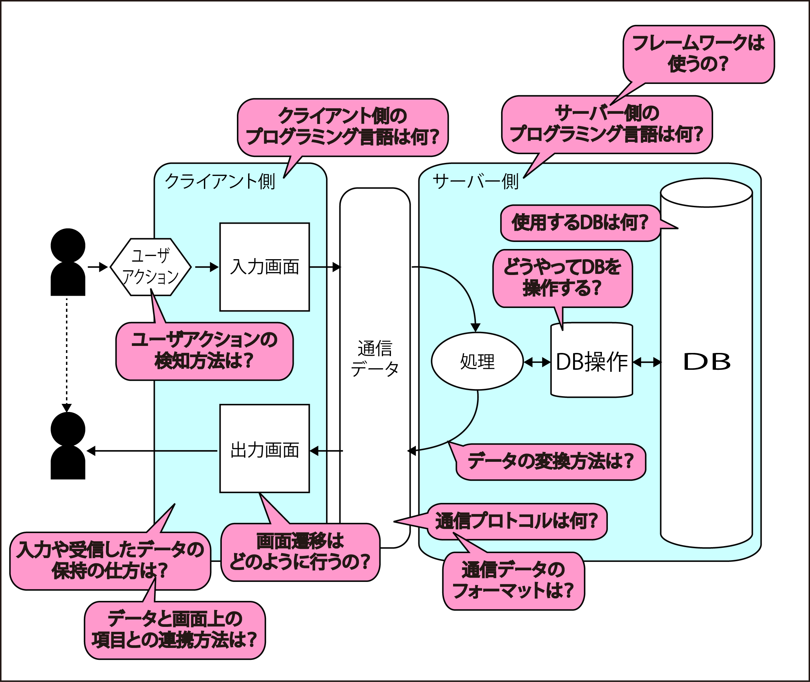

# 各部の個別の実装技術を決定する

第2段階の各部位について検討すべき要綱

* クライアント側
    * ユーザアクションの検知方法は？マウス？タッチ？音声入力？
    * 入力や受信したデータの保持方法は
    * データと画面上の項目との連携方法は？
    * 画面遷移はどのように行うの？
    * クライアント側のプログラミング言語は何？
* 通信
    * 通信プロトコルは何？
    * 通信データのフォーマットは？
* サーバ側
    * データ変換方法は?
    * 使用するデータベースは何？
    * どうやってデータベースを操作するの？
    * サーバ側のプログラミング言語は何？
    * フレームワークは使うの？

