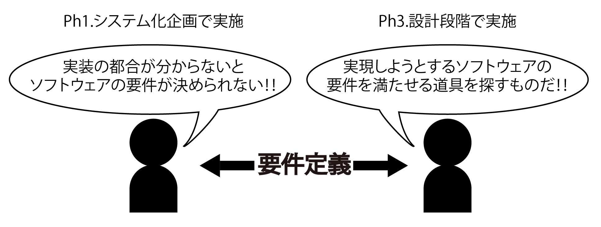

# ソフトウェアアーキテクチャの決定

* アーキテクチャ ＝ 構造という意味
* ITアーキテクト ＝ 「ITを活用するシステムの構造を設計する人」
    * 広義では「システムエンジニア」という言葉と同義

## 概要

* ソフトウェアアーキテクチャ設計 ＝ 技術的な選定や方式の方針決定
    * 実現しようとうする要件を満たせる道具を探す
    * ＝ 実装技術の選定
    

## ソフトウェアアーキテクチャを決める手順

* [基本的なシステムアーキテクチャを決める](01)
* [各部の個別の実装技術を決定する](02)
