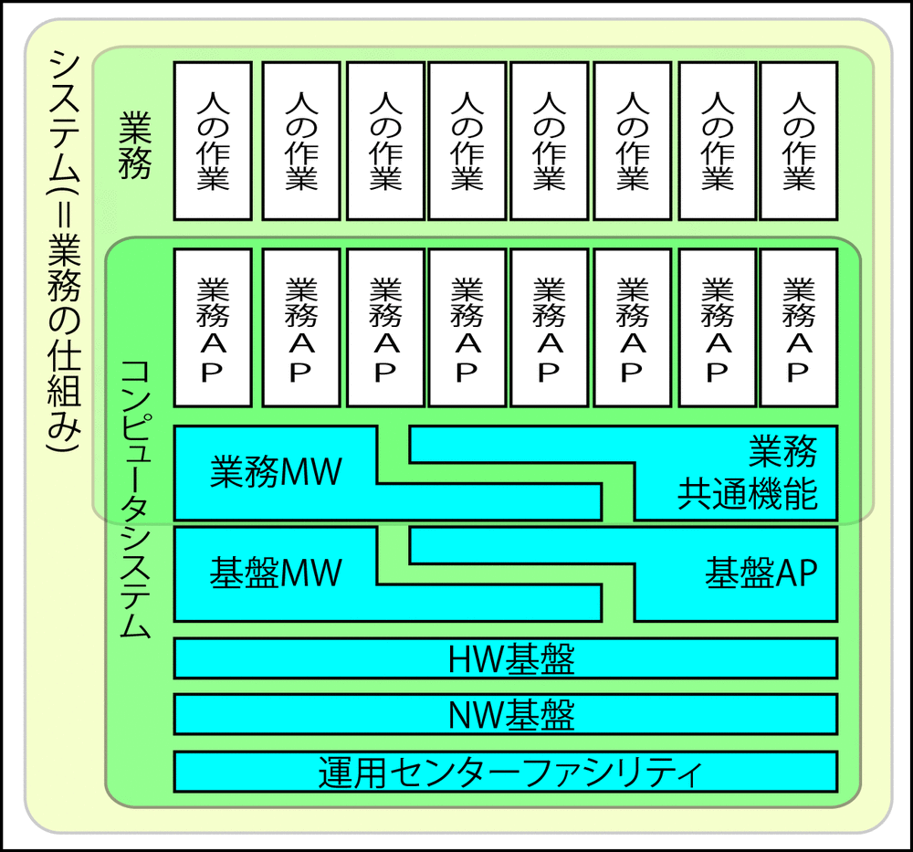

# 運用センターファシリティ

* ファシリティとネットワークに関しては、
    * ファシリティ: システムの運用に必要な設備
* システムごとにバラバラに持つのではなく、共通して持つことで費用を削減することを考える
* 運用センターファシリティは、どこかのセンターを借りるか

## 検討の観点

* 人材
    * オペレーターさんのスキルも評価対象
* 接続変更対応
    * オフィスとの接続において、接続のしやすさとシステムの変更に耐えられるか
* 費用
    * 運用センターの利用には多額の費用がかかる

最近ではAWSかGCPか、という風潮になり、上記の状況は変化している