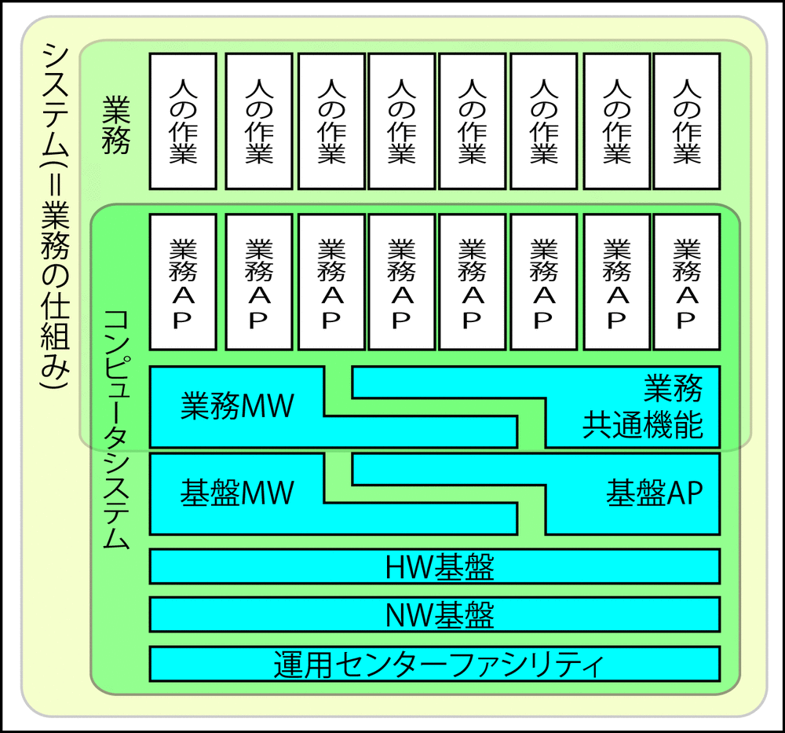

# ネットワーク基盤

運用センターファシリティ上に敷設するネットワーク基盤を検討

* 「ネットワーク基盤は情報機器同士、あるいは拠点同士をつなぐもの」という観点だけでは、トポロジ(ネットワーク構造)は考えられない

## 検討の観点

表面上はスイッチやルーターなどの機器云々という面ではなく、以下を重要視する

* どのようなセキュリティポリシーを定めた上で敷設するか
* 将来、どのようにサーバーやシステムが追加されていくか
* 実作業上も追加がしやすいかetc
* どのようにアプリケーションシステムを設置していくか
* トランザクションが想定以上に増えても影響範囲を限定できるか
* セキュリティ上、どの範囲に誰を入れ、誰を入れないようにするか

