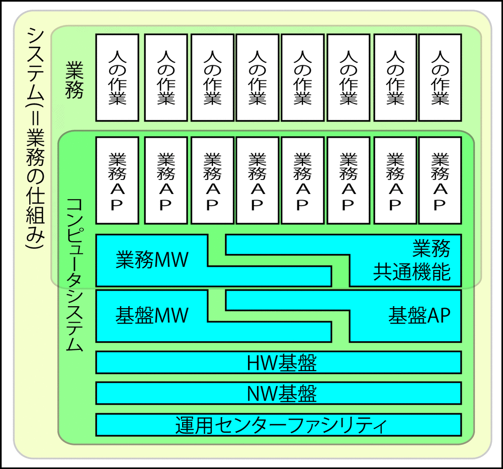

# 基盤ミドルウェア＆基盤アプリケーション

* 基盤ミドルウェアと基盤アプリケーション
    * 基盤ミドルウェア
        * DB、トランザクション処理(TP)モニター、Webアプリケーションサーバーetcが含まれる
    * 基盤アプリケーション
        * グループウェア、認証システム、運用管理システムetcが含まれる
* 業務アプリケーション単位になるが使用する製品はなるべく少なくした方が品質は向上しやすくなる
    * 運用の容易性や問題発生時の対応の横展開を実現可能

