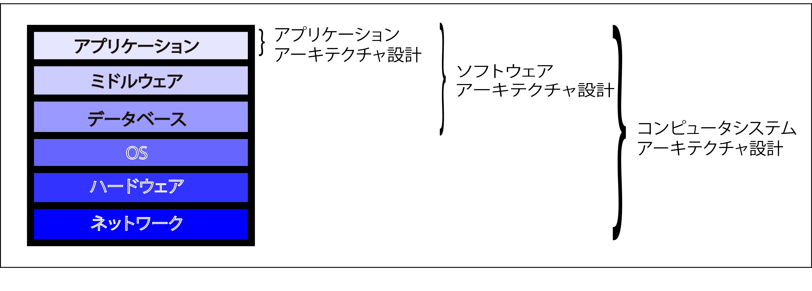
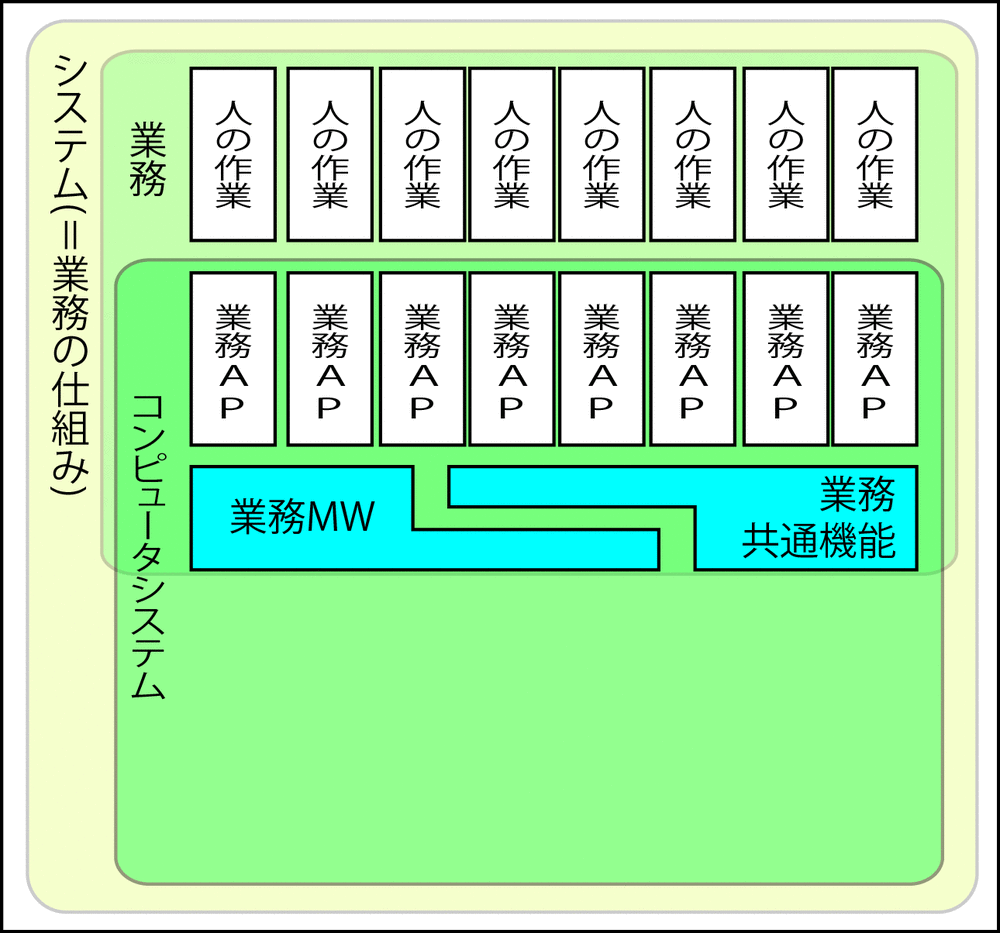

# 低レベルのアーキテクチャ

* ソフトウェアアーキテクチャより下のスタック
* ハードウェアやOSは低レベルのアーキテクチャと呼ばれる
    * スタックの下層にあるため
* 意識することはほとんどない
    * OSやミドルウェアやプログラミング言語の進歩の賜物

* [運用センターファシリティ](01)
* [ネットワーク基盤](02)
* [ハードウェア基盤](03)
* [基盤ミドルウェア](04)
    * デーバベースサーバー、Webアプリケーションサーバーなど
    * 基盤アプリケーション
        * グループウェア、認証システム、運用管理システムなど

