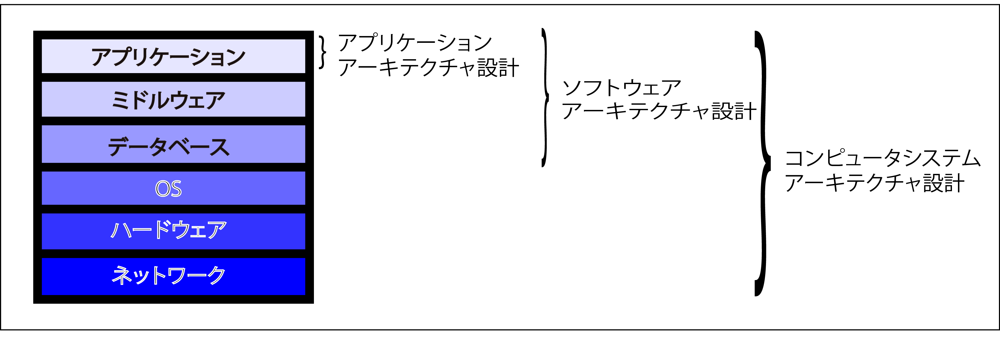

# アーキテクチャ設計

* アーキテクチャ = `設計の基本構造`という意味
    * `設計の基本構造` = システムの`基本的な構造`

## ITアーキテクチャの全体像

システムの構成要素

* 全体として「業務の仕組み」を実現
    * 「システム」には人の作業も含まれる
    * コンピュータに実装された業務アプリケーションと相互に連携

## アプリの開発者の範疇

* [ソフトウェアアーキテクチャ](00_computer/01_software)
    * アプリケーションアーキテクチャ

    

