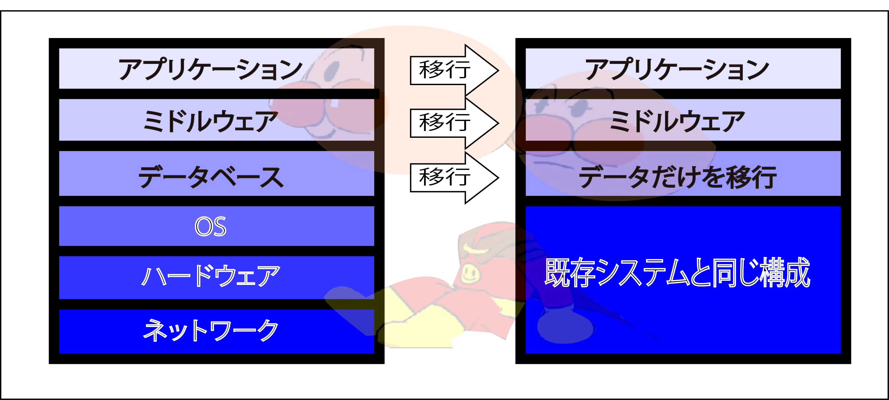

# 移行設計

* 開発システムを本番環境に移行する際の設計
* 開発が完了したシステムを既存システムに代わってデータなどを準備するための設計
    * 新しくシステムを開発した場合には問題にならない
    * 稼動している既存システムがある場合
* 本番環境で動作するように配置

* 既存システムへの影響を最小限に留めながら、本番環境に新システムを配置
* サービスインと同時に正常に動作するようにする

## 難しい点

* データベースに格納されているデータを移行
    * 既存システムが直前まで動いている場合
        * その最新のデータを新しいデータベースにインポートする
        * ミスがあると致命的ダメージを負う
            * データが消える
            * 間違ったデータが本番環境のデータベースに入るetc,,
        * 本番データは量が多いので移行の時間もかかる
            * ミスを挽回する時間も多くない
    * テーブルの構成を変える場合
        * 移行プログラムを作成し、プログラムデータを加工しながら新しいデータベースに登録
        * カラムの名前や型が変わったり、カラムがなくなったりすると非常に難しい
* この移行作業の手順を検討するのが移行設計

## スタック

* スタックの多くの構成が変わらなければ、移行作業は間単
    * 変更がスタックの中に閉じていれば、影響も少ない
* DB製品のバージョンやテーブルの構成などが変わらなければ、データの移行も大きな問題ない    
* 構成が既存システムと同じ場合
    * * `構成`: ネットワーク、ハードウェア、OS、DBなどの構成
    * アプリケーションとミドルウェアだけを新しいものに移行
    * DBはデータだけを移行すれば済む

## 以降プログラムの種類

* どの移行方法を選択するか
    * そのシステムの使われ方や稼動状況によって決まる
* 種類
    * 一度にすべて移行するもの
    * 段階的に移行するもの
        * DBのレプリケーションを作成するもの
        * 既存システムに新旧両方のDBに書き込ませるもの
            * この場合は既存システムに改修が必要

## リハーサル

* 実際にリハーサルをやってみないとわからない問題がある
    * 本番に近い環境でリハーサルを行う
