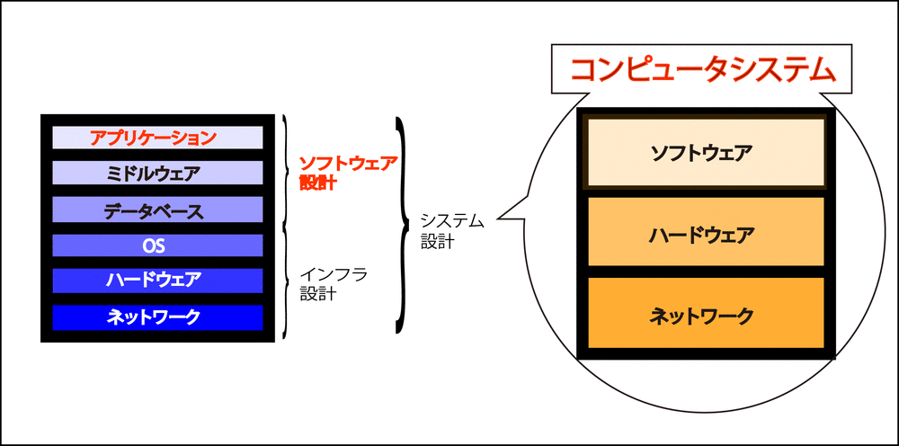
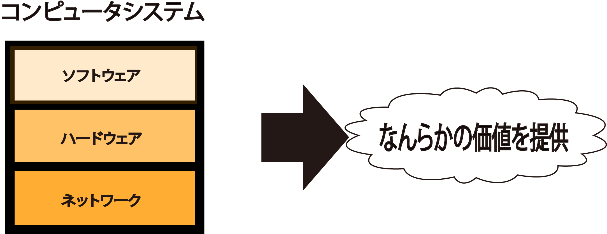

# 設計

**ウォーターフォール+オブジェクト指向開発**

## 概要

* [概要](00_about)

## 設計の対象(基本知識)

* [ソフトウェア設計](01)
* [インフラ設計](02)
* [アーキテクチャ設計](03_architecture)
* [移行設計](04)
* [運用設計](05)

## スタックとプロダクト

* アプリケーション
* ミドルウェア
    * Apache, JBoss, WebLogic, WebSphere
* DB
    * MySQL, Oracle, Sysbase, SQL Server
* OS
    * windows, Mac, Linux
* ハードウェア
    * PC, Mac, Workstation
* ネットワーク
    * IP, TCP, UDP, HTTP, SMTP, POPS

## コンピュータシステム

